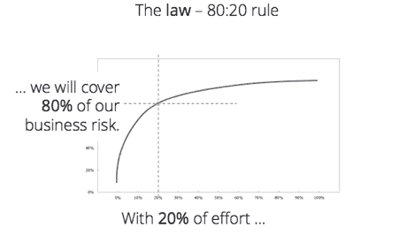

# 大多数组织过度测试软件——同时也测试不足

> 原文：<https://thenewstack.io/most-organizations-are-overtesting-software-and-also-undertesting/>

 [沃尔夫冈·普拉茨

沃尔夫冈是 Tricentis 的创始人兼首席产品官。他是软件测试创新的幕后推手，例如基于模型的测试自动化和线性扩展测试设计方法。](https://www.tricentis.com/team/wolfgang-platz/) 

像许多奥地利人一样，我喜欢“上山滑雪”——在滑雪板上绑上滑雪板，爬山，也许休息一会儿喝杯饮料，然后滑下来。这需要携带一定数量的装备。即使在低风险的情况下，你也需要一个装有护目镜、急救箱、地图、额外的隔热层、水、一些食物，也许还需要一个小头灯的背包。对于一个更偏远/崎岖的地方，你可能想增加你的食物供应，加上雪崩收发器，铲子，雪探针，等等。

这是一个微妙的平衡动作。你不想跳过一些你可能真的需要的东西——比如万一你遭遇雪崩。但是，如果你带的太多，你就无法达到期望的速度和敏捷性。在最糟糕的情况下，你有一个沉重的背包，里面塞满了太多的东西，却没有足够的东西——让你同时毫无准备和超负荷。

这就是大多数企业组织在软件测试方面的立场:测试太少或太多，过度暴露于风险之中，并且不能快速转向。让我解释一下…

## 定制应用程序:过多的测试

大多数“定制”的定制应用程序实际上都被过度测试了。当测试外包给服务提供商时，过度测试尤其普遍，服务提供商的报酬取决于定义和自动化的测试数量。这种情况经常发生，导致公司为产生有限商业价值的测试支付过高的费用。

当测试人员由他们产生的测试数量来衡量时，您倾向于得到比您实际需要的多得多的测试——并且发布经常被延迟，因为所有这些测试都被创建、执行和更新。这就是为什么测试通常被认为是应用程序交付过程中的头号瓶颈的主要原因之一。更糟糕的是，你通常不会得到正确的测试结果。你只是得到很多测试，反复检查同样的事情。

你怎么解决这个问题？采用一种新的测试方法:关注业务风险覆盖率，而不是测试用例的数量。

> 如果“业务”向测试人员提供了应用程序功能如何映射到业务风险的准确评估，那么测试人员可以非常有效地覆盖那些风险。

你可能听说过 80/20 法则(即帕累托法则)。最常见的是，这指的是 20%的努力创造了 80%的价值。软件开发等同于 20%的交易代表 80%的商业价值……对 20%需求的测试可以覆盖 80%的商业风险。

即使测试人员真的试图覆盖你的顶级业务风险(相对于仅仅创建一定数量的测试)，获得正确的测试也不容易。凭直觉工作，大多数团队只实现了 40%的风险覆盖率，并最终积累了一个具有高度冗余的测试套件(也称为“膨胀”)。平均来说，67%的测试对风险覆盖没有贡献——但是它们使得测试套件执行缓慢并且难以维护。回到我们最初的类比，这就像在你的背包里只装了水。这比你在雪中可能需要的水还要多，这些水占据了空间和重量，而这些空间和重量本可以更好地分配给食物和额外的隔热层等必需品。

如果“业务”向测试人员提供了应用程序功能如何映射到业务风险的准确评估，那么测试人员可以非常有效地覆盖那些风险。这是一个巨大的未开发的机会，可以使测试更快更有效。如果测试人员了解风险是如何在应用程序中分布的，并且知道哪 20%的事务与那 80%的业务价值相关，那么在没有过多测试投资的情况下覆盖顶级业务风险是完全可行的。

一旦明确了真正需要测试的内容，下一步就是确定如何尽可能高效地测试它。正如并非所有的需求都是相同的(从风险的角度来看)，同样的道理也适用于为验证这些需求而创建的测试。一个单独的战略性设计的测试可以达到和 10 个其他测试一样多的风险覆盖率，如果不是更多的话。

这就是测试用例设计方法的用武之地。通过有效的测试用例设计策略，比如线性扩展，测试人员可以尽可能高效地测试最高风险的需求。他们被引导到所需的最少可能的测试，以 1)达到您的风险覆盖目标，以及 2)确保当测试失败时，团队确切地知道要调查什么应用程序功能。

对于定制应用的测试，越少越好。对团队和利益相关者更有价值。更多的时间花在按时实现测试上，这样您就可以按时发布。并且当项目改变过程并且测试套件需要重大更新时更加敏捷。

## 打包应用程序:没有足够的测试

像 SAP 和 Salesforce 这样的打包应用程序属于过度测试-测试不足的另一端。测试 SAP 企业应用程序变更的最常见策略是什么—是自定义更新、服务包还是紧急修复？根本不要测试变化！

嗯，也许这并不完全准确。大多数组织对他们打包的应用程序进行一些测试。当需要将更新部署到生产环境中时，他们会让关键用户进行测试。

但是你猜怎么着？重点用户不喜欢测试。测试打包的应用程序更新通常是一个漫长的手动考验。业务流程测试可能已经过时——或者更糟，没有文档记录——这使得测试令人沮丧并且容易出错。而且这些测试任务已经堆积在关键用户繁忙的日程之上。一些关键用户向我承认，为了加快进度，他们主要测试他们知道会通过的用例。他们的策略是:“我们测试绿色！”

当然，这些对运营团队来说都不是新闻。为了解决缺乏有效的预发布测试的问题，他们通常会在更新上线后立即添加一个“hypercare”阶段。Hypercare 是一个“全员参与”的时期，在此期间，组织最昂贵的资源(通常是开发人员和项目人员)处于待命状态，以解决生产中出现的紧急问题。需要说明的是，这些问题是在预发布测试中没有发现的，而修复这些问题要容易得多，也便宜得多！因为 hypercare 阶段非常普遍，而且非常昂贵，所以有些公司专门为客户提供 hypercare 支持。

超过 90%的 SAP 企业客户选择这种部署策略，这种策略既耗时又昂贵。关键用户测试通常持续一到两周。一个 hypercare 阶段可以持续三个月，在此期间，缺陷造成的大部分负担是由那些贫穷的关键用户感受到的——你猜对了。

对于大多数依靠关键用户测试+hypercare 来测试其打包应用的组织来说，我有一个坏消息，也有一个好消息。首先是坏消息。SAP(以及其他打包应用供应商)将比以往更加频繁地提供更新。这意味着客户必须想办法跟上。

好消息是。除了关键用户测试和 hypercare，还有一个更好的选择:变更影响分析。变更影响分析—一夜之间—分析您的整个 SAP 生态系统并生成报告

*   哪些变化会带来业务和技术风险
*   基于这些风险，到底需要创建或运行什么样的测试
*   哪些新的或现有的测试覆盖了频繁变化的“热点”,因此应该自动化
*   哪些定制代码你没有使用(也不需要测试)。

简而言之:它将帮助您准确地聚焦于需要测试的内容。你将接受生存所需的测试，但你不会因为过多的测试而不堪重负。

然而，对于变更影响分析有一个警告。鉴于大型打包应用程序的复杂性，某个核心组件的变化可能会影响许多对象，这些对象将显示为“受影响的”这降低了该技术的有效性。为了减轻您的测试负担，进一步缩小测试范围，考虑对象依赖性(关注“风险最大”的对象)。

## 数据:测试不够

现代应用程序接收、集成和转换大量数据。数据泄露的机会数不胜数，但通常很少有(如果有)正式的流程来确保整个数据环境中的数据完整性。

也许你已经成功地对所有定制应用和打包应用进行了适量的测试，收集数据并将其转化为有价值的信息。但是底层数据测试的频率和彻底程度如何呢？您的系统的每个其他组件可能看起来都完全按照预期运行，但是如果数据丢失，业务需求就没有得到满足。事实上，这项业务正面临极大的风险。

假设打包的应用程序更新引入了数据格式的细微变化，这种变化会阻止每 100，000 条记录中有 1 条被处理。你会立即知道，还是会被忽视，直到愤怒的客户(或挑剔的监管者)打电话来？如果您的组织引入了一个新的字段(例如，新冠肺炎测试状态)，那么一个月后，无论用户配置文件何时更新，一个团队的错误修复都会覆盖该状态，该怎么办？

随着自动化的“质量关”在数据进入和通过应用程序时不断检查数据，您可以在引入这些问题时发现它们。您还可以在它们影响业务并需要大量手动数据检查/修复之前消除它们。

到目前为止，金融、保险和医疗保健公司在自动化端到端数据测试方面一直处于领先地位。他们正在取得一些显著的成果，比如在 20 分钟内自动测试 2 亿个值的能力。如果您正在开发的应用程序消费、操作或输出数据(谁不是呢？)，不要把这个本质落下。没有它，微妙的数据问题可能会迅速发展成一场危机，你需要相当大的雪崩铲来挖掘。

<svg xmlns:xlink="http://www.w3.org/1999/xlink" viewBox="0 0 68 31" version="1.1"><title>Group</title> <desc>Created with Sketch.</desc></svg>