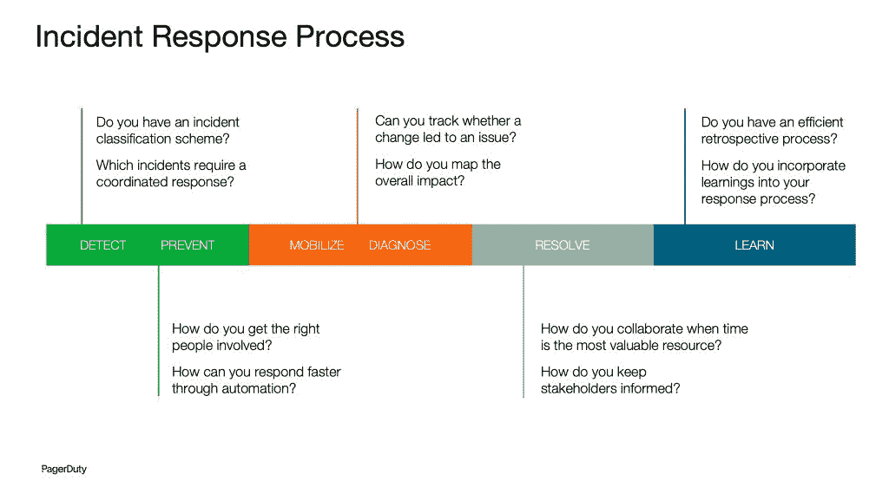
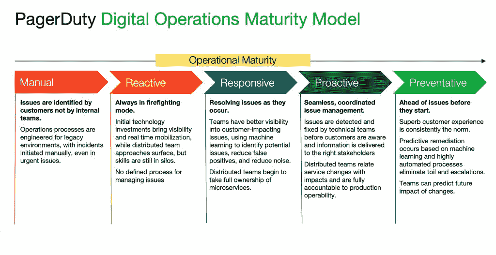

# 借助自动化事件响应摆脱手动模式

> 原文：<https://thenewstack.io/move-away-from-manual-with-automated-incident-response/>

随着公司加大数字化工作的力度，越来越多的事件带来了很多额外的压力，这反过来又使团队健康面临潜在的倦怠和流失风险。事实上，我们看到从 2019 年到 2020 年，我们平台上的关键事件增长了[19 %, 2021 年的初步数据显示，这一数字仅在过去一年有所上升。](https://www.pagerduty.com/state-of-digital-ops/)

 [汉娜·卡尔弗

Hannah 是 PagerDuty 的一名解决方案营销人员，她对数字时代各行各业的实时紧急工作感兴趣。](https://www.linkedin.com/in/hannah-culver/) 

除了事故增加之外，这些事故的时间安排还导致了个人时间和重点工作时间的中断。根据[平台数据](https://www.pagerduty.com/state-of-digital-ops/)，团队经历:

*   9%以上的非工作时间干扰。
*   假期/周末干扰增加 7%。
*   5%以上的工作时间中断。

当您查看我们用户的工作时间时，这种额外的压力会更加明显。根据我们的数据，我们看到用户在 2020 年每天额外工作两个小时，这相当于每年额外工作近 12 周！这是不可持续的，对团队和响应者的长期和短期健康都是有害的。

这种代价超出了个人范畴。在一个通常被称为“大辞职”的时代，这种额外的工作只会增加自然减员。随着团队失去人员并寻求招聘这些空缺职位，他们的工作量只会增加。有些事情必须改变，IT 领导者正在寻求一些战略计划来帮助他们。

我们向 700 名 IT 决策者询问了他们在 2021 年的[优先事项，73%的技术负责人表示他们正在投资 AIOps 和自动化，以帮助提升他们的运营流程并消除手动工作的负担。这是因为 90%的受访者表示，传统的 ITOps 方法不再能够跟上当今的步伐和复杂性。](https://www.pagerduty.com/global-tech-leadership-digital-dependency/)

为了减轻一些压力并适应这个新时代，72%的领导者正在加大数字化转型的力度，74%的领导者正在使用 DevOps 来推动更好的一致性。这些投资的总体目的是更好、更快的事件响应，减少响应者的工作量。另一种思考方式是，这些愿望为自动事件响应(AIR)类别奠定了基础。

## 什么是自动事件响应？

Gartner 去年引入了术语“自动化事件响应”,这是对事件响应这一由来已久的定义的发展。这种变化反映了团队对采用自动化的日益增长的需求，并且源于我们技术环境中日益增长的复杂性。

[据 Gartner](https://www.gartner.com/en/documents/4006245) 称，“自动化事件响应(AIR)解决方案通过实现集中式警报或事件路由来自动化事件响应流程。使用基于策略或规则的引擎、随叫随到的调度程序或简化的协作，这可以通过以行动为导向的洞察力提高运营效率。”

在 PagerDuty，我们一直在思考自动化如何在事件响应中发挥作用。事实上，我们的标准解决方案从 2017 年起就已经满足了这个定义。我们最初的随叫随到管理功能提供了时间安排。我们的 IT 服务警报和上报政策支持集中警报路由。此外，我们的利益相关方通知和响应功能简化了事件响应团队之间的协作。这让我们不禁要问，“下一步是什么？”

## 在更多事件响应生命周期中扩展自动化的价值

将自动化添加到事件响应流程中应该在人类承担过度负担的点上战略性地完成。我们发现，通过下图中的这些类型的问题，可视化自动化可以在哪些方面帮助减轻这种负担是最有帮助的。

其中一些需求必须由人类来解决。毕竟，仅仅用机器是无法完成回顾的；你需要人类在那里实际学习。但是，这个过程的其他部分不需要人类作为第一道防线。

从我们的研究中可以明显看出，传统的手动事件响应方式已经不足以满足客户的需求，而且对于响应人员来说，维护起来太费力、太累了。人类正在竭尽全力解决问题，完成机器无需干预就能解决的任务。手动和自动化流程之间的差距变得越来越令人痛苦。

人工方式包括打断人们正在做的任何事情，无论是遛狗、睡觉还是专注于下一个关键项目，并要求他们自己找到根本原因。但是在合适的时间找到合适的人已经不够了。团队需要依靠自动化来管理这种增长的速度和复杂性。

新的自动化方式是为了防止人类成为第一道防线。它介绍了利用机器来承担一些负担并帮助人类平衡关键工作负载的方法。它实时或按需工作，根据每个团队的准备情况来处理大量用例。听起来很棒，那么团队实际上如何开始呢？

## 我如何从手动到自动？

自动化事件响应之旅不可能一蹴而就。当谈到自动化时，重要的是专注于减少操作负载以完成更多工作，同时提高组织速度和创新。团队可以用爬行-行走-奔跑的方法来完成。关键是从你的组织现在所处的位置开始，并有一个持续成熟的计划。

在 PagerDuty，我们将[运营成熟度](https://www.pagerduty.com/digital-operations-maturity/)分为从手动到预防性的五个阶段。旅程中最重要的部分之一是了解您的团队和组织目前在这个模型中的位置。然后你可以从选择一个特定的领域开始。

**对于处于手动和反应阶段的组织**，您可以识别并启用组织中那些与自动化有密切关系的人。学习自动化可能会令人生畏，所以鼓励人们使用他们已经掌握的技能和语言来保持熟悉感。

处于运营成熟度早期阶段的团队应该支持行动，并关注将手动记录的步骤转化为自动化的步骤。一旦你做到了这一点，你将在你的组织中拥有自动化的口袋，使你的主题专家更加有效。

**当团队到达响应阶段**时，目标变成标准化事件响应流程并实现自助服务。标准化帮助您构建可以跨团队和服务重用的自动化。自助服务是您如何利用自动化来实现更大的价值，方法是让其他人做以前只有您的主题专家才能做的事情。

标准化和自助服务分散了运营负载，提供了更有效的资源利用，并使中小企业能够摆脱劳累，专注于推动业务发展。因为第一反应者有他们需要的工具，事故将被更快地解决。

**在主动阶段**，自动化针对实时工作进行了优化。这意味着运行自动化来响应事件，创建自动补救功能，并减轻响应关键工作的团队的实时负担。

人才是一个组织最宝贵的资源。保护团队能力的最好方法是在没有人为干预的情况下尽可能多地解决问题。这不是要取代人类；这是关于用自动化来增强你的人类，让他们远离重复或嘈杂的任务，以便他们可以专注于创新。

当团队能够有效地将自动化与他们的事件响应流程联系起来时，他们将在减少事件总数和缩短响应时间方面受益。这最终意味着团队更少的救火工作、更少的倦怠、更少的损耗和更多的创新时间。这听起来真的像是新鲜空气吗？

要了解 PagerDuty 自动事件响应的实际效果，请查看本次[网络研讨会](https://www.pagerduty.com/resources/webinar/automated-incident-response-journey-from-manual-to-automated/)。或者，如果你想自己尝试一下，报名参加我们的 [14 天免费试用](https://www.pagerduty.com/sign-up/)。

<svg xmlns:xlink="http://www.w3.org/1999/xlink" viewBox="0 0 68 31" version="1.1"><title>Group</title> <desc>Created with Sketch.</desc></svg>