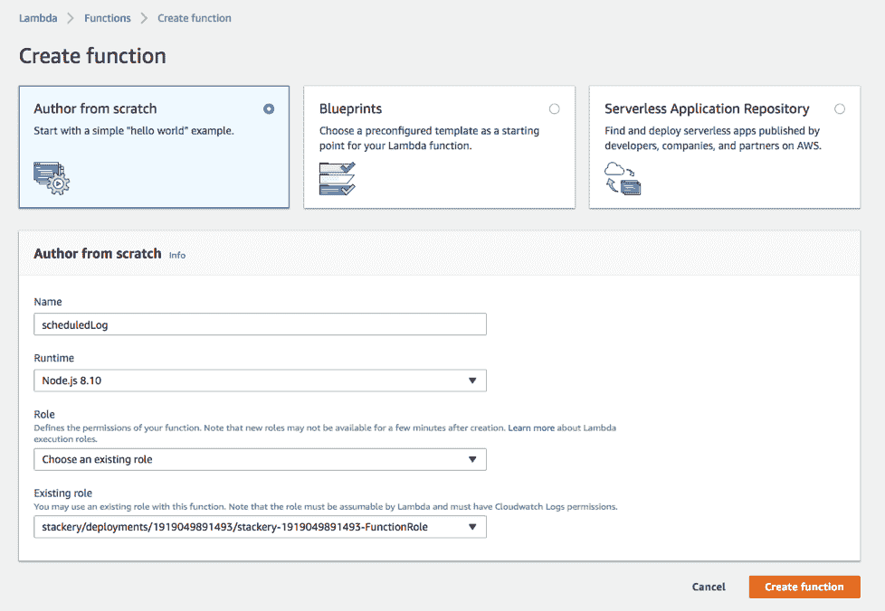
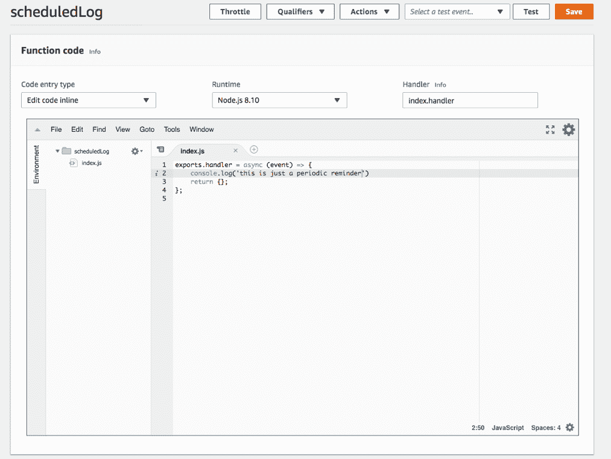
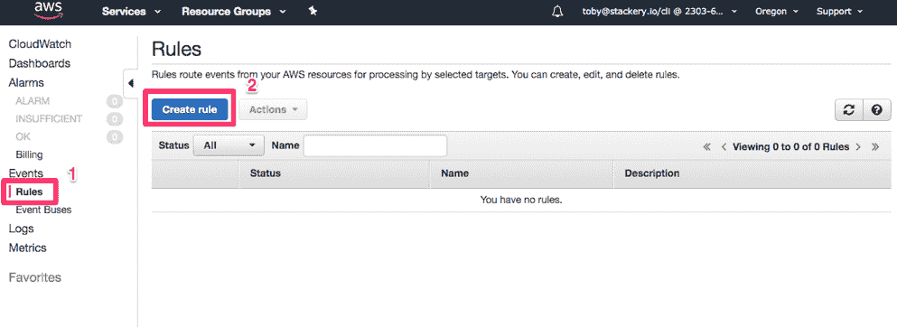
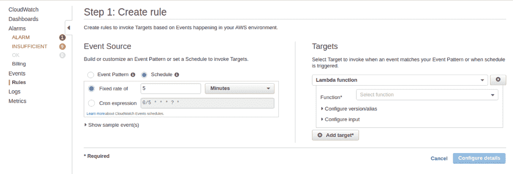
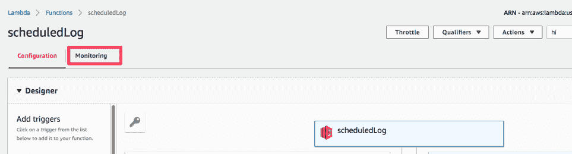
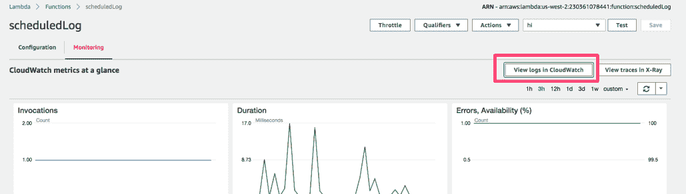
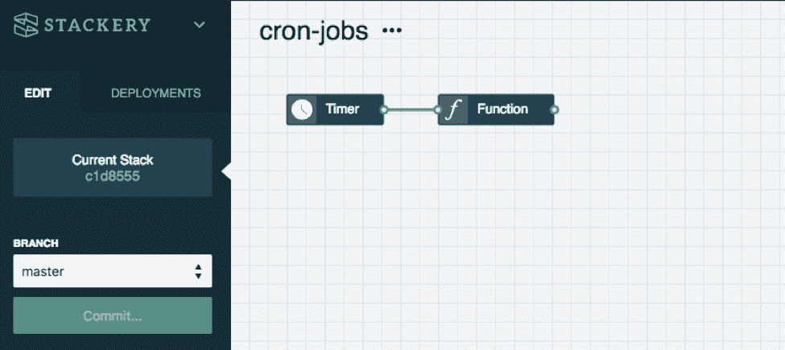

# 通过 3 个步骤将 Cron 作业转移到无服务器

> 原文：<https://thenewstack.io/move-your-cron-jobs-to-serverless-in-3-steps/>

[](https://www.stackery.io/)

 [托比·费

托比是 Stackery 的一名社区开发者。她的角色和经历结合了软件工程师、作家和技术讲师的工作，用新兴工具构建有趣的项目，并与世界分享她的发现。在加入 Stackery 之前，Toby 是 NWEA、瓦卡萨和新遗迹公司的工程师。](https://www.stackery.io/) [](https://www.stackery.io/)

Cron 作业通常是我们 web 应用程序的夜班。有些任务在实时或高峰使用时没有意义，需要定期安排。克隆乔布斯有两个众所周知的问题:

*   **相对不透明的配置:**像 Regex 或 SQL 一样，cron 有一个紧凑且一致的语法，如果你不了解它，几乎不可能读懂。
*   **可观察性:**一旦您的团队在多个服务器上安排了多个作业，就很难确保每个人都知道哪些 cron 作业需要运行，它们在哪里，以及如何将它们转移到新系统。

使用 [Amazon Web Services (AWS)](https://aws.amazon.com/) 我们可以将所有 cron 作业转移到 EC2 Linux 服务器中。这至少会使备份和克隆我们所有任务的机器变得更容易，但是我们仍然需要知道如何读取一个 [crontab](https://crontab.guru/) 文件，并且维护整个服务器只是为了定期运行一些代码。

本教程将向你展示如何安排一个 Lambda 函数定期运行，将你安排的任务转移到无服务器模式。您可以使用这种技术来启动数据库维护、运行夜间任务或者向您的团队发送定期报告。

## 1.制作一个 Lambda 函数

如果您想直接在 AWS 中完成这项工作，可以从 Amazon Web Services 中创建一个简单的 Lambda 开始。



我们的 Lambda 可能是最简单的东西:静态日志消息。向下滚动到代码编辑器，输入以下几行

```
exports.handler  =  async  (event)  =&gt;  {
console.log('this is just a periodic reminder')
return  {};
};

```



之后，保存你的 Lambda。

## 2.重复 Cloudwatch 触发器

下一步是为 Cloudwatch 创建一个新的“规则”来定期触发我们的 Lambda。从 Cloudwatch 控制台中，选择“规则>创建规则”



您可以在此输入 crontab 行，或者从下拉列表中选择一个简单的时间间隔。



注意，crontab 提供的不仅仅是“每 X 分钟/小时/天”，如果您不熟悉语法， [crontab 生成器](https://crontab-generator.org/)可以帮助您编写一个规则，比如“每隔一个月的每个星期四”选择我们刚刚创建的 Lambda 作为我们的目标。一旦规则被保存，我们应该看到 Lambda 每隔 X 个间隔被调用一次。

## 3.看到它的实际应用

要查看这个 Lambda 的运行情况，我们需要检查日志，因为我们的 Lambda 没有发送出站流量。转到 AWS Lambda 仪表板，选择相关的 Lambda。



从那里，选择“监控”并转到日志显示。



## 快速简单的方法

这里我必须指出:如果你想节省自己大量的时间，点击 AWS 的菜单， [Stackery](https://www.stackery.io/) 极大地改进和简化了这个过程，简化为两步。完全披露:我为 Stackery 工作，发现这个产品功能非常棒。

1.  拖动 Lambda 资源。
2.  连接一个定时器。仅此而已。



## 进一步阅读

在 AWS 官方教程中有关于这个主题的[涵盖了类似的材料](https://docs.aws.amazon.com/lambda/latest/dg/with-scheduled-events.html)，以及如何触发基于 Lambda 的其他事件。如果您想了解更多关于无服务器入门的信息，AWS 开发人员指南提供了额外的用例资源。

<svg xmlns:xlink="http://www.w3.org/1999/xlink" viewBox="0 0 68 31" version="1.1"><title>Group</title> <desc>Created with Sketch.</desc></svg>