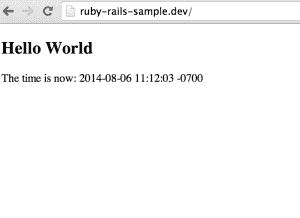

# 将 Ruby 应用从 Heroku 迁移到 Docker

> 原文：<https://thenewstack.io/moving-ruby-apps-from-heroku-to-docker/>

我一直在尝试将 Heroku 上的应用程序迁移到 Docker 上。我在做实验的时候遇到了一些困难，我想分享一下我的经历以及我是如何克服这些困难的。运行单个流程容器(就像使用 Sqlite 的 Rails 应用程序)很简单。但是，当你开始运行使用 Heroku 服务的应用程序时(甚至 Postgres 数据库也是你的应用程序的一项服务)，事情变得复杂了，因为你需要链接容器，遗憾的是，互联网上几乎没有关于如何做的信息(Docker 文档非常通用)。具体来说，关于如何将真实应用程序框架中的应用程序与真实数据库服务相链接的分步信息非常少。我希望在使用 Docker 和 Rails 之前就了解这些组件是如何链接在一起的(并在它们不链接时对它们进行故障排除)。这本指南将告诉你如何做。如果你很忙，可以跳到 TL；DR 部分，看看我是如何把一个在 Heroku 上运行的应用程序转换成在 Docker 中运行的多进程容器的。这一节给你一个在 Docker 上启用 rails 应用的快速操作方法。如果您需要某个特定步骤的更多细节，只需跳回到对该步骤有更详细解释的部分。

## 使用 Heroku Rails 参考应用程序

从 Heroku([https://github.com/heroku/ruby-rails-sample](https://github.com/heroku/ruby-rails-sample))
的示例应用程序开始

```
$  git clone  <a  href="https://github.com/heroku/ruby-rails-sample">https://github.com/heroku/ruby-rails-sample</a>
$  cd ruby-rails-sample

```

现在，让我们确保我们可以在本地运行它。我在本地使用 [RVM](http://rvm.io) 来管理不同版本的 Ruby，我已经在我的笔记本电脑上安装了 Postgres(使用[自制软件](https://github.com/Homebrew/homebrew)，我喜欢零配置 web 服务器 [Pow](http://pow.cx) 的简单性。一旦我安装了这三样东西，我就可以运行这些命令，一切就正常了。

```
$  powder link
$  printf  'if [ -f "$rvm_path/scripts/rvm" ] &amp;&amp; [ -f ".ruby-version" ]; then 
 source "$rvm_path/scripts/rvm" 
 rvm use `cat .ruby-version`
fi'  &gt;  .powrc
$  printf  “2.1.1”  &gt;  .ruby-version
$  bundle   
$  bundle exec rake db:create db:schema:load  
$  powder open

```

关于这些步骤的更多细节:

1.  我们刚刚在 pow 内部链接了我们的应用程序
2.  安装一个. powrc 来加载我们的。ruby-version 文件，以便在 pow 内部运行时正确使用正确的 ruby 版本。
3.  设置。ruby-version 文件指向 2.1.1(我们通过查看 Gemfile 确定了这一点)
4.  安装了相关的 ruby 库
5.  创建数据库并将我们的应用程序模式安装到数据库中。
6.  然后，我们在浏览器中打开应用程序。

我们现在应该在浏览器中看到这个。 [](https://thenewstack.io/wp-content/uploads/2014/08/Screen-Shot-2014-08-06-at-11.12.07-AM.png) 我们的 app 做的不多，只是在页面加载时显示服务器时间。事实上，如果我们检查应用程序，我们甚至在“app/models”目录中没有模型，所以我们应该验证我们实际上连接到了数据库。运行 ps 命令并搜索 postgres，显示我们的应用程序已正确连接到数据库:

```
$  ps ax  |  grep postgres  |  grep xrdawson  
38270     ??   Ss        0:00.01  postgres:  xrdawson ruby-rails-sample_development  127.0.0.1(54935)  idle  
38273     ??   Ss        0:00.01  postgres:  xrdawson ruby-rails-sample_development  127.0.0.1(54938)  idle

```

如果我们查看我们的 config/database.yml 文件，我们可以看到有一个名为“ruby-rails-sample_development”的数据库。我们实际上并没有创建这个数据库，但是由于应用程序实际上并没有对它运行查询，看起来 Rails 并不在乎它的不存在。

## 将我们的示例 Rails 应用程序归档

现在，为了对此进行 dockerize 化，我们将使用 Dockerfile，它将容器化我们的应用程序。rails 有一个“库存”映像(也称为“基本”映像，由 Docker 或其他知名组织认可的映像)。我们可以使用这个文件作为我们的基础，并向这个文件添加相关的额外步骤，以制作一个可再现的图像清单(“Dockerfile”)，我们可以方便地将它与其余的源代码一起存储。

```
$  printf  “FROM rails”  &gt;  Dockerfile
$  docker build  -t  sample_rails_app_for_heroku  .

```

这失败了！我们看到这些问题:

```
Sending build context to Docker daemon  1.802  MB
Sending build context to Docker daemon
Step  0  :  FROM rails
# Executing 5 build triggers
Step onbuild-0  :  ADD  .  /usr/src/app
---&gt;  1379eabf72b1
Step onbuild-1  :  WORKDIR  /usr/src/app
---&gt;  Running in  0d4b99e50593
---&gt;  f2f211cf84ea
Step onbuild-2  :  RUN bundle install  --system
---&gt;  Running in  1b94dbcb836d
Don't  run Bundler as root.  Bundler can ask for sudo if it is needed,  and
installing your bundle as root will break this application for all non-root
users on this machine.
Your Ruby version is  2.1.2,  but your Gemfile specified  2.1.1
2014/08/06  10:30:33  The command  \
[/bin/sh  -c  bundle install  --system]  returned  a  non-zero code:  18

```

因此，基础 rails 映像使用 Ruby 2.1.2，而我们的 Gemfile 指定 2.1.1。怎么办？我们升级有关系吗？很难知道。可能有不工作或不编译的库。我们升级一下，看看会发生什么。

```
$   rvm install  2.1.2  --verify-downloads  1  # without verify-downloads this failed…

```

现在我们已经安装了 ruby 2.1.2。让我们更改 gem 文件中的行。ruby-version 切换到 2.1.2。我们将验证它在本地工作，然后用 Docker 重试。

```
$  ruby  -pi  -e  'gsub(/2\.1\.1/, "2.1.2")'  .ruby-version Gemfile
$  git commit  -am  “Switch to  2.1.2”
$  cd  .  # this switches us to 2.1.2 inside our shell
$  bundle  # install the libraries inside ruby 2.1.2 context.
$  powder open

```

当我们这样做时，我们仍然看到它在本地运行。因此，重新运行 docker build 命令。

```
$  docker build  -t  sample_rails_app_for_heroku  .

```

它从 gem 文件中构建并重新生成宝石缓存。现在，我们可以运行容器了。

```
$  docker run  -p  3000:3000  sample_rails_app_for_heroku

```

然后，我们可以访问运行在 docker 主机上的程序。我在 OSX，我的内部 docker IP 是 192.168.59.103。

如果我打:http://192.168.59.103:3000 我看到这个: [](https://thenewstack.io/wp-content/uploads/2014/08/Screen-Shot-2014-08-06-at-10.39.52-AM.png)

因此，应用程序在容器内部运行，但是它不能连接到 postgres。我们使用的基本映像(“rails”)中没有运行 postgres。我们可以将 postgres 添加到这个容器中(例如，将“RUN apt-get install postgresql -y”添加到 Dockerfile 中)，但是关于[这是否是正确的做事方式](http://jpetazzo.github.io/2014/06/23/docker-ssh-considered-evil/)还有[的争论](http://phusion.github.io/baseimage-docker/)。将每个容器隔离到一个进程意味着我们可以在某个时候切换到一个 postgres 容器集群，我们的 rails 服务器不必知道其中的区别(而不是用一堆额外的代码和数据来膨胀我们的 rails 映像)，所以让我们运行另一个内部有 postgres 的容器，并用 Docker“链接”将它们连接在一起。

```
$  docker run  --name sample_rails_postgres  -p  5432:5432  postgres

```

该命令将启动基础映像“postgres”(如果您还没有检索到它，首先安装它)，然后在端口 5432 上启动。现在，我们应该能够在运行我们的 rails 应用程序时使用“link”开关来链接容器，并且它们可以以一种安全的方式相互通信。您应该在另一个终端窗口中执行此操作，因为此命令将运行并显示正在运行的容器的输出；如果您想给这个图像加背景，请使用-d 开关。现在，启动 rails 容器，使用–link 开关将它链接到 postgres 容器。

```
$  docker run   -p  3000:3000  \
--link sample_rails_postgres:sample_rails_postgres  \
sample_rails_app_for_heroku

```

我们立即发现了一个问题。我们的应用程序没有正确配置以到达 postgres 链接服务器，因此错误消息是相同的。怎么办？那么，如何让它在 Heroku 上工作并在本地运行呢？

### 使用 nsenter 进行故障排除

当事情不工作，我们当然可以做谷歌搜索。但是，由于我们的 rails 应用程序运行在一个新的上下文中，即 Docker 容器，我们的结果现在是有限的。排除故障的更好方法是检查我们的容器本身。但是，我们不能让 SSH 进入我们的容器:出于同样的原因，我们不希望在与 Rails 应用程序相同的容器中运行 postgres，许多 Docker 用户一致认为我们不应该在我们的容器中使用 SSH 服务器，我大体上同意这一点。您可以临时安装 SSH，但是这样我们会弄乱映像，当我们取消对部署就绪的更改时，我们的构建步骤会变得复杂。相反，我们可以使用 Docker 员工之一的 [nsenter](https://github.com/jpetazzo/nsenter) 将 shell 装入一个运行容器。这是调试正在运行的容器的正确方法，因为您将实验命令排除在构建最终映像的工作流之外。不幸的是，使用 nsenter 的安装说明不起作用(它从未将二进制文件构建到我的 OSX /usr/local/bin 目录中),但放置这段代码片段(在自述文件中有进一步解释)确实起作用。

```
docker-enter()  {
boot2docker-cli ssh  '[ -f /var/lib/boot2docker/nsenter ] || \
docker run --rm -v /var/lib/boot2docker/:/target jpetazzo/nsenter'
boot2docker-cli ssh  -t  sudo  /var/lib/boot2docker/docker-enter  "$@"
}

```

我把这几行字添加到我的。bash_profile(然后运行”。~/.bash_profile”来“源”它)，然后可以使用“docker-enter”命令。运行 docker-enter 看起来是这样的:

```
$  docker ps
CONTAINER ID         IMAGE                                 COMMAND                 CREATED              STATUS               PORTS                     NAMES
<b>ff806bee1067</b>         sample_rails_app_for_heroku:latest    rails server            7  days ago           Up  37  minutes        0.0.0.0:3000-&gt;3000/tcp    kickass_kowalevski
<b>2dd659027836</b>         postgres:latest                       /usr/src/postgres/do    7  days ago           Up  37  minutes        5432/tcp                  kickass_kowalevski/sample_rails_postgres,sample_rails_postgres
$  docker-enter  2dd659027836
root@2dd659027836:~# apt-get update
...
root@2dd659027836:~# apt-get install postsgreql -y
...
root@2dd659027836:~# su postgres -l
$  psql  -h  localhost
psql  (9.3.4)
Type  "help"  for help.

postgres=# \list
List of databases
Name     |   Owner    |  Encoding   |  Collate  |  Ctype  |    Access privileges
-----------+----------+-----------+---------+-------+-----------------------
postgres   |  postgres  |  SQL_ASCII  |  C        |  C      |
template0  |  postgres  |  SQL_ASCII  |  C        |  C      |  =c/postgres           +
|           |            |          |        |  postgres=CTc/postgres
template1  |  postgres  |  SQL_ASCII  |  C        |  C      |  =c/postgres           +
|           |            |          |        |  postgres=CTc/postgres
(3  rows)

```

所以，我可以获得一个数据库服务器的 shell，并查看正在运行的数据库中的数据库。因此，我们知道 Postgresql 服务器工作正常。我不怀疑这是个问题，问题出在 rails 容器的连接上。但是很高兴看到我们可以确保 Postgres 服务器上的一切都如我们所期望的那样工作。如果您的主机上安装了 Postgres 命令行工具，您可以在这里使用它们来测试服务器。确保指定 docker 主机的 IP 地址(可能类似于“psql -h 192.168.59.103”的命令)。如果我们使用 docker-enter(" docker-enter ff 806 bee 1067 ")跳转到 Rails 应用程序容器，然后像上面那样安装 postgresql 工具，我们可以尝试访问服务器并诊断发生了什么。阅读 link 的文档，我们应该能够看到一个环境变量，它告诉我们 Postgres 服务器的 IP 以及如何到达它。让我们来解决这个问题:

```
root@ff806bee1067:~# set | grep -i sample
root@ff806bee1067:~#

```

没什么！感谢 IRC 上的 cpuguy83 告诉我:“nsenter 在一个单独的进程中运行。/proc/1/env 就是你想要的。”Docker 只是将链接的环境变量添加到流程中，而不是整个容器中。因此，您需要使用 proc 文件系统来检查特定的进程并查看其环境，这恰好是容器中的第一个进程。

```
root@ff806bee1067:~# cat /proc/1/environ
HOME=/PATH=/usr/local/sbin:/usr/local/bin:/usr/sbin:/usr/bin:/sbin:/binHOSTNAME=7902bd7d540eSAMPLE_RAILS_POSTGRES_PORT=tcp://172.17.0.152:5432SAMPLE_RAILS_POSTGRES_PORT_5432_TCP=tcp://172.17.0.152:5432SAMPLE_RAILS_POSTGRES_PORT_5432_TCP_ADDR=172.17.0.152SAMPLE_RAILS_POSTGRES_PORT_5432_TCP_PORT=5432SAMPLE_RAILS_POSTGRES_PORT_5432_TCP_PROTO=tcpSAMPLE_RAILS_POSTGRES_NAME=/jovial_morse/sample_rails_posgresSAMPLE_RAILS_POSTGRES_ENV_PGDATA=/var/lib/postgresql/dataroot@7902bd7d540e:~#

```

所以，我们可以在那乱糟糟的乱七八糟中看到它。正如文档所解释的，我们将把带有链接别名前缀的环境变量转换成大写。在这种情况下，我们可以看到我们想要的环境变量是这样的:SAMPLE _ RAILS _ POSTGRES _ PORT _ 5432 _ TCP _ ADDR。让我们将它添加到 database.yml 文件中。

```
$  ruby  -pi  -e  \
'gsub(/[^\#]host: localhost/, "host: &lt;%= ENV['SAMPLE_RAILS_POSTGRES_PORT_5432_TCP_ADDR'] || 'localhost' %&gt;" )'  config/database.yml

```

(该命令使用内嵌 ruby 编辑模式和 gsub 命令，将行“host: localhost”更改为提取环境变量的行，并忽略下面看起来像“#host…”的注释掉的行)本质上，我们所做的是在环境变量存在时使用它，而在变量不存在时使用原始的 localhost。因此，在我们的本地环境中，事情仍然会起作用。现在，如果我们再次运行，我们应该看到它的工作吧？没有。我们仍然会遇到连接失败的问题。我们的映像仍然像以前一样引用相同的源文件(因此映像没有将源文件更改为 config/database.yml)，所以我们需要重新构建。所以，再睡一会儿吧。说真的，你没有时间小睡一会儿，但这确实需要一段令人沮丧的等待时间，尤其是当你正在搞清楚事情的时候。

```
$  docker build  -t  sample_rails_app_for_heroku  .
Sending build context to Docker daemon  2.481  MB
…
Successfully built  22fcd3739b27
$  docker run   -p  3000:3000  \
--link sample_rails_postgres:sample_rails_posgres  \
sample_rails_app_for_heroku

```

## 指定容器的用户

现在，我们看到了不同的东西。 [](https://thenewstack.io/wp-content/uploads/2014/08/Screen-Shot-2014-08-06-at-2.23.10-PM.png) 这向前迈进了一步:我们在容器中以 root 用户身份运行，postgres 告诉我们数据库中没有指定的 root 用户。我们可以从前面的“\list”命令的输出(从 postgres 容器内部使用 psql 客户机)中看到，有一个名为 postgres 的数据库属于 postgres 用户。您的本地 postgres 安装可能有不同的用户名，等等。因此，您需要调整 config/database.yml 文件来反映这一点。大概是这样:

```
<span class="s1">username</span><span class="s2">:  &lt;%=  ENV[</span>'LOGNAME'<span class="s2">].eql?(  </span>"xrdawson"<span class="s2">  )  ?  </span>"xrdawson"<span class="s2">  :  </span>"postgres"<span class="s2">  %&gt;</span>

```

这将检查我们是否在本地运行，如果是，则使用我们的本地 postgresql 用户(“xrdawson”，我在 OSX 机器上的用户名)，否则使用“postgres”用户，这是我们在 docker 容器中运行时将使用的用户。Heroku 将忽略所有这些，因为它会生成自己的 config/database.yml，所以即使我们在这里做了更改，这些内容仍会在 Heroku 中运行。我们最终的 config/database.yml 文件可能看起来像这样(只是开发部分):

```
development<span class="s1">:
</span>   <span class="s2">adapter</span>:  postgresql
   <span class="s2">database</span>:   postgres
<span class="s1">   </span><span class="s2">host</span><span class="s1">:  &lt;%=  ENV[</span>'SAMPLE_RAILS_POSTGRES_PORT_5432_TCP_ADDR'<span class="s1">]  ||  </span>'localhost'<span class="s1">  %&gt;
</span><span class="s1">   </span><span class="s2">username</span><span class="s1">:  &lt;%=  ENV[</span>'LOGNAME'<span class="s1">].eql?(  </span>"xrdawson"<span class="s1">  )  ?  </span>"xrdawson"<span class="s1">  :  </span>"postgres"<span class="s1">  %&gt;</span>

```

注意，我们将数据库从原来的“ruby-rails-sample_development”名称更改为“postgres”。我们的本地服务器不关心名字是什么，但是我们的 dockerized 服务器关心，所以让我们使用一个适用于 Docker 的服务器。我们让主机动态决定是否在 Docker 中运行，并根据我们是在本地运行还是在 Docker 中运行来指定用户名。我们现在需要确保运行 rails 命令“rake db:schema:load ”,以便在实例化链接到 Postgres 的容器后，将我们的模式加载到数据库中。我们可以将它添加到 docker 文件中，以便在构建容器后运行这个命令。一定要注意 RUN、CMD 和 ENTRYPOINT 之间的区别，它们看起来都有帮助。RUN 是行不通的，因为它运行的是一个内置在映像中的命令:RUN 发生在“编译”阶段，即生成映像的时候，而不是在“运行”阶段。“运行”阶段是我们的应用程序唯一一次获得 postgres 服务器的环境变量。一旦实例化了容器，CMD 和 ENTRYPOINT 都可以工作，但是运行 CMD 似乎会覆盖 rails 基本映像的现有 ENTRYPOINT(这意味着它不会运行“rails s”来启动服务器)。因此，我们需要一个 CMD 和一个 ENTRYPOINT 命令:

```
$  printf  “CMD bundle exec rake db:schema:load”  &gt;&gt;  Dockerfile
$  printf  “ENTRYPOINT rails  s”  &gt;&gt;  Dockerfile

```

现在，重新构建(并小睡一会儿)然后运行容器。

```
$  docker build  -t  sample_rails_app_for_heroku  .
$  docker run   -p  3000:3000  \
--link sample_rails_postgres:sample_rails_postgres  \
sample_rails_app_for_heroku

```

现在，如果我们点击 http://192.168.59.103:3000/找到了，有用。而且，我们在本地工作时仍然可以使用它。

### 我在使用 Docker 和 Rails 时遇到的最大问题是

Rails 彻底改变了 web 开发，让您可以轻松地对应用程序代码进行小小的修改，点击重新加载，并立即看到结果。Rails 在很多方面都是对庞大而繁琐的 Java 构建步骤的回应，将 Java 源文件编译并打包成 WAR 包，然后部署到应用服务器上，这个过程可能需要几分钟时间，会降低开发人员的工作效率。Docker 为最小化部署的成本和复杂性提供了一些惊人的好处，但按照我的方式做事情意味着调整一个正在运行的 docker 容器是一个缓慢的过程:每次对 rails 基本映像的工作方式进行更改时，您都必须停止容器，重建映像，然后再次运行映像。这意味着你可以打很多盹，但是你的老板可能不喜欢这样。这样做非常有意义:您希望在映像中拥有完整的源文件，这样就可以将完整的映像发送出去进行部署。但是，这将是很好的消除 RVM 和权力从我的笔记本电脑，只与 Docker。当工程师入职时，消除像 RVM 和 POW 这样的工具(它们会干扰系统设置和编译软件)将意味着新开发人员可以只安装 Docker 并需要运行一两个命令，而不是对许多不同的工具进行故障排除，这些工具在不同的主机操作系统和版本上可能有细微的差异。有没有一种方法可以获得简单部署的好处和快速迭代的灵活性，而没有繁重的重建步骤的成本？我认为 [Docker volumes](https://docs.docker.com/reference/run/#volume-shared-filesystems) 是这里的关键。rails 基本映像将源代码(所有代码都位于 docker 文件所在的目录中)构建到映像中。如果有一种方法可以运行带有环境变量(让我们称之为“开发”)的容器，将当前的工作目录挂载为一个卷，而不是将其构建到目录中，这将是一个可行的选择。在生产过程中，该环境变量将不存在，运行中的容器将使用映像中内置的源。这反映了人们在 rails 中使用环境的方式(“开发”、“生产”和“测试”)，不需要 rails 开发人员的认知跳跃，只需要在命令行上增加一点额外的语法。想象这两个命令:

```
$  # These don't work yet, of course! 
$  docker run  <strong>-e  RAILS_ENV=development</strong>  -p  3000:3000  \
--link sample_rails_postgres:sample_rails_postgres  \
sample_rails_app_for_heroku  
$  docker run  -p  3000:3000  \
--link sample_rails_postgres:sample_rails_postgres  \
sample_rails_app_for_heroku

```

简而言之，第一个命令指定我们正在开发模式下运行，因此，容器内部决定使用当前目录的[卷](https://docs.docker.com/reference/builder/#volume)挂载点(因此，当在运行容器内部执行时，它可能需要调整[工作目录](https://docs.docker.com/reference/builder/#workdir)来使用卷挂载点，而不是安装在/usr/src/app 中的源代码)。这里有一些复杂性，我无法在本文发表之前及时解决，但这看起来是一种可行的方法，可以在使用 Docker 开发和部署 Rails 应用程序时获得最佳效果。或者，您是否知道更好的方法来获得我想要的东西，在开发模式下运行时跳过构建步骤，并且在安装了所有源代码的情况下进行部署时仍然可以获得 Docker 映像的好处？

## TL；灾难恢复说明

1.  克隆你的 rails 应用
2.  调整到 Ruby 版本 2.1.2。如果您不使用这个，请使用正确版本的 Ruby 找到另一个基础映像。通过运行测试来确保一切正常。
3.  运行“bundle”来安装所有需要的 gem。
4.  如果你想使用 [Pow](http://pow.cx) 在本地运行，添加[。powrc](https://github.com/xrd/ruby-rails-sample/blob/master/.powrc) 和[。ruby-version](https://github.com/xrd/ruby-rails-sample/blob/master/.ruby-version) 文件，以确保 Pow 运行的是正确版本的 ruby。使用“pow link”将应用程序链接到 pow。
5.  检查 Rails 应用程序是否在本地工作(“powder open”)
6.  创建一个 [Dockerfile](https://github.com/xrd/ruby-rails-sample/blob/master/Dockerfile) ，内容为:“FROM rails \ nCMD bundle exec rake db:schema:load \ n trypoint rails s”。
7.  在另一个终端中启动 postgres 服务器，命令如下:“docker run–name sample _ rails _ postgres-p 5432:5432 postgres”
8.  调整 database.yml 文件以从其环境中提取，并在 Docker 中运行时正确使用正确的主机和数据库。[使用 GitHub 资源库中的例子](https://github.com/xrd/ruby-rails-sample/blob/master/config/database.yml)。
9.  使用如下命令构建 Rails 应用程序:“docker build-t sample _ Rails _ app _ for _ heroku。”
10.  使用如下命令运行 Rails 应用程序:“docker run-p 3000:3000–link sample _ Rails _ postgres:sample _ Rails _ postgres sample _ Rails _ app _ for _ heroku”
11.  点击端口 3000 上的 docker 守护进程 IP(http://192 . 168 . 59 . 103:3000/)，查看您的应用程序在 Docker 中运行。
12.  如果您看到任何问题，请使用[n 输入](https://github.com/jpetazzo/nsenter)对正在运行的容器进行故障排除(无需安装 SSH 服务器)。如果您无法使用自述文件中详细介绍的快速启动步骤在本地安装“n center”应用程序，请尝试自述文件中进一步提到的“docker-enter”命令。
13.  请记住，每当您对 Rails 应用程序进行更改时，您都需要重新构建映像并重启 Docker 容器才能看到这些更改。因此，最好使用 Pow 开发本地运行的应用程序。一旦您固化了您的更改，然后构建一个新的映像并将其交付到部署或映像存储库中。

我们已经[分叉了 Heroku 样本库](https://github.com/xrd/ruby-rails-sample)，你可以使用它并看到完整的文件集。

<svg xmlns:xlink="http://www.w3.org/1999/xlink" viewBox="0 0 68 31" version="1.1"><title>Group</title> <desc>Created with Sketch.</desc></svg>