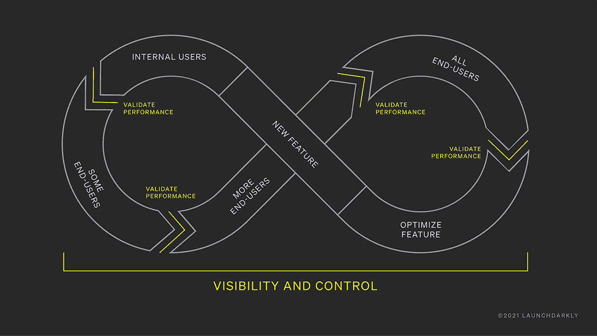

# 向云的迁移为特性标志提供了新的用例

> 原文：<https://thenewstack.io/moving-to-the-cloud-presents-new-use-cases-for-feature-flags/>

虽然这不是一个新概念— [我能找到的关于成功使用功能标志的最老的博客](http://code.flickr.net/2009/12/02/flipping-out/)来自 Flickr，现在已经超过十年了——商业功能管理和实验产品与其他 DevOps 技术相比相对较新，如[持续集成(CI)和持续交付(CD)](https://thenewstack.io/category/ci-cd/) ，它们只是在过去五年左右才进入市场。

功能标志的工作原理是将代码封装在 if 语句中，然后有一个过程(如从配置文件中读取值)来确定条件值是真还是假。这个例子摘自 Java 的[launch crystally](https://launchdarkly.com/?utm_content=inline-mention)文档，展示了它的样子:

```
LDUser user  =  new LDUser("user@test.com");

boolean showFeature  =  client.boolVariation("your.feature.key",  user,  false);

if  (showFeature)  {

// application code to show the feature

}

else  {

// the code to run if the feature is off

}

```

当然，使用自主开发的解决方案很容易做到这一点，但领先的功能管理供应商(如 LaunchDarkly、AB Tasty 和 Optimizely)在此基础上添加了一系列功能，如高级受众定位、渐进式发布管理、安全和隐私功能，以及管理功能标志生命周期的工具。

结合使用这些功能，可以精确地控制某个功能向给定百分比或部分用户的逐步推广，从而将部署与发布分开。

因此，功能管理可用于更好地了解给定功能在生产中的表现，对其实现充满信心，并深入了解用户如何以渐进和受控的方式与之交互。

在她最近在 [Trajectory conference](https://launchdarkly.com/trajectory-2021/) 上的主题演讲中，launch crystally 首席执行官兼联合创始人 [Edith Harbaugh](https://www.linkedin.com/in/edithharbaugh/) 基于经典的 DevOps infinity 循环给出了一个例子，以说明这是如何工作的:首先向内部用户提供一个功能，然后逐渐向越来越多的外部用户发布，从而实现生产测试和 canary 部署。



特性如何向内部用户发布，然后逐渐向外部用户发布，允许在生产中和通过 canary 部署进行测试。(图表由 LaunchDarkly 提供)

## 生产中的测试

生产中的测试曾经有些争议，带有牛仔编程和草率 QA 的含义。此外，正如分布式系统工程师和奥赖利的作者[辛迪·斯里德哈兰](https://twitter.com/copyconstruct)所言，安全地做这件事确实需要非常小心:

“能够在生产中成功和安全地进行测试，需要大量的自动化，对最佳实践的深刻理解，以及从头开始设计系统，使其很好地适应这种形式的测试。”

然而，如果操作正确，它有很大的优势。斯里达哈兰说过:

相比之下，生产中的测试使您的 QA 团队能够获得关于给定特性实际执行情况的真实见解。它还可以突出应用程序其他部分中的意外问题，这些问题可能很难解决，或者很难在其他地方复制。

使用功能标志等工具意味着，如果在流程中遇到问题(例如，新功能导致性能下降或客户参与度下降)，只需关闭标志，就可以立即关闭某个功能，而无需中断用户或重新部署。

这个过程可以使用来自[监控](https://thenewstack.io/category/monitoring/)和可观察性工具(如 Datadog 和[蜂巢](https://www.honeycomb.io/?utm_content=inline-mention))的信号实现自动化，如果达到特定阈值，则关闭某个功能，而无需人工干预。

## 特征标志为技术债务

当然，在源代码中插入特性标志的一个不太理想但却很自然的结果是由此积累的技术债务。随着特性标志变得越来越普遍，触及堆栈的更多元素，风险和技术债务的水平都会快速增长。

有鉴于此，在考虑基于供应商的解决方案时，重要的是要考虑该产品提供了什么来更好地管理标志。

最近一份关于特性管理和实验的 Forrester Wave 报告特别表扬了 LaunchDarkly 在这方面的表现。launch crystally 产品包括运行分析的能力，使开发团队更容易看到某个标志是否在使用中，这种功能称为代码引用。

LaunchDarkly 产品营销高级总监 Ravi Tharisayi 告诉新堆栈:“一旦你发现了一个不再需要的标志，你就可以在几下点击中找到存储库和代码行，将其从代码库中删除。”

此功能由一些关于如何从工作项和流程的角度管理标志移除的建议来补充。

## 基础设施作为一项功能

虽然通常用于纯代码特性和 UX 实验，但向云的转移和作为代码的基础设施的兴起开辟了更多的用例。

Tharisayi 说:“在云世界中，堆栈的各个层相互交织，你可以利用这个概念，真正扩展功能的范围，将这些相同的概念应用到基础设施层。”

在她在 Trajectory 的演讲中，Harbaugh 描述了 launch crystally 自己的数据库迁移，该供应商从基于 Postgres 和 [MongoDB](https://www.mongodb.com/cloud/atlas/?utm_content=inline-mention) 的环境迁移到 CockroachDB。通过并行运行旧数据库和新数据库，launch crystally 团队能够降低出错风险，并可以在迁移的每个步骤中监控应用程序性能。

此外，客户支持代理可以深入了解特定客户使用的数据库版本，从而实现更高效的故障排除流程。

正如 [Charlie Custer](https://www.linkedin.com/in/charliecuster/) [在 CockroachDB 博客](https://www.cockroachlabs.com/blog/customer-launchdarkly-database-migration-tips/)上指出的，这种方法提供了更多的优势，包括学习时间:

“转移到一个新的数据库系统可能需要一些思维上的转变，特别是当您从一个遗留的单节点系统转移到一个现代的多云、多区域分布式系统时。您必须给团队足够的时间和空间来试验和进行这些转变，而这只有在您采用分阶段迁移方法并从不太关键的工作负载开始，允许您有一点出错空间的情况下才有可能实现。”

这种相同的分阶段方法——在[扼杀者模式](https://www.cnpatterns.org/development-design/strangle-monolithic-application)上的一种变体——也可以用于从整体架构迁移到基于微服务的架构，以及其他类型的平台迁移活动。

“我们有一个客户将他们的 lambda 处理转移到了 [AWS](https://aws.amazon.com/?utm_content=inline-mention) 新的 [Graviton2 处理器](https://aws.amazon.com/ec2/graviton/)，”Tharisayi 告诉新的堆栈使用特征标志，他们能够测试出该服务是否能够为他们省钱。这是在一个比你通常想到的特性更深的层次上。"

在某种意义上，这又回到了无限循环。云之旅永远不会真正结束；随着特定云提供商提供新服务，使用功能标志作为以低风险方式尝试这些服务的能力可以帮助开发人员不断优化他们的整个应用程序，包括其架构和运行的底层基础架构。

<svg xmlns:xlink="http://www.w3.org/1999/xlink" viewBox="0 0 68 31" version="1.1"><title>Group</title> <desc>Created with Sketch.</desc></svg>