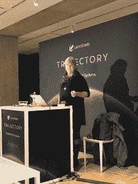

# Mozilla BugBug 为 Bugzilla 增加了机器学习

> 原文：<https://thenewstack.io/mozilla-bugbug-adds-machine-learning-to-bugzilla/>

Emma Humphries，Mozilla 的 Bugmaster

火狐开源网络浏览器背后的组织 [Mozilla](https://www.mozilla.org/en-US/) 的 bug masterEmma Humphries 说，将机器学习(ML)加入 Bugzilla 解决了几个问题。 [Bugzilla](https://www.bugzilla.org/) 是一个有 20 年历史的 bug 跟踪系统，工程师和 Firefox 用户可以在这里提交他们发现的 bug。

Mozilla 新的 ML 平台 BugBug ，自动评估每一个新的 Bug，并自动将其分配给正确的产品和组件。这只是这项工作的第一阶段。

Bugzilla 是一个嘈杂的数据源，Marco Castelluccio 在他的 GitHub 博客上写道，这不是一个 bug，这是一个特性。

“bug 被用来跟踪任何东西，从‘为贡献者 X 创建一个 LDAP 账户’到‘打印第 Y 页不起作用’，”他写道。“这使得很难知道哪些 bug 是 bug，哪些 bug 不是 bug，例如功能请求、元 bug 或重构等等。”

Bugzilla 使用一个 bug 分类系统，给每个 bug 贴上标签。60%的 bug 被提交 bug 的用户标记在一个通用组件中，但是 bug 只被从一个特定的组件中挑选出来进行处理。

汉弗莱斯说:“人们只是没有发现一般性的错误。

Castelluccio 在“[教导机器对 Firefox Bugs 进行分类”](https://hacks.mozilla.org/2019/04/teaching-machines-to-triage-firefox-bugs/)的帖子中写道，“为了帮助正确的 Firefox 工程师快速发现 bug，我们开发了 BugBug，这是一个机器学习工具，它会自动为每个新的未分类的 bug 分配一个产品和组件。”

汉弗莱斯说，并不是所有提交 Bug 的人都是工程师，所以对来自不同背景的人编写的 bug 进行 bug 培训是有危险的。他们不可能从 150 万个错误中输入数据，然后简单地训练。

她说，挑战在于如何明智地使用机器学习。

## 现代化 Bugzilla

但是在 BugBug 被创造出来之前，Bugzilla 本身需要一些根本性的改变。

Humphries 在大约四年前到达时继承的是一个经过调整和定制的系统，可以满足 Mozilla 各个团队的即时需求，但无法扩展。由于系统中有超过 150 万个错误，扩展不再是一个选项。

因为 Bugzilla 有一个数据库和访问控制列表，它可以用来跟踪 bug 和任务。二十年前，SaaS 还不是一个东西，所以多年来，该系统被整个公司的团队采用，从人力资源到法律，甚至是福克西的吉祥物请求，所有人都要求定制以适应他们的特定用例。这些都是临时建立的，汉弗莱斯继承了一个笨拙的系统，迫切需要凝聚力和现代化。

另一个问题是错误的优先排序方式。汉弗莱斯说，事实证明，投票是一种糟糕的功能优先排序方式。正如 Luis Villa 所指出的，“投票最终与实际的 bug 有效性、重要性或严重性没有任何关系。”

然后是元数据爆炸的问题。

Humphries 首先后退一步，从元数据开始，将系统作为一个整体进行审查。随着时间的推移，添加了如此多的可选元数据，以至于“我开始浏览元数据并问‘这有必要吗？’，”她说。

Humphries 还回顾了在整个系统中跟踪一个 bug 意味着什么。她问了一些基本问题，比如，关键词是指出 bug 的正确方式吗？多州旗帜会更好吗？

她说，因为关于 bug 是回归的问题是非二进制的，所以关于如何标记 bug 有几个问题需要回答。“你真正想知道的，”汉弗莱斯说，“是‘哪一次失误造成的？’"

## 结构

Bugzilla 内置在 TK/TCL 中，然后移植到 PERL，用 Apache ModPerl 和 MySQL 作为后端。二十年前，这是尖端技术。

跟踪标志是五年前添加的。这些标志可以附加到产品或组件上。他们建立了自己的多值标志，主要用于 Mozilla 内部的细粒度发布管理跟踪。

汉弗莱斯说，基础很牢固，所以在评估后，她决定不拆除重建。她只是在改造和现代化已经存在的东西。

与所有升级一样，Humphries 和她的团队面临的部分挑战是让 Mozilla 员工和志愿者改变他们对变化本身的看法。

“我需要让他们习惯用实验来做实验的想法。任何微小的改变都会遭到如此多的抵制，”她叹息道。

为了帮助这项事业，[劳拉·汤普森，Mozilla 的高级工程总监，](https://www.linkedin.com/in/laurathomson/)创造了一个短语“做更多的纸杯蛋糕”

因为纸杯蛋糕比蛋糕小，所以更容易食用，烘烤时间也更短。他们将这种类比应用于新功能和产品开发本身。

汉弗莱斯说:“增量变化更容易消耗。

该产品每天有三次发布“列车”。工程师和 bug 修复志愿者可以在他们完成后将一个特性放入诺曼底。

Normandy 发送一个遭遇(食谱),如果客户确认匹配，它就会被放到下一列火车上，按照自己的时间表发布。她说，只要你能和诺曼底人对话，你就会得到配方。

她说，这个系统的美妙之处在于，回滚只是意味着发送一个新的配方，而不是发布一个点。“我们发送的是规则，不是代码，”她说。

## “当心豹子”

Humphries 坚持认为所有的改变都应该被很好地记录下来，并且易于查找和使用。为了提醒她的团队这一点，她采用了“当心豹子”的口号。

在道格拉斯·亚当斯的经典科幻小说《银河系漫游指南》中，亚瑟·登特醒来后看到一台推土机准备推倒他的房子，这样他们就可以修建一条高速公路。他被告知计划在地下室的委员会办公室里，在洗手间的一个柜子里，有一个牌子写着“小心豹子”。教训:不要埋没你的文档。

BugBug 的工作正在进行中。Humphries 很高兴添加新的知识，使 BugBug 在各种项目中有用。

来自 Pixabay 的 Lolame 的特征图像。

<svg xmlns:xlink="http://www.w3.org/1999/xlink" viewBox="0 0 68 31" version="1.1"><title>Group</title> <desc>Created with Sketch.</desc></svg>