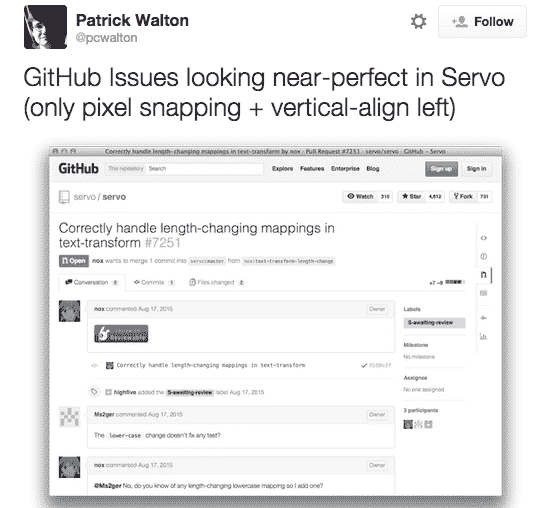
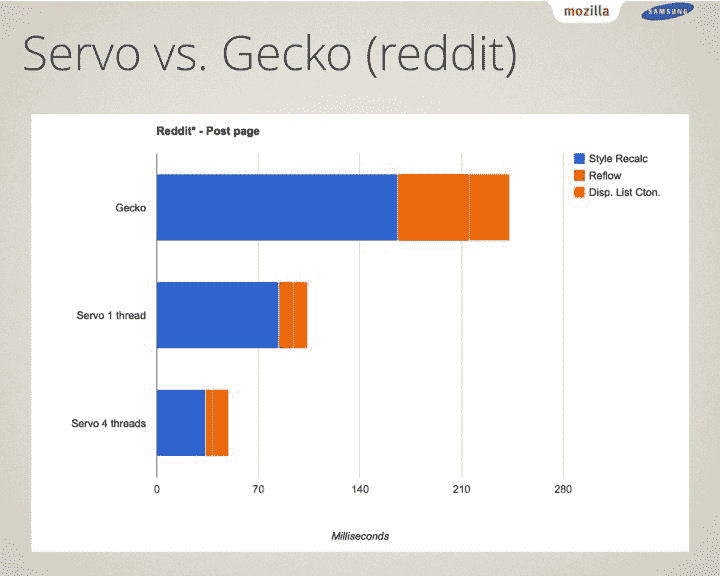

# Mozilla 的伺服让 Rust 发光

> 原文：<https://thenewstack.io/mozillas-servo-lets-rust-shine/>

Mozilla 的下一代服务器布局引擎 Servo 现在几乎完美地呈现了 GitHub.com，展示了使用 [Rust 编程语言](https://www.rust-lang.org/)进行的优化。

Mozilla 研究员帕特里克·沃尔顿(Patrick Walton)周一在 Twitter 上用截图展示了 Servo 的进展。

【T2

这标志着 Servo 的一个重要里程碑，因为它的进步继续与它用现代标记呈现大型网站的能力。Servo 计划在 2015 年发布 alpha 版本，其 2015 年第三季度路线图指向在 Firefox Nightly 中添加对 Rust 组件的支持，以及其他小的修复，并继续为其 alpha 版本而努力。

Mozilla 的目标是用那些利用 Rust 与 Servo 共享的组件替换使用 Gecko 的组件。Rust 不仅速度快，而且可以防止几乎所有的分段错误(segfaults)，运行时间和线程最少，没有数据竞争。Rust 使用多线程的方式使得网页渲染速度更快，同时也更安全。Servo 更新其 Gecko 组件以利用 Rust 不仅会改善开发人员使用引擎的体验，还会改善团队在其管道中使用它的体验。

## 为什么生锈？

Rust 因其编译工具而受到 C++社区的关注。Rust 编译器不会强迫用户调试 segfaults，而是警告用户他们的代码在编译时不稳定。它的包管理器是以这样一种方式设置的，用户可以很容易地添加库和依赖项。Rust 的借用者检查器和对内存安全的处理意味着这种语言不是一个下午就能学会的，从而确保那些真正希望学习这种语言的人能够写出更高效的代码。Rust 严格的编译器确保开发人员编写干净、有条不紊的代码，如果代码通过了编译，人们可以放心地按预期工作。

伺服测试将在 2015 年继续进行，Mozilla 将解决性能测试、编译数据以及解决自动着陆器周期时间的问题。对于希望在自己的 web 渲染项目中使用 Servo 的开发人员，Mozilla 将提供一个稳定的 API/ABI 和一个基于 C 的接口。Servo 的目标是与 Chromium API 兼容。目前没有计划在 Firefox 和 Thunderbird 中用 Servo 取代 Gecko，尽管在看到 Servo 速度测试后，人们可以希望 Mozilla 会考虑这一点。目前，Mozilla 正专注于移动和嵌入式环境中的伺服，而不是桌面应用。三星为 Rust 贡献了一个 ARM 后端，随着开发的继续，Servo 为基于 Android 的网络浏览提供了动力。

## 堆栈管理和移动浏览的未来

在处理如何为堆栈分配内存时，Rust 允许用户微调如何处理堆和堆栈分配。这与 go 形成了鲜明的对比，在 Go 中，编译器利用转义分析来确定元素是否应该进入堆中。Rust 迫使开发人员在编程时主动考虑堆栈分配，而其他语言在默认情况下以可能效率较低的方式这样做——在某些情况下，允许用户掩盖他们的堆栈是如何管理的。Servo 对 Rust 的利用是该语言向前迈出的重要一步，从 Servo 渲染复杂网页的速度可以清楚地看出这一点。

总的来说，Servo 代表了 Rust 巩固自己作为移动和嵌入式环境开发的首选语言的独特机会。Mozilla 利用当今智能手机的强大功能，为响应迅速、安全的网络浏览设立了新的标准。随着每天越来越多的浏览是通过移动设备完成的，Servo 保证会产生影响，不仅是开发人员，那些使用手机与重要的人联系的人也会看到这种影响，而不会出现普通移动浏览器遇到的性能问题。越来越多的人在移动设备上工作——要求他们的手机取代他们过时的技术——或者在旅行时使用笔记本电脑。当我们展望未来时，Servo 可能会将现状转向 Android，其 Rust 主干支持移动开发的基石。

特征图片:bkerensa 的“mozilla logo”由 2.0 在 [CC 下授权。](https://creativecommons.org/licenses/by/2.0/)

<svg xmlns:xlink="http://www.w3.org/1999/xlink" viewBox="0 0 68 31" version="1.1"><title>Group</title> <desc>Created with Sketch.</desc></svg>