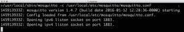

# 了解 MQTT:物联网的消息协议

> 原文：<https://thenewstack.io/mqtt-protocol-iot/>

MQTT (以前的 MQ 遥测传输)是一种轻量级协议，主要设计用于通过低带宽网络连接功率受限的设备。虽然它已经存在了十多年，但 M2M(机器对机器通信)和[物联网](https://thenewstack.io/securing-internet-vulnerable-things/)(物联网)的出现使它成为一个流行的协议。

渴望构建物联网解决方案的开发人员需要学习 MQTT，它正迅速成为将设备连接到云的最受欢迎的协议。亚马逊 Web Services、微软 Azure、IBM Watson 等企业云平台通过 MQTT 对外公开其物联网 PaaS。

本文介绍了构建 M2M 和物联网应用程序所必需的 MQTT 的核心概念。它涵盖了高级概念的基本术语，还有一个入门部分来看看 MQTT 的实际应用。


资料来源:欧洲技术公司

## MQTT 的起源

MQTT 早在 1999 年就由两位工程师创建了——安迪·斯坦福-克拉克和阿尔伦·尼珀。他们不得不发明一种新的协议来通过不可靠的卫星网络连接石油管道。

设计 MQTT 的动机是创建一个轻量级、带宽高效的协议，该协议与数据无关，支持多种服务质量(QoS)。有趣的是，即使在今天，这些也是选择 MQTT 来实现物联网解决方案的相同原因。

2011 年，IBM 和 Eurotech 向名为 Paho 的 Eclipse 项目捐赠了 MQTT。2013 年提交给 OASIS 进行标准化。协议规范的最新版本 3.11 已经成为一个 [OASIS 标准](http://docs.oasis-open.org/mqtt/mqtt/v3.1.1/os/mqtt-v3.1.1-os.html)。

## 概念和术语

熟悉面向消息的中间件(MOM)的开发人员，比如 [RabbitMQ](https://www.rabbitmq.com/) 、 [Redis](https://thenewstack.io/why-the-redis-ecosystem-is-flourishing/) 和 [Apache Qpid](https://qpid.apache.org/) 可能会将 MQTT 误认为是 MOM 的另一种实现。理解 MQTT 只是一个与消息队列或发布/订阅实现无关的协议是很重要的。MQTT 不能代替 RabbitMQ 或任何企业发布/订阅引擎。

MQTT 实现和 MOM 之间的根本区别是消息被存储和交付。与 MOM 不同，MQTT 不是为了处理持久和持久的消息。不能考虑将其用于实现存储转发模式。传统的 MOM 是为在企业应用程序之间可靠地传递消息而设计的，而 MQTT 是一个更简单的协议，只有五个用于连接设备的 API。它不能用作交易系统的中间件。

MQTT 使用发布/订阅模式将感兴趣的各方联系起来。它通过分离发送者(发布者)和接收者(订阅者)来实现。发布者向一个中心主题发送消息，该主题有多个订阅者等待接收该消息。发布者和订阅者是自治的，这意味着它们不需要知道彼此的存在。


由于 MQTT 是一个规范，它可以被现有的 MOM 软件支持。RabbitMQ 支持 MQTT 和其他协议，比如 HTTP 和 AMQP。Azure IoT Hub 是一个物联网平台如何支持 MQTT 的例子。

我们先来了解一下 MQTT 的术语。

*   **客户端**–任何通过网络连接到中央代理的发布者或订阅者都被认为是客户端。需要注意的是，MQTT 中有服务器和客户机。发布者和订阅者都被称为客户端，因为他们连接到中央服务。客户端可以是持久的，也可以是暂时的。持久客户端维护与代理的会话，而代理不跟踪临时客户端。客户端通常通过库和 SDK 连接到代理。有十几个库可用于 C、C++、Go、Java、C#、PHP、Python、Node.js 和 Arduino。

*   **代理**–代理是从发布客户端接收所有消息并将其发送给订阅客户端的软件。它保持与持久客户端的连接。由于代理可能会成为瓶颈或导致单点故障，因此通常为了可伸缩性和可靠性而进行集群。由实现者决定如何创建可伸缩的代理层。MQTT 代理的一些商业实现包括 [HiveMQ](http://www.hivemq.com/) 、 [Xively](https://xively.com/) 、 [AWS IoT](https://aws.amazon.com/iot/) 和 [Loop](http://litmusautomation.com) 。

*   **主题**–MQTT 中的主题是客户端连接的端点。它充当发布和订阅消息的中央分发中心。在典型的 MOM 中，主题是在发布者和订阅者连接到端点之前创建的。在 MQTT 中，主题是发布者和订阅者都知道的位置。它是在任一客户机与代理建立连接时动态创建的。主题是简单的、分层的字符串，用 UTF-8 编码，用正斜杠分隔。例如，建筑物 1/房间 1/温度和建筑物 1/房间 1/湿度是有效的主题名称。订阅者可以通过通配符选择订阅特定主题或所有子主题。订阅 building1/+/temperature 将自动订阅该建筑中所有房间的温度主题。类似地，building1/#/将匹配 building1 下的所有可用主题。有关通配符的更多细节，请参考 MQTT 规范。

*   **连接**–MQTT 可以被基于 TCP/IP 的客户端使用。经纪人曝光的标准端口是 1883，不是安全端口。那些支持 TLS/SSL 的代理通常使用端口 8883。为了安全通信，客户端和代理依赖于数字证书。AWS IoT 是 MQTT 的安全实现之一，它要求客户端使用 X.509 证书。

## MQTT 实践

了解了关键概念和术语之后，让我们建立测试平台来看看 MQTT 的运行情况。我们将安装代理和客户机，以查看消息是如何发布的。这会帮助你理解 MQTT 的本质。

### 安装代理

最简单的 MQTT 代理以名为 [Mosquitto](http://mosquitto.org) 的开源软件的形式存在。在装有 [Home Brew](http://brew.sh) 的 Mac 上，你可以用一个简单的命令来安装 mosquito——Brew install mosquito。对于 Windows 和 Linux，请参考[官方安装指南](http://mosquitto.org/download/)。

Mosquitto 二进制文件可以在 **/usr/local/sbin** 中找到。它还需要一个配置文件，其中包含绑定地址、端口、客户端过期时间和最大连接数等设置。可以使用位于**/usr/local/etc/mosquitto/mosquitto . conf**的默认配置文件，无需任何修改。

要在 Mac 上启动 Mosquitto，请运行以下命令:

```
/usr/local/sbin/mosquitto  -c  /usr/local/etc/mosquitto/mosquitto.conf

```

这将使用默认设置启动 Mosquitto。您应该会看到类似如下的输出:



### 安装客户端

现在代理已经启动并运行了，让我们启动客户端，它们都充当发布者和订阅者。尽管 Mosquitto 附带了用于发布/订阅的命令行工具，但使用 GUI 还是很有趣的。让我们从[http://mqttfx.jfx4ee.org](http://mqttfx.jfx4ee.org)下载名为 MQTT.fx 的基于 Java 的 MQTT 客户端。

在 Mac 上创建两个名为 pub 和 sub 的文件夹，然后将 MQTT.fx 应用程序从下载的 DMG 映像复制到这两个文件夹中。每个副本分别代表发布者和订阅者。


启动 MQTT.fx 应用程序的两个副本，并将它们配置为与本地 Mosquitto 代理对话。单击齿轮图标配置连接设置。单击“连接配置文件”窗口中的+号，添加一个连接到在本地主机上运行的 Mosquitto 的配置文件。


确保发布者和订阅者使用唯一的客户端 id。将 MQTT.fx 的两个实例连接到 Mosquitto 代理。点击 subscriber 应用程序的 Subscribe 选项卡，在点击 Subscribe 按钮之前输入 **test/topic1** 。在 publisher 中，添加相同的主题， **test/topic1** *，*，并在其下方的文本框中键入消息。


您应该看到消息从发布者流向订阅者。您可以启动其他订阅者来收听同一主题。最后，切换到命令窗口，查看 Mosquitto 对客户端事件的确认。


我们已经在本地机器上成功地设置了代理、发布者和订阅者。我们还看到了如何向订阅者发布消息。

## 摘要

MQTT 是 M2M 和物联网应用的首选协议。基于发布/订阅模式，它简化了设备之间的连接。本文试图向您介绍 MQTT 的基础知识。我们将在接下来的文章中讨论 MQTT 的高级概念，包括 QoS、安全性、LWT、持久性以及与 WebSockets 的集成。

<svg xmlns:xlink="http://www.w3.org/1999/xlink" viewBox="0 0 68 31" version="1.1"><title>Group</title> <desc>Created with Sketch.</desc></svg>