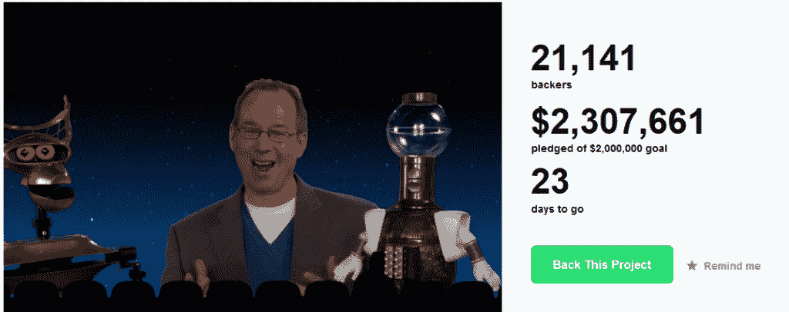
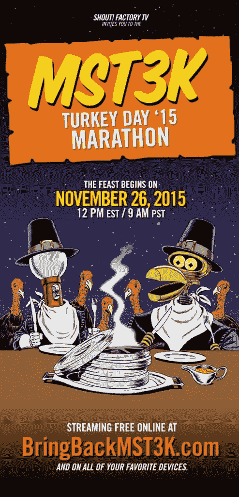

# MST3K 在 Kickstarter 集会上复活，感恩节回归

> 原文：<https://thenewstack.io/mst3k-revived-in-kickstarter-rally-returns-for-thanksgiving/>

这个感恩节，乔尔·霍奇森有很多值得感激的事情。

11 天前，Kickstarter 收到了“一个叫 Joel 的家伙”的奇怪访问，陪同他的是他的两个机器人朋友，Crow 和 Tom Servo。“神秘科学剧院 3000”的创作者[要求粉丝](https://www.kickstarter.com/projects/mst3k/bringbackmst3k)为在线复出提供资金，两天内他就筹集了超过 150 万美元。在接下来的五天里，他跨越了神奇的 200 万美元门槛，超过 2 万名该剧最喜爱的粉丝全额资助了三集全新剧集的制作。

【T2

“我们有电影标志了！”霍奇森[在推特](https://twitter.com/MST3K/status/666431369795473412)上发文，以示感谢。该系列的粉丝们记得那个哔哔声信号，它总是让乔尔和他的机器人争先恐后地回到他们的剧院，在那里超过 11 年，他们以剪影的形式出现，质问 197 部特别糟糕的电影。现在新的活动还剩三周，霍奇森希望资助更多的节目——每增加 110 万美元，就资助三集。他的视频暗示，他们也希望被另一个有线电视网络——或者一个在线平台——接下来更长时间地播放，这样新一代人就可以找到它。就像你一样。”

他将通过主持另一场经典剧集的在线马拉松来庆祝这个感恩节，有霍奇森的新镜头，也有一些粉丝的新来信。根据霍奇森发布的 Kickstarter 更新，去年有超过 100，000 人收听。

这是一个始于 27 年前的传统，当时该节目于 1988 年感恩节首次出现在明尼阿波利斯当地的 KTMA 电视台。霍奇森只有 28 岁，但他很快就开始了长达 30 个小时的感恩节马拉松，直到 1991 年这部剧被新的喜剧中心网络选中。

这是电视网的首批节目之一，比《南方公园》第一集播出还早六年，比乔恩·斯图尔特 1992 年作为“短时间注意力跨度剧场”的联合主持人开始他的电视生涯还早一年。1997 年《MST3K》在喜剧中心被取消后，粉丝们发起了一场书面活动，给科幻频道留下了深刻的印象，从而挽救了这部电视剧，并在那里继续播放了三季。它最终在 1999 年结束——尽管重播一直持续到 2004 年。(当时，粉丝们发起了另一次拯救该节目的尝试——甚至为《综艺》杂志上的一则广告付费——但没有成功。)

虽然最初的演员都被邀请在这些全新的剧集中客串，但将有新的演员为机器人和另一位“主持人”配音。已经宣布的是乔纳·雷 Nerdist 播客的三位主持人之一(他已经在 Kickstarter 视频中出现)。

霍奇森在 Kickstarter 更新中解释道[“为了这部剧的利益，是时候更新一下了。乔尔和他后来的替代者迈克·尼尔森都拍摄了超过 100 集，“我们需要一个新的一代的新主持人。”](https://www.kickstarter.com/projects/mst3k/bringbackmst3k/posts/1415162)

当然，其他一些实体也从这场运动中受益。根据霍奇森在[发布的最新消息，第一笔 200 万美元中，16 万美元将用于 Kickstarter 和信用卡处理器。这是 8 %,而另外 27%将用于资助和运送所有 t 恤和咖啡杯，作为 Kickstarter 对捐款超过 25 美元的人的“奖励”。](https://www.kickstarter.com/projects/mst3k/bringbackmst3k/posts/1413188)

众筹已经成功地复兴了其他电视节目，包括《维罗妮卡·火星》(Veronica Mars)、《阅读彩虹》(Reading Rainbow)和《超级士兵》(Super Troopers)，乔尔在一个在线视频中讲述了他的情况，称他花了过去五年的时间致力于复兴该节目。

“现在，这不是由我或坐满高管的会议决定的。这真的取决于你。现在粉丝有力量了！”

这个主题可以追溯到该节目 1988 年的起源。“甚至当它还在 KTMA 的时候，观众们…就开始录下来给他们的朋友看，”MST3K 官方维基回忆道。“这对于让人们收听这个奇怪的时间点有很大的影响。在喜剧《中央岁月》的前几季中，人们向这些早期的推广者致敬，称赞他们“继续循环播放磁带”"

现在，MST3K 的 Kickstarter 活动进入了一个 27 年后的新世界，有了一个新的口号:“继续传播网址”

图片来自 [MST3K](http://mst3k.com/) 。

<svg xmlns:xlink="http://www.w3.org/1999/xlink" viewBox="0 0 68 31" version="1.1"><title>Group</title> <desc>Created with Sketch.</desc></svg>