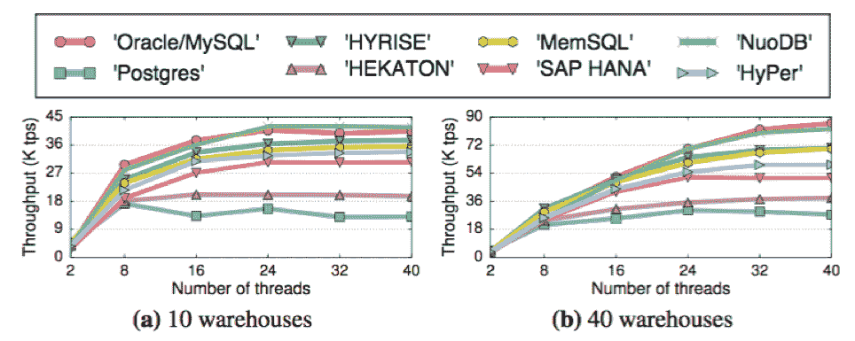
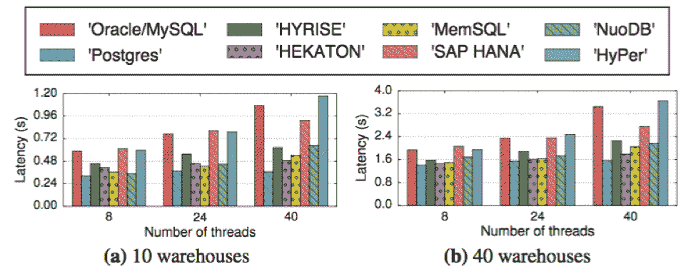

# 多版本并发控制的数据库设计决策

> 原文：<https://thenewstack.io/multi-version-concurrency-control-mvcc-design-decisions/>

 [米莲娜·伊万诺娃，SQL 团队，NuoDB

作为 NuoDB 的 SQL 团队的软件工程师，米莲娜·伊万诺娃的工作重点是 SQL 查询的优化。米莲娜有研究背景，在 CWI 的列存储主内存系统 MongoDB 上工作了几年，是荷兰电子科学中心的数据库技术主管，负责数据库技术在大科学数据上的应用。](https://www.nuodb.com) 

多版本并发控制， [MVCC](https://www.nuodb.com/techblog/mvcc-part-1-overview) ，是当今最流行的在不牺牲可串行化的前提下最大化并行性的方案。D.P. Reed 在 1979 年的一篇博士论文中首次提到了它，并于 1981 年首次在 InterBase(后来开源为 [Firebird](https://www.firebirdsql.org/en/interbase-public-license/) )上实现，后来又在 [Oracle](https://www.oracle.com/database/index.html) 、PostgreSQL 和 [MySQL InnoDB 引擎](https://dev.mysql.com/doc/refman/5.7/en/innodb-storage-engine.html)上实现。很多新的事务型 DBMS 也对 MVCC 青睐有加: [SAP HANA](https://www.sap.com/products/hana.html) ， [MemSQL](https://www.memsql.com/) ，[HyPer](http://hyper-db.com/)(2016 年被 Tableau 收购[，微软](https://www.tableau.com/about/press-releases/2016/tableau-acquires-hyper) [Hekaton](https://www.microsoft.com/en-us/research/publication/hekaton-sql-servers-memory-optimized-oltp-engine/) 在线事务处理引擎。在 MVCC 之前，数据库使用仅基于锁定的并发控制方法。

我公司的技术， [NuoDB](https://www.nuodb.com) ，[也使用 MVCC](https://www.nuodb.com/techblog/mvcc-part-1-overview) ，最近在 2017 年 VLDB 超大型数据库会议上，[在一次演讲中提到了使用多版本并发控制的数据库系统](http://www.vldb.org/pvldb/vol10/p781-Wu.pdf)(MVCC)。

MVCC 系统有几种设计选择，它们具有不同的权衡和性能行为。MVCC 遗留系统的设计受到了面向磁盘的单核环境的影响。本次 VLDB 演讲的重点是多核内存数据库中的 MVCC 可扩展性，因为同步多个数据版本的开销可能会超过多版本的优势。来自新加坡国立大学的吴迎军和来自卡耐基梅隆大学的安德鲁·帕夫洛团队的论文分析了 MVCC 的四个关键设计决策:并发控制协议、版本存储、垃圾收集和索引管理。

## 并发控制协议

分析了四种并发控制协议:

1.  原始时间戳排序(MVTO)算法，使用事务标识符预先计算序列化顺序。
2.  乐观并发控制(MVOCC)算法基于事务不太可能冲突的假设。它们分为三个阶段:读取、验证和写入，并且该协议最大限度地减少了事务持有元组锁的时间。这个协议用于 MemSQL、HyPer 和 MS Hekaton。
3.  在两阶段锁定(MV2PL)协议中，每个事务在被允许读取或修改当前元组版本之前获取该版本的锁。该协议用于 Oracle、MySQL、Postgres、SAP HANA 和 NuoDB。
4.  Postgres 中实现的串行化证明协议(Serializable Snapshot Isolation，SSI)维护一个串行化图，用于检测和移除由并发事务形成的危险结构。

已经提出了其他协议(例如推测性读取、急切更新)。但是它们通常存在性能瓶颈，阻碍了向多核的扩展。

## 版本存储

版本存储描述了系统如何存储物理版本以及每个版本包含的信息。存储方案对垃圾收集和索引管理有影响。

仅追加存储可以有两种版本链:最旧到最新和最新到最旧。无论何时修改元组，最旧到最新的方案(Postgres 和 Hekaton)都不需要更新索引。但是，读取查询可能会很慢，因为它们可能需要遍历很长的版本链才能获得最新的值。最新到最老的版本链(MemSQL 和 NuoDB)最小化了链遍历，因为大多数事务都在最新的元组版本上工作。当链头改变时，所有的索引都必须更新以指向新的版本。这个性能瓶颈可以通过使用一个间接层来解决，这个间接层带有一个到最新物理地址的映射，代价是一些额外的存储。

时间旅行存储(SAP HANA)将旧版本存储在单独的表中。每个元组的主版本存储在主表中，多个版本存储在时间旅行表中。索引不受元组更新的影响，因为它们总是指向元组的主版本。在这种存储方案中，更新将当前主版本复制到时间旅行表，并将新版本放在主表中的相同槽中。

最后，增量存储(MySQL、Oracle 和 HyPer)将主版本存储在主表中，一系列增量版本保存在单独的增量存储中。对于更新只影响有限数量的元组列的工作负载，这种存储模式可以节省内存。

## 碎片帐集

所有 MVCC 系统都需要定期修剪版本链，以管理内存利用率和性能。这种修剪被称为“垃圾收集(GC)”。最常见的 GC 方法是元组级后台清空，其中系统检查每个单独元组版本的可见性。旧的、未使用的版本将被删除。事务级 GC 回收过期事务生成的元组版本。它使用粗粒度的 epoch 内存管理。新的事务被分配给当前活动时期。当一个时期到期并且不再有活动事务时，可以回收在该时期中更新的所有元组版本。因此，事务级 GC 需要跟踪每个时期的事务的读/写集合。

## 索引管理

最后，MVCC 索引管理可以在辅助索引中使用逻辑或物理指针。实验表明，当索引数量增加时，逻辑指针提供的性能比物理指针高 25%到 45%。

## 研究结论

虽然过去的数据库研究传统上侧重于优化并发控制协议，但这项研究发现，协议和版本存储方案对在多核环境中扩展内存 DBMS 有很大影响。

仅附加和时间旅行存储方案受存储器分配方案的效率影响。这可能会成为一个瓶颈，但作者表明，这可以通过在每个内核上划分内存空间来解决。增量存储方案对于事务性工作负载表现良好，尤其是当修改的属性比例很小时。但是，它的表扫描性能较低，不适合分析性读取密集型工作负载。

作者使用内存中的 DBMS Peloton 来模拟几个现代数据库管理系统中的九个 MVCC 实现。[交易处理性能委员会的](http://www.tpc.org/) [TPC-C 交易工作负载](http://www.tpc.org/tpcc)扩展了一个表扫描查询，用于展示各种 MVCC 设计的整体性能。

在这个实验中，Oracle/MySQL 和 NuoDB 在事务吞吐量方面表现最佳。这两种存储方案——增量存储和仅追加存储，按照从最新到最早的顺序排列，在多核主内存系统中表现出色。两个系统中使用的 MV2PL 协议在高和低争用工作负载下都提供了相对较高的性能。

下一组性能较低的系统(MemSQL 和 HyPer)使用乐观并发协议，这可能会在事务验证阶段(读集分析)带来较高的开销，并在争用时导致更多的中止事务。在一个孤立的实验中，MVOCC 协议显示出中止相对繁重的事务的趋势，从而比其他协议浪费更多的计算工作。

在该实验中具有最低吞吐量的系统，Postgres 和 Hekaton，使用具有从最早到最新版本记录排序的仅附加存储方案，这限制了系统的可伸缩性。

尽管增量存储方案显示出良好的事务处理性能(例如，Oracle 中具有 MV2PL 协议的增量存储)，但是它被显示出在表扫描查询的等待时间方面最差，因为遍历元组版本的链花费了更长的时间(参见图 25)。

一个有趣的观察是，原始的时间戳排序并发控制协议在微基准中显示了针对不同工作负载和争用级别的最平衡的行为。然而，这里研究的当代系统都没有使用这个协议。

垃圾收集的实验证实了它对整个系统性能的重要性。事务级 GC 批量删除过期的版本，减少同步开销，并显示提供高达 20%的吞吐量改进。但是，它会导致吞吐量和内存占用量的波动。

总之，在 NuoDB 中实现的 MVCC 设计选择:MV2PL 协议、仅附加存储方案和索引中的逻辑指针，显示出在事务吞吐量和延迟方面实现了良好的整体性能。

<svg xmlns:xlink="http://www.w3.org/1999/xlink" viewBox="0 0 68 31" version="1.1"><title>Group</title> <desc>Created with Sketch.</desc></svg>