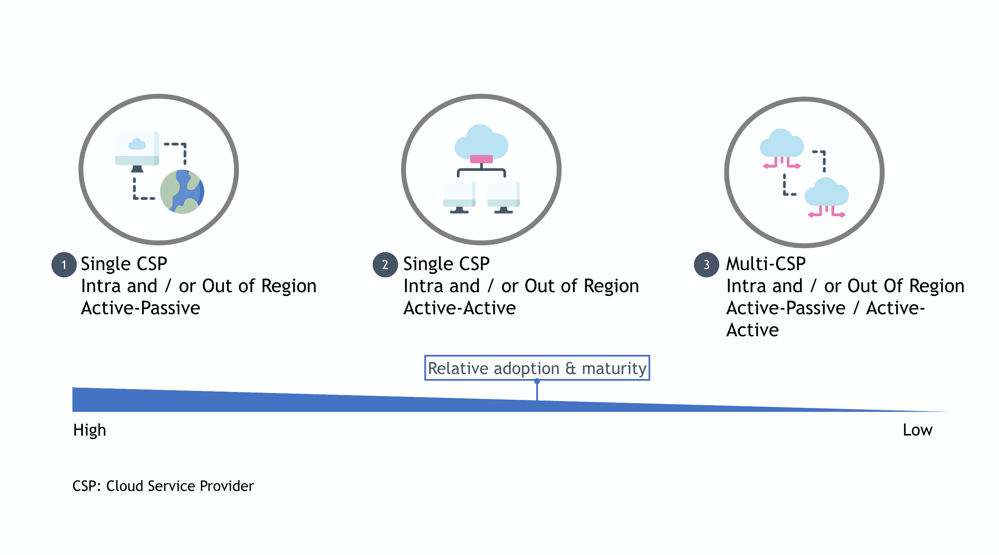
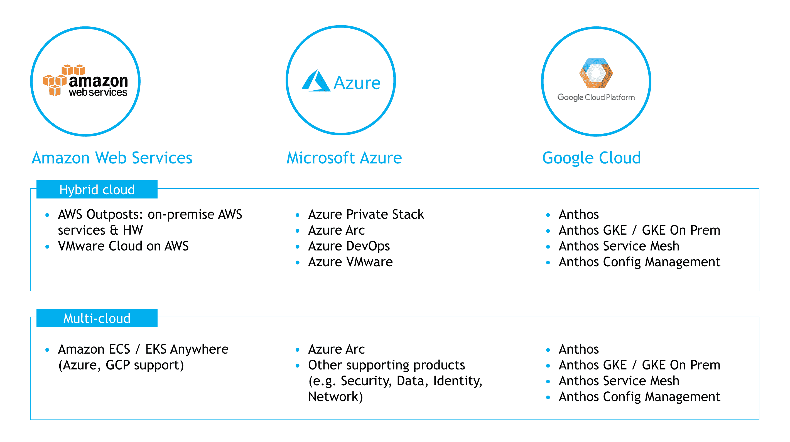

# 多云为云原生弹性模型铺平了道路

> 原文：<https://thenewstack.io/multicloud-paves-the-way-for-cloud-native-resiliency-models/>

虽然用于灾难恢复的传统 IT 基础架构方法已成为规范，但针对核心基础架构和数据的供应商无关服务的承诺和发展正在催生云原生模式，这将显著提高运营弹性。

 [马修·莱博尔德

Matthew Leybold 是波士顿咨询集团(Boston Consulting Group)驻纽约的副总监，负责云计算和 IT 基础设施主题，为波士顿咨询集团(BCG Platinion)北美分公司的金融机构和公共部门垂直行业提供服务。](https://www.bcg.com/about/people/experts/matthew-leybold) 

从历史上看，企业技术弹性植根于数据中心、托管设施以及传统的托管服务提供商(MSP)。业务连续性管理(BCM)和灾难恢复(DR)的最佳实践通常植根于企业 IT 组织、第三方供应商和灾难恢复解决方案组合的企业数据中心、主机托管和托管服务提供商(MSP)设施。

然而，尽管用于灾难恢复的数据中心和传统基础架构方法已成为常态，但面向核心基础架构和数据的供应商无关服务的承诺和发展正在催生云原生模式，这将显著提高运营弹性。

公共云采用率的上升导致低成本、低风险解决方案在备份和恢复模式中的使用大幅增加。在过去的几年中，一些“诞生在云中”的应用程序甚至已经具备了云原生弹性然而，直到最近，由于过去的企业云战略方法，以及云服务提供商(CSP)缺乏可用的工具来减少实现的摩擦，利用真正的混合云和多云作为运营弹性的机制还是不可能的。企业云客户现在将采用多云作为一项战略要务，而通信服务提供商现在提供了让这一梦想成为现实的能力。

云原生恢复能力在传统恢复模式的基础上有所改进，具有以下特性:

*   **提供统一的模板和构建模块:**如果你看看弹性架构的关键组件，它们都是云原生的，其中许多是用于生产运营的标准商业云服务，设计上具有弹性(例如 AWS 自动伸缩以防止故障事件；AWS 直连/ELB，用于支持关键工作负载的基于网络的弹性和工作负载分配；用于长期数据保留和存储的 EBS/S3/冰川)
*   **自动化整个生命周期以包括故障恢复:**从备份流程本身的自动化，到水平扩展等预防性措施，再到故障切换触发的操作处理程序，云原生弹性增强了您的实施和故障切换模型的自动化
*   **使用“运营工具”支持“备份工具”:**面向多云的新 CSP 原生产品，即 [GCP 安索斯](https://cloud.google.com/anthos)，显著减少了多云部署的摩擦，最终将降低跨 CSP 部署和新弹性模型的准入门槛

## 有哪些部署模式可供我们选择？

当云服务提供商(CSP)启用弹性方法时，出现了三种关键的弹性模型:

图 1:云原生弹性模型的范围涵盖了单个到多个云选项。

**主动-被动配置中的单个 CSP。**这是最常见的弹性模式，对于传统应用程序而言，通常涉及单个 CSP，该 CSP 通常充当本地数据中心环境中生产应用程序的故障切换站点。

在云原生模式中，最常见的是对于在云中诞生的应用程序，这也是最受欢迎的恢复模式，适用于允许某些恢复时间目标(RTO)的应用程序，这些目标不需要主动-主动复制模式。这里的关键模型包括热待机、指示灯以及备份和恢复。

在热备用模式中，应用程序的所有基本服务都以最低可行的方式运行，几乎是在完整生产环境的“生产精简”版本中运行。在发生故障或其他触发恢复的情况下，该备用环境可以轻松扩展以处理生产负载，并且可以有效地切换网络更改以将所有流量路由到热备用环境。

在试验光模型中，来自生产应用程序的数据被复制，应用程序环境被存储为模板，可在发生恢复情况时启动。恢复正常生产运行的时间比热待机长，但如果应用程序对停机时间有相对较高的容忍度，这也是一种非常经济高效的恢复方法。

最后，许多企业云客户通过 CSP(例如[亚马逊网络服务](https://aws.amazon.com/?utm_content=inline-mention)’[备份和恢复](https://aws.amazon.com/backup-restore/?nc2=h_ql_sol_use_bnr)、 [S3 冰川](https://aws.amazon.com/glacier/))实现了基本存储和归档模式，以实现企业内部工作负载数据的低成本长期保留。这是早期采用公共云的首批可行用例之一。

评估和关键考虑事项:这种模型通常是一种标准、可靠的弹性方法，适用于执行几分钟到几小时的故障事件是可以容忍的情况。

(注意:在此阅读有关恢复时间目标和恢复点目标[的更多信息)。](https://docs.aws.amazon.com/wellarchitected/latest/reliability-pillar/plan-for-disaster-recovery-dr.html)

**主动-主动配置中的单个 CSP。**在 AWS 配置中也称为多站点，任务关键型应用程序通常需要主动-主动故障转移，这些故障转移可以是跨可用性区域(AZ ),在某些情况下也可以是跨可用性区域(AR ),具体取决于关键程度、区域外恢复(OOR)的监管要求以及延迟容限。

通常，这种型号采用主动-主动配置的单个 CSP 在 AWS 中，这被称为多站点模式，在区域内或 OOR 运行相同的生产工作负载，网络流量切换和规则在 DNS 中建立。恢复点目标(RPO)通常被指定为最后一次异步或同步数据库写入。一些客户尝试使用跨 AWS 美国东西区域的多区域主动-主动设计模式来设计他们的灾难恢复

评估和关键考虑事项:如果您有极其关键的、时间敏感的、超低延迟的生产应用程序，其中“毫秒具有百万美元的影响”，这通常是合适的弹性模型。通常，具有极低延迟的应用程序和延迟敏感型应用程序可以选择区域内模型，甚至是多区域数据中心和云部署的全球部署，以使数据更接近边缘和用户。

**主动-被动或主动-主动配置中的多 CSP。**这种模式类似于主动-主动配置中的单个 CSP，只是跨 AZ 或跨 ar 场景被不同的 CSP 供应商区域所取代。这可以是每个 CSP 的同一个区域(例如 AWS 美国东部-北弗吉尼亚州和 GCP 美国东部-a/b/c)，也可以是不同 CSP 生态系统的跨区域。

评估和关键考虑:在健壮、成熟的 CSP 工具和服务产品出现之前，许多组织在 3-5 年前尝试了这种模型。在现代应用构建中，采用多 CSP 通常是为了在必要时保证或要求进行多云部署(例如，某些 CSP 跨区域的可用性限制，降低依赖单一 CSP 供应商的风险)。然而，每个人都试图用他们自己的定制解决方案，因为这些计划发生在多云工具出现之前，如 GCP Anthos。对于跨国公司和全球性组织来说，这也是一个很好的选择，因为它们出于技术考虑需要进行全球部署，并且为不同国家的客户提供服务，这些国家在数据使用方面有不同的法律和管理。

## 为什么以前不能这样，有哪些拦截器被移除了？

几年前，许多组织尝试实现多云架构和运营模式，但都失败了。然而，新一轮的 CSP 原生工具和服务并不可用，许多其他原因也阻碍了多云的采用，包括:

缺乏可用的工具。如今，随着基于容器的产品、流程编排工具以及每个 CSP 现在都提供服务和工具来促进更加开放和模块化的生态系统，采用多云的摩擦显著降低。许多组织尝试了多云，但失败了，并退回到混合云模型，甚至是“多云”模型，在这种模型中，不同的环境被单独管理。事实上，许多主要的金融机构试图实施自主开发的跨 CSP 模型来降低单一供应商环境的风险，但最终在没有强大、成熟的 CSP 产品支持的情况下退回到混合云模型。

**企业规模的多云需要不切实际的人才和技能要求。**当时，CSP 领域刚刚起步，在没有企业人才模型和技能的情况下，很难与单个 CSP 全面合作，更不用说多个供应商了。现在，大多数组织都在多个 CSP 基础架构和 SaaS 环境中运营，并且拥有构建和运营云原生生态系统所需的更多技能，尽管这仍然是一个持续的挑战。

**“果汁不值得榨”。**由于缺乏工具，许多组织尝试的定制解决方案证明，弹性、灾难恢复规划和工作负载移动性方面的提升被定制解决方案的整个体系的成本和维护开销以及跨环境的相互依赖性所抵消。

## 服务和工具成熟度如何实现云的本地弹性？

[三大通信服务提供商中的每一家都开发并发布了混合和多云服务](https://www.linkedin.com/pulse/each-big-3-cloud-service-providers-officially-what-means-leybold/)，为多云运营模式以及运营弹性的新方法开辟了一个新的可能性世界:

图 X:每个 CSP 供应商都维护着一组向多云发展的服务，支持新的弹性模型。

**谷歌云平台(GCP)。** GCP Anthos 于[2019 年首次推出](https://cloud.google.com/blog/topics/hybrid-cloud/new-platform-for-managing-applications-in-todays-multi-cloud-world)，最初是作为混合云解决方案推出的，通常被认为是支持多云模式的扩展中的第一个市场。根据 Anthos 文档，该堆栈旨在与环境无关，但目前主要适用于在 AWS 上运行的[和在 VMware 基础架构上运行的内部 Anthos 集群，根据](https://cloud.google.com/blog/topics/anthos/multi-cloud-features-make-anthos-on-aws-possible) [Anthos 技术文档](https://cloud.google.com/anthos/docs/concepts/overview)。向多云的战略转移极大地打开了跨供应商和 CSP 弹性模型的窗口，并为寻求实现相同功能的其他 CSP 创造了大量快速追随者。

**微软 Azure。**随着 Azure Private Stack 的发布，微软很早就进入了混合云趋势，在微软生态系统一致的模式中实现了混合云。从那时起，该产品已扩展到 [Azure 混合和多云解决方案](https://azure.microsoft.com/en-us/solutions/hybrid-cloud-app/)，其中包括用于实现单个控制平面跨环境的 Azure Arc、用于将工作负载扩展到边缘的 Azure IoT，以及支撑多云生态系统的众多支持服务(如安全、数据、身份、网络)。

**亚马逊网络服务(AWS)。**多年来，AWS 主要是原生公共云，最终演变为混合云，提供 [AWS 前哨](https://aws.amazon.com/outposts/)服务。最近，[发布的公告](https://acloudguru.com/blog/business/aws-just-went-multi-cloud-and-its-only-the-beginning)显示，亚马逊的 AWS-native container 服务将扩展到支持多种环境，甚至其他 CSP 供应商。目前还不清楚亚马逊 ECS Anywhere(T18)和 EKS Anywhere(T20)是否会在 2021 年的版本中提供与 Azure 和 GCP 产品集一样高的支持多云的程度。然而，这是朝着同一个方向迈出的一大步，并接受了许多客户对多云支持的需求信号，以及最终跨 CSP 的容器可移植性，以提高多云运营模式的弹性。

## 我们应该采取哪些措施来实现和提高云的本机恢复能力？

**行动#1:为您的企业技术生态系统选择合适的云原生“锚”,并围绕它构建弹性模型。**

对于许多组织来说，它仍然是任务关键型业务和企业工作负载及服务(例如身份、加密和密钥管理)的企业数据中心，然后扩展或联合到公共云环境。对于其他初创公司、数字和云原生企业而言，公共 CSP 生态系统通常是绿地环境诞生的地方，也支持任务和业务关键型工作负载以及企业 IT 服务。

当您选择在公共云中锚定时，灾难恢复并不一定更容易。恢复后回切更加复杂。随着云基础架构资源变得更加容易获得，许多公司已经设置了灾难恢复基础架构并准备就绪(例如热故障转移、试点轻型模型)。但是，许多组织没有在多 CSP 或数据中心环境中实践云原生 BC/DR 或替代模型。业务连续性/灾难恢复应该是重中之重，并支持云产品设计、工程和运营自动化您的恢复流程是保护您的业务免受意外事件影响的最佳投资之一。自动化减少了灾难恢复测试的犹豫，降低了风险，提高了测试频率。混沌工程经常作为测试弹性的技术出现；我们还没有看到这种技术在大型科技公司之外的实践中得到应用。

了解每个模型的关键风险领域以及如何减轻这些风险也很重要，例如延迟、数据驻留和安全策略。数据中心和云区域的物理邻近性、混合和多云工具的数据驻留和加密影响，以及相同的安全编排，通常都是许多组织的合规性和准入的高壁垒

点击此处阅读更多内容，更好地了解[在混合和多云环境中保持运营弹性](https://www.linkedin.com/pulse/cloud-service-provider-csp-disruptions-lessons-learned-leybold/)。

**行动#2:了解什么是跨 CSP 供应商服务的商品化，什么是差异化，以及它如何影响弹性规划。**

在设计任务关键型系统时，不仅要考虑功能，还要根据服务选择和架构对弹性的影响进行严格审查。应考虑两个关键因素:

1.  **CSP-本地服务选择:**应该为内部 CSP 选择哪些服务，它们的默认故障转移配置文件是什么(例如区域/地区)？如果供应商还要求额外的设计，则必须内置适当的弹性。值得注意的是，根据众所周知的云最佳实践[共享责任模型](https://aws.amazon.com/compliance/shared-responsibility-model/)和[架构良好的框架](https://aws.amazon.com/architecture/well-architected/)的精神，CSP 供应商有责任遵守 SLA 承诺，包括服务正常运行时间和耐用性。此外，这些服务的体系结构、使用和配置客户必须了解每项服务的故障切换和弹性模型，以及它如何支持该系统故障切换要求所需的更广泛的应用程序体系结构(例如，主动-主动、主动-被动、指示灯)。
2.  **跨 CSP 或环境选择:**哪些服务(或整个应用/数据集)应该成为跨 CSP 或环境故障转移的候选。如果 CSP-native 服务选择不能满足您的应用架构的所有需求，请考虑您的跨 CSP 供应商环境和工具的选择，以及混合安排中的企业数据中心。

**行动 3:做出平衡的云架构选择，最大限度地提高控制力，同时充分利用云弹性的优势。**

云原生和云无关的工具和服务都是必不可少的，随着最近 CSP 的发展，商业和公共部门组织现在拥有了取得成功的工具。

从对 CSP 不可知论、控制和工作负载可移植性的极度渴望，到对一个或多个 CSP 供应商及其环境所能提供的一切的完全接受，存在着一个连续的采用过程。建议根据更广泛的技术战略仔细评估每种采用模式的状况，并做出平衡的云架构和 CSP 服务选择，以支持您的环境和解决方案战略愿景。

许多组织是“偶然”而不是通过深思熟虑的战略实现混合或多云生态系统的，并且正在经历了解其当前数据中心和云足迹的过程，以评估运营弹性的最佳模式以及其他业务需求。在下图中，广泛的选择涵盖了完全云原生的 CSP 嵌入式生态系统以及云无关的解决方案。每个模型都可以完全支持混合和多云架构，但在供应商参与以及工具和服务选择方面有所不同，以构建容灾的服务结构。

对市场的观察显示，每种架构模型都有广泛的采用模式，并有各自的技术和操作权衡。与云无关的模型通常设计有跨 CSP 和数据中心的定制灾难恢复解决方案，同时在 IaaS 堆栈中大量使用公共云服务，通常需要开放标准和可以驻留在任何云环境中的与供应商无关的平台工具。

数据系统的恢复是复杂的。当考虑云服务及其弹性时，请关注您的数据架构。在云中设计高度可用的任务关键型应用程序时，数据一致性、数据遍历成本、主站点和备份站点之间的延迟是关键考虑因素。

在 CSP-native 模型中，组织通常“全身心投入”云，并实例化适当的跨区域甚至跨 CSP 控制，以确保运营弹性。

## 进一步阅读

### CSP 弹性参考:

<svg xmlns:xlink="http://www.w3.org/1999/xlink" viewBox="0 0 68 31" version="1.1"><title>Group</title> <desc>Created with Sketch.</desc></svg>