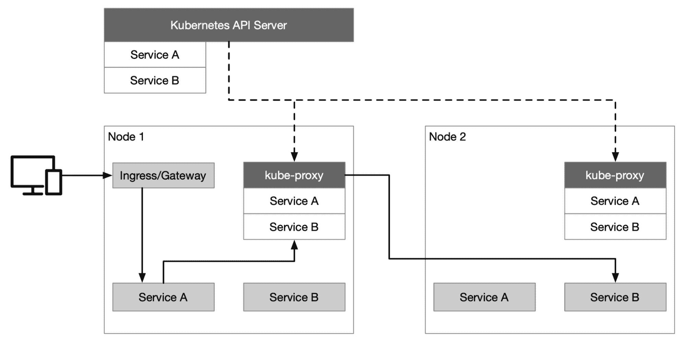
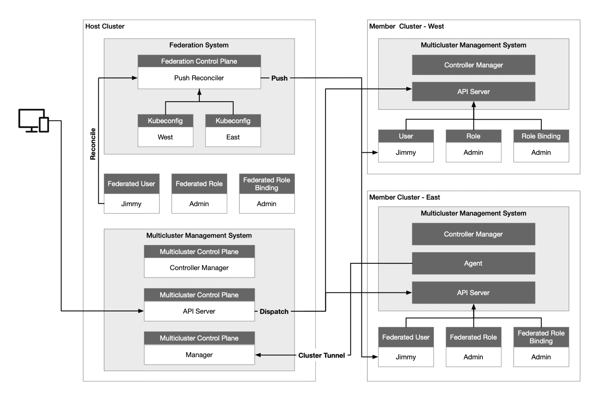
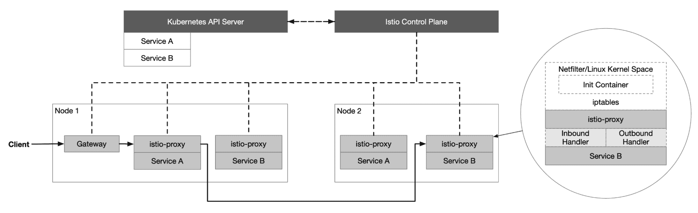
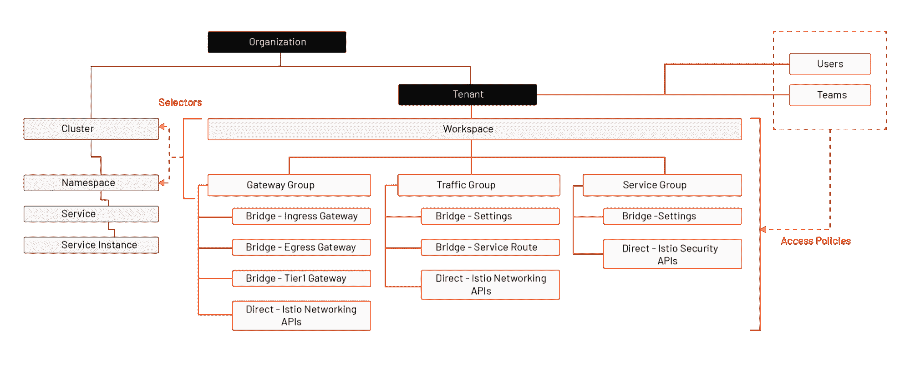
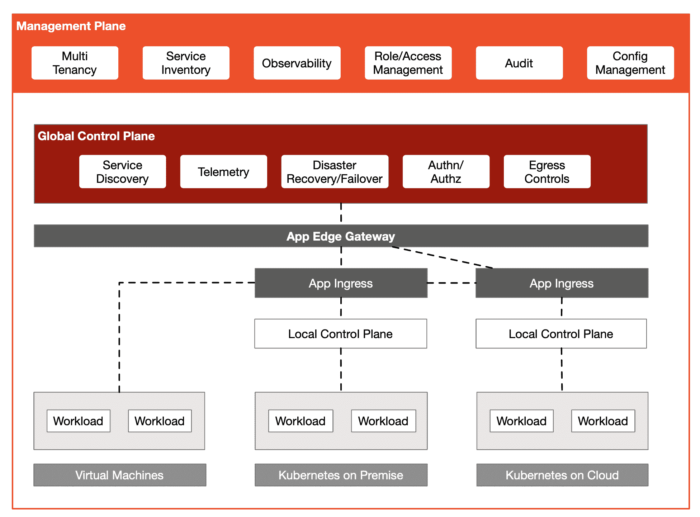

# 使用 Kubernetes 和 Istio 进行多集群管理

> 原文：<https://thenewstack.io/multicluster-management-with-kubernetes-and-istio/>

您是否有多个 Kubernetes 集群和一个服务网络？Kubernetes 集群中的虚拟机和服务需要交互吗？本文将带您了解使用 Kubernetes 和 Istio 服务网格构建混合云的过程和注意事项。Kubernetes 和 Istio 可以一起用于将混合工作负载纳入一个网格，并实现多集群的互操作性。但是基础设施的另一层——管理平面——有助于管理多集群或多网格部署。

## 库伯内特斯

 [吉米·宋

Jimmy 是 Tetrate 的开发者倡导者，CNCF 大使，ServiceMesher 和 Cloud Native Community(中国)的联合创始人。他主要关注 Kubernetes、Istio 和云原生架构。](https://www.linkedin.com/in/jimmysongio/) 

使用 Kubernetes 可以快速部署分布式环境，实现云互操作性并统一云上的控制平面。它还提供资源对象，如服务、入口和[网关](https://kubernetes.io/blog/2021/04/22/evolving-kubernetes-networking-with-the-gateway-api/)，以处理应用流量。Kubernetes API 服务器与集群中每个节点上的 kube-proxy 组件进行通信，为节点创建 iptables 规则，并将请求转发给其他 pods。

假设一个客户端现在想要访问 Kubernetes 中的一个服务，该请求首先被发送到入口/网关，然后根据入口/网关中的路由配置被转发到后端服务(下图中的服务 A)。然后，服务 A 向服务 B 的实例轮询服务 B 请求的流量。最后，服务 A 向服务 B 请求的流量被轮询转发到服务 B 的实例。

【T2

## Kubernetes 多星团

多集群管理最常见的使用场景包括:

*   服务流量负载平衡
*   隔离开发和生产环境
*   分离数据处理和数据存储
*   跨云备份和灾难恢复
*   计算资源灵活分配
*   跨区域的低延迟服务访问
*   避免供应商锁定

一个企业内通常有多个 Kubernetes 集群；由 [Multicluster SIG](https://github.com/kubernetes/community/blob/master/sig-multicluster/README.md) 开发的 Kubernetes 集群联盟的 [KubeFed](https://github.com/kubernetes-sigs/kubefed) 实现支持多集群管理功能，允许通过同一界面管理所有 Kubernetes 集群。

使用集群联合时，需要解决几个一般性问题:

*   配置需要联合的集群
*   API 资源需要跨集群传播
*   配置如何将 API 资源分发到不同的集群
*   在集群中注册 DNS 记录以实现跨集群的服务发现

以下是用于 [KubeSphere](https://kubesphere.io/) 的多集群架构，这是最常用的 Kubernetes 多集群管理架构之一，其中主机集群充当控制平面，有两个成员集群，West 和 East。

【T2

主机集群需要能够访问成员集群的 API 服务器，但是不需要成员集群之间的网络连接。主机集群独立于其管理的成员集群，并且成员集群不知道主机集群的存在。这样做的好处是，当控制平面出现故障时，成员集群不会受到影响，部署的负载仍然可以正常运行，不会受到影响。

主机集群还承担 API 门户的角色，主机集群将资源请求转发给成员集群——这样便于聚合，也便于统一的权限认证。我们看到主机集群中有一个联合控制平面，推送协调器将身份、角色和角色绑定从联合集群传播到所有成员集群。

## Istio 服务网格

当我们在 Kubernetes 中运行多语言、多版本的微服务，并且需要更细粒度的 canary 发布和统一的安全策略管理来实现服务间的可观察性时，可以考虑使用 Istio 服务网格。Istio 通过使用 IPTables 透明地拦截进出应用的所有流量，并绕过主要的 kube 代理负载平衡，实现了从应用层到集群中其他支持服务网格的服务的智能应用感知负载平衡。Istio 控制平面与 Kubernetes API 服务器通信，以获取集群中所有已注册服务的信息。

下图展示了 Istio 的基础，其中所有节点都属于同一个 Kubernetes 集群。

您可能最终拥有至少几个 Kubernetes 集群，每个集群都托管微服务。Istio 的多集群部署有多种[部署模式](https://istio.io/latest/docs/setup/install/multicluster/)——取决于网络隔离、主部署和备份部署——这可以在使用 Istio Operator 进行部署时通过声明来指定。集群中这些微服务之间的通信可以通过服务网格来增强。在集群中，Istio 提供了通用的通信模式来提高弹性、安全性和可观察性。

以上都是关于 Kubernetes 上的应用程序负载管理，但是对于虚拟机上的遗留应用程序:如何在同一个平面上管理它们？Istio 支持虚拟机上的应用程序，那么我们为什么需要管理平面呢？

## 管理平面

要管理网关、流量和安全分组，并将它们应用于不同的集群和名称空间，您需要在 Istio 之上添加另一个抽象层:管理平面。下图显示了 Tetrate Service Bridge (TSB)的多租户模型。TSB 使用下一代访问控制(NGAC)——一种细粒度的授权框架——来管理用户访问，并促进零信任网络的构建。

【T2

Istio 提供工作负载识别，受强大的 mTLS 加密保护。这种零信任模型优于基于拓扑信息(如源 IP)信任工作负载。用于多集群管理的通用控制平面构建在 Istio 之上。然后添加一个管理平面来管理多个集群，提供多租户、管理配置、可观察性等。

下图显示了 Tetrate 服务桥的架构。

## 摘要

Kubernetes 实现了异构集群的互操作性。Istio 将容器化和虚拟机负载纳入单个控制平面，以统一集群内的流量、安全性和可观察性。然而，随着集群数量、网络环境和用户权限变得更加复杂，需要在 Istio 的控制平面之上构建另一个管理平面(例如， [Tetrate Service Bridge](https://www.tetrate.io/tetrate-service-bridge/) )用于混合云管理。

<svg xmlns:xlink="http://www.w3.org/1999/xlink" viewBox="0 0 68 31" version="1.1"><title>Group</title> <desc>Created with Sketch.</desc></svg>