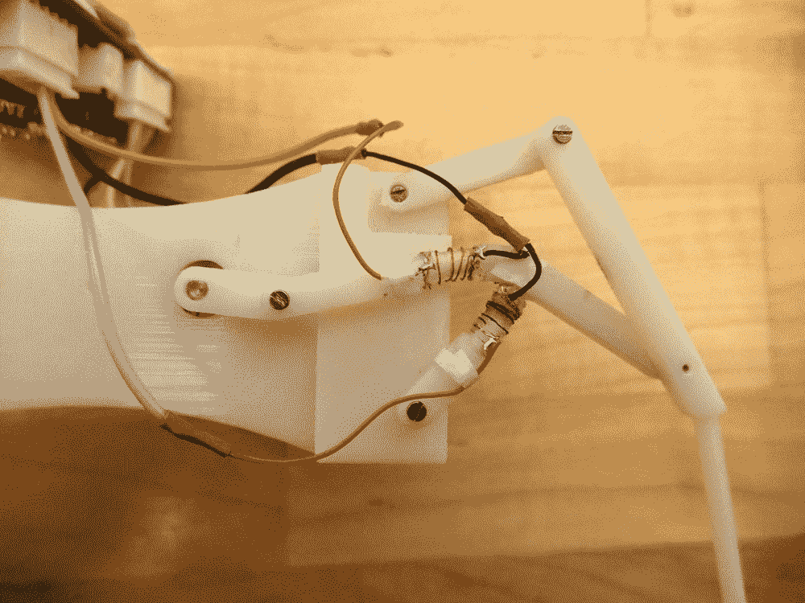

# 多功能机器人通过融化自己的关节来变形

> 原文：<https://thenewstack.io/multifunctional-robot-shapeshifts-by-melting-its-own-joints/>

自然界的进化通常被描述为“适者生存”，即那些最能适应周围环境的人更有可能生存和繁衍。例如，青蛙是一个很好的例子，它进化成了尽可能多才多艺的生物，它的生物发展导致它有腿，可以走路、跳跃和游泳，以躲避捕食者，并获得更广泛的食物。

因此，在不断寻求设计更好、更通用的机器的过程中，机器人专家从大自然中寻找灵感是有道理的。为了创造一种可以在各种环境下执行各种功能的多模态机器人，科罗拉多州立大学[的研究人员开发了一种小型行走机器人，它可以实际上“融化”其关节机械结构的一部分，从而允许它以不同的方式移动。观察它是如何工作的:](http://www.engr.colostate.edu/~zhao/)

[https://www.youtube.com/embed/HOeQnwz8zmU?feature=oembed](https://www.youtube.com/embed/HOeQnwz8zmU?feature=oembed)

视频

在最近发表在 IEEE Robotics&Automation Letters 上的一篇论文中，该团队解释了他们的自适应机器人如何通过使用电流熔化和重新固化其关节来实现各种运动方式。该机器人由 3D 打印的塑料外壳制成，其中包含电源和其他电子设备。最重要的是，这个机器人有由 3D 打印的聚乳酸(PLA)制成的关节腿，这是一种生物可降解和生物活性的热塑性聚合物，受热时会变软。

正如人们在视频中看到的那样，电线缠绕在这些接头上，当施加电流时，电线变热，接头软化并弯曲成所需的任何形状，这一过程大约需要 10 秒钟。获得所需形状后，切断电源，PLA 塑料再次硬化，关节不再需要能量来保持形状。在这种情况下，PLA 塑料既作为可重构元件又作为结构元件。

## '形状变形关节'

根据研究人员的说法，正是这种简单的“变形关节”系统将允许机器人执行许多不同的功能，如行走、攀爬或使自己变短，以便可以在障碍物下滑动，而不必修改其机械结构的其余部分。这种方法将减少机器人的总重量，并最大限度地减少因过于复杂的设计而出现故障的可能性，同时有助于降低生产成本。正如研究人员指出的那样，这种方法比设计一个具有可重构人造“肌肉”的机器人更具成本效益，也更简单，这些人造“肌肉”将对应于生物模型。此外，这种机器人与可能具有相同多功能属性的生物有机体相比，至少有一个优势。

“对于我们的重新配置方法，机器人可以变形到另一种配置，并保持新的配置而不消耗任何能量，”助理教授，科罗拉多州立大学[自适应机器人实验室](http://www.engr.colostate.edu/~zhao/)主任和论文合著者赵建国在 [*IEEE 频谱*](https://spectrum.ieee.org/automaton/robotics/robotics-hardware/robot-melts-its-bones-to-change-how-it-walks) 上指出。“即使动物可以实现新的配置，它也不可能保持这种配置而不消耗任何能量。例如，鸟类在滑翔过程中可以跨越翅膀，但需要主动驱动肌肉来保持机翼形状。”

利用他们的技术，研究人员设想开发完全多模态的机器人，不仅可以在陆地上行走，还可以改变大小、形状或功能，还可以在水中游泳、爬树，甚至利用各种空气动力学设置飞行。这种自适应机器人可能被部署为智能集群或“移动传感器网络”，用于环境监测或军事监视任务，以及灾难期间的搜索和救援行动。目前，该团队正在努力完善其原型的变形能力，减少变形过程所需的时间和形状变形关节的可靠性。

图片:科罗拉多州立大学

<svg xmlns:xlink="http://www.w3.org/1999/xlink" viewBox="0 0 68 31" version="1.1"><title>Group</title> <desc>Created with Sketch.</desc></svg>