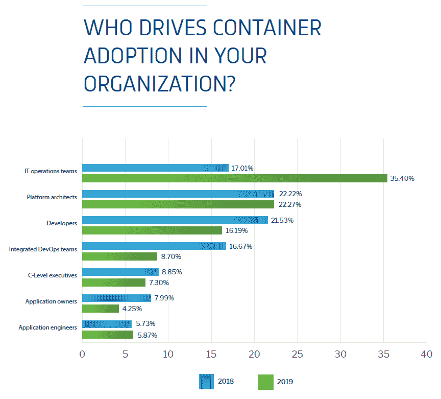
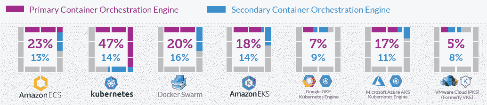
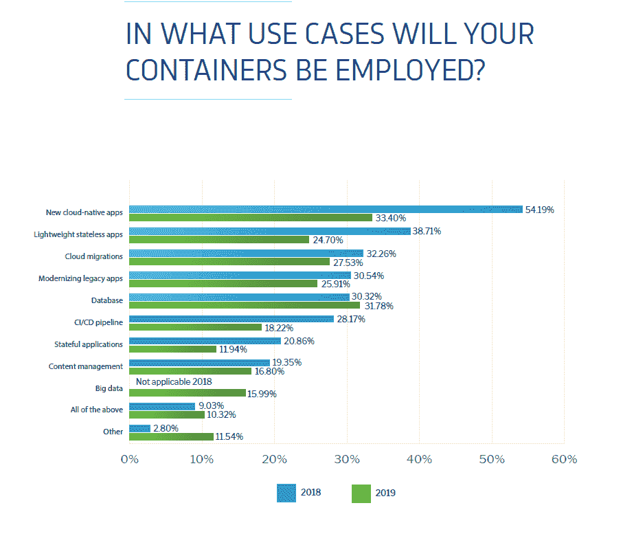

# IT 运营在集装箱管理中扮演着更重要的角色

> 原文：<https://thenewstack.io/multilple-containers-surveys-corroborated/>

Kubernetes 提供商 [Diamanti](https://diamanti.com/) 的 [2019 年容器采用基准调查](https://diamanti.com/wp-content/uploads/2019/06/Diamanti_2019_Container_Survey.pdf)证实了我们在最近关于容器采用的市场研究中看到的三个趋势:1) IT 运营团队已经领先；2)增加采用的最大障碍是安全，而不是国家；3)在裸机上运行容器的原因是性能，而不是成本。

在 Diamanti 调查的 500 多名 IT 领导者中，35%的人表示 IT 运营团队正在推动容器的采用，这是 2018 年研究中回答这一问题的人数的两倍。IT 运营影响力的增加部分是因为许多公司甚至在大规模生产使用容器之前就已经做出了[战略决策](https://thenewstack.io/add-it-up-enterprise-adoption-of-kubernetes-is-growing/)来推进 Kubernetes。

来源:Diamanti 的“集装箱采用基准调查”

容器的生产使用也促使更多公司关注这一领域。DZone 最近的研究发现，在使用容器的组织中，IT 运营团队的采用率从去年的 38%上升到 60%。同一项研究报告称，QA/测试团队的使用也大幅增加。正如我们今年早些时候解释的，随着越来越多的应用进入生产环境，安全团队越来越担心。因此，如果你是一个应用程序的所有者或开发者，请准备好与公司的其他技术人员密切合作。

在生产中使用容器的人中，安全性成为 Diamanti 受访者面临的最大挑战，从 2018 年的 22%上升到 2019 年的 31%。这与 Portworx 和 Aqua Security 发布的[报告](https://portworx.com/wp-content/uploads/2019/05/2019-container-adoption-survey.pdf)相一致，该报告称，与持久存储相比，安全性被认为具有挑战性的可能性几乎是前者的三倍。在我们自己关于数据流处理的调查中，我们发现随着生产使用的增加，对状态的关注减少了。

尽管人们对直接在裸机上运行容器很感兴趣，但我们还没有看到它的实际使用量激增。只有 21%的 Diamanti 调查受访者在 2019 年将容器部署到裸机，比上一年上升了一个百分点。在使用裸机服务器的公司中，56%的公司这样做是为了获得更高的性能，只有 36%的公司声称成本较低。这与 Turbonomic 的调查结果一致，该调查发现，与降低总体许可成本相比，CPU 密集型工作负载的性能更有可能被视为容器平台裸机基础设施的主要优势。

Diamanti 的调查还发现，“管理复杂性”是裸机容器的最大挑战。该公司有一个[设备](/diamanti-one-stop-shop-docker-kubernetes/)产品可以简化管理，但这并不是使事情更容易管理的唯一方法。另一种方法是使用托管服务或公共云产品，消除管理裸机服务器的需求。容器即服务(CaaS)产品通常在裸机上运行，但即使不是这样，CaaS 和功能即服务(FaaS)也可以抽象出管理虚拟机的需求。随着本地容器工作负载继续流行，Knative 可能会提供一条可导航的路径来运行容器化和/或无服务器应用程序，而不依赖于公共云产品。

## 更多图表值得你关注

当进行“调查中的调查”时，通常很难报告所有相关的主题。本文引用的三项研究包含了在容器化环境中运行的工作负载的百分比数据，但是我们选择不写这个主题。我们避免了讨论特定容器编排平台的采用。调查继续表明 Docker Swarm 和 Amazon ECS 拥有许多用户。DivvyCloud 在 2018 年秋季进行的另一项调查非常有用，因为它报告了正在使用的云提供商和容器编制者。应用我们之前的方法[来衡量 Kubernetes 即服务](/measuring-success-kubernetes-service/)产品的成功，我们继续看到谷歌将其更高比例的云客户转化为其 CaaS 产品的用户。

DivvyCloud 的《企业云和容器采用及安全状况》。另一个问题发现，75%在使用 AWS 作为云提供商，68%使用微软 Azure，25%使用谷歌云平台。

* * *

* * *

来源:Diamanti 的“集装箱采用基准调查”。新的云原生应用从 54%下降到 33%。总的来说，几个类别的下降是因为受访者在这个“全选”问题中勾选的框减少了。受访者并没有对云原生基础架构失去兴趣，而是对云原生的含义有了更狭隘的理解。此外，轻量级无状态和有状态应用程序的减少并不是因为采用的减少，而是因为“状态”不再被用作一个包罗万象的术语。

通过 Pixabay 的特征图像。

<svg xmlns:xlink="http://www.w3.org/1999/xlink" viewBox="0 0 68 31" version="1.1"><title>Group</title> <desc>Created with Sketch.</desc></svg>