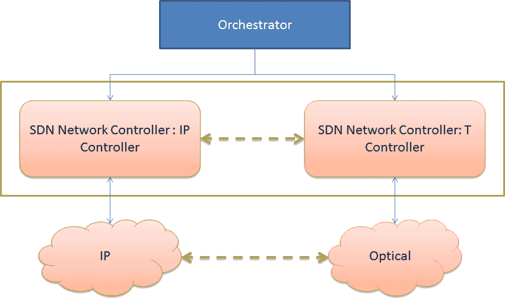
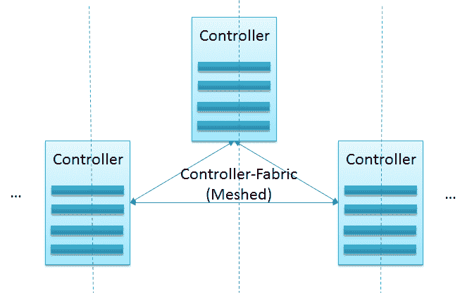
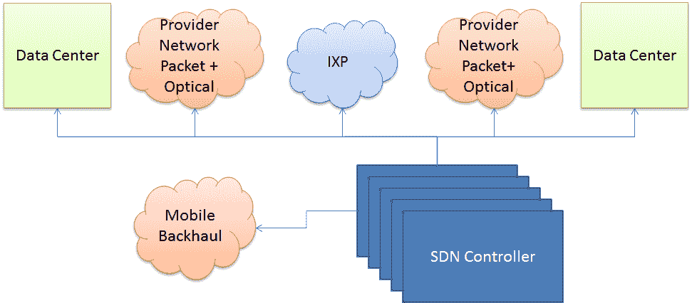

# 软件定义网络中运行多个控制器的指南

> 原文：<https://thenewstack.io/multiple-sdn-controllers/>

 [斯里达尔饶

斯里达尔于 2007 年获得新加坡国立大学计算机科学博士学位；2000 年获得印度苏拉特卡尔 KREC 大学计算机科学硕士学位；并于 1997 年 8 月在印度班加罗尔大学 Tumkur 获得仪器仪表和电子工程学士学位。他在 NEC 印度技术公司担任副总经理；印度 SRM 研究所研究负责人；意大利都灵理工大学微软创新中心博士后研究员；并在新加坡资讯通信研究所(I2R)担任研究员。他从事过各种开发和部署项目，涉及 ZigBee、WiFi 和 WiMax。斯里达尔目前在思必驰通信印度有限公司担任解决方案架构师。](https://thenewstack.io/author/sridharrao/) 

在本文中，我们将鸟瞰软件定义网络(sdn)的多控制器场景。在本文中，当我们讨论多控制器场景时，我们不会局限于那些使用 OpenFlow 等标准协议的控制器。相反，我们将使用术语“控制器”的更广泛的含义

我想强调的是，随着 NFV 的发展，多 SDN 控制器的使用案例/场景变得越来越重要，这主要是由于基于 NFV 的服务的固有性质。基于 NFV 的服务实现可能需要在多个地理位置协调异构资源的管理，并涉及多个管理域。

术语“多个”既包括多个同类控制器，其中所有控制器具有相同的能力和可能不同的角色，也包括多个异类控制器，其中使用具有不同能力的不同控制器。通常，在同类控制器的情况下，控制器之间的通信大多限于通常称为“[东西向通信](http://etherealmind.com/layer-2-multipath-east-west-bandwidth-switch-designs/)的通信，而在异类控制器的情况下，分层排列的“南北向”通信是常见的。

SDN 控制器的多样性(无论是分层的还是平面的)通常由几个关键的技术和业务驱动因素驱动，例如性能改进、可扩展性和可靠性、多个管理域及其交互、多个网络层和相应的故障管理。

在层级结构中，典型地，控制者有执行特定任务的特定“角色”。控制器层级之间没有标准化的通信方式。在平面(非分层)部署场景中，标准分布式系统解决方案在实现控制器之间的通信方面发挥了重要作用。

下表总结了可能需要多个 SDN 控制器部署的各种用例属性。我想强调的是可能会有重叠，例如，一个用例可能包括一个或所有这些属性。例如，transport-SDN 用例将包括多个域、多种网络类型、集群和异构网络元素。

如果我们考虑典型的“传输 SDN”用例，我们通常会发现多种技术，如 IP/MPLS、光纤等。在这种情况下，可能会有多个 SDN 控制器管理数据中心的交换机、聚合交换机和光纤交换机。

此外，为了在这种多层网络中实现端到端的服务提供和资源管理，需要在光网络和 IP/MPLS 网络之间进行交互和协调。这种协调通常可以通过部署多个 SDN 控制器并实现它们之间的高效交互来实现，以实现多层优化和智能流量工程。在出现故障的情况下，多控制器部署还需要在 IP 和光纤级别处理“恢复和优化”。

在 2015 年开放网络峰会上，华为的 Peter Ashwood-Smith 展示了 Transport SDN 中统一管理的解决方案。他首先强调了典型运营商客户的问题，如网络运营成本、设备成本以及运营控制和管理的集成。然后，他展示了三种基于 NFV 的技术如何有所帮助:自动 IP 链路部署、服务驱动的 IP 拓扑优化和多层恢复。

SDN 控制器集群可视为一个管理大规模网络的系统，处理由大量网络元素组成的控制平面通信。典型地，这样的系统由多个控制器组成，并且将它们自己暴露为单个逻辑实体。

在大多数实时部署中，控制器平面被实现为 SDN 控制器的集群。多个控制器节点将部署在不同的集群配置中，以实现高可用性。这种配置可能有不同的形式，通常是主动-被动或多主动。

除了解决可用性、可扩展性、可靠性、一致性和安全性等常见挑战之外，SDN 集群还应该有助于解决其他问题，例如高效的拓扑管理和相应的路径/路由计算、一致的数据存储(跨控制器实例共享的数据)以及高效的北向 API。

许多 SDN 控制器的商业供应商，如 NEC、Fujitsu、Cisco、BigSwitch，坚持将其控制器部署为分布式集群。事实上，SDN 控制器的所有实际部署通常都依赖于某种形式的集群部署，以实现可用性和/或可扩展性。甚至像 [OpenDaylight](https://www.opendaylight.org/) 和[开放网络操作系统](http://onosproject.org/) (ONOS)这样的开源项目也支持集群，后者(ONOS)被构建为分布式架构。

## 多域

多域环境是那些将数据中心、企业网络、客户站点和移动实体相互连接的网络。这种网络通常被分解成管理/地理域，这些域使用各种网络技术互连。

多个 SDN 控制器部署场景(包括多个域)通常以端到端服务供应和优化为目标。下图总结了各个领域–数据中心、提供商网络、互联网交换点和移动回程。一些现实世界的部署考虑了云、城域网和核心网等领域，其中服务部署通常跨越这些多个领域。此外，编排(多域部署中的一个主要挑战)通常既发生在一个域内，也发生在多个域之间。

## 管理的资源

多个 SDN 控制器可用于管理不同类型的网元:

### 物理、虚拟和虚拟化网络元素

控制器可以管理物理交换机(例如:NEC 的可编程流交换机)、虚拟交换机(例如:Cisco 的 1000v)或虚拟化网络元素(例如:VNFs)。可能存在不同的控制器可用于管理这些交换机中的每一个的情况。我坚信 NFV 部署是采用这种多控制器部署的有力候选。

### 开放和专有

网络元件可以是:(a)专有的和使用“开放的和标准的”协议(例如:NEC 的可编程流交换机)，(b)具有专有的但开放的和基于标准的软件的白盒交换机(例如:pica-8、big switch、cumulus networks 等使用的模型)和(c)专有的和封闭的软件(例如:Cisco 的硬件交换机)。在涉及这种开放/专有交换机的部署中，可以使用不同的控制器来管理这种异构交换机。

### 不同的网络类型

云基础设施可以由由不同 SDN 控制器管理的底层和顶层网络组成。例如，OpenStack 和 OpenDaylight 可用于实现和管理覆盖网络，并具有 NEC 的可编程流 SDN 控制器来管理底层。

### 混合 OpenFlow 和非 OpenFlow 部署

一个越来越常见场景是在支持开放流和非开放流资源的集中管理的网络中。例如，数据中心网络可能具有完全基于 OpenFlow 的核心网络，基于 VXLAN 的核心网络在该核心网络上运行，包括 VXLAN 网关，该核心网络可由控制器管理，并且不支持 OpenFlow。

总之，SDN 控制器的多样性——分层或平面——可以在各种情况下看到，例如具有底层和顶层网络的数据中心网络、具有网络技术层的电信网络、包含异构网络元素的网络以及涉及多个管理域的网络。这种多个控制器有助于提高性能、可扩展性、可靠性，并提供高效的端到端服务。

<svg xmlns:xlink="http://www.w3.org/1999/xlink" viewBox="0 0 68 31" version="1.1"><title>Group</title> <desc>Created with Sketch.</desc></svg>