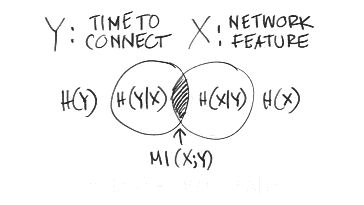

# 人工智能的基石:互信息和皮尔逊相关性

> 原文：<https://thenewstack.io/mutual-information-pearson-correlation-building-blocks-ai/>

 [易卜拉欣·萨法维

易卜拉欣·萨法维是 Mist Systems 的数据科学家。他是一名人工智能爱好者，拥有从信息检索、知识发现和自然语言处理到物联网(IoT)等领域的经验。他利用机器学习和数据驱动的分析来解决现实世界的问题。易卜拉欣拥有史蒂文斯理工学院的认知学习网络博士学位。他喜欢听音乐、徒步旅行和摄影。](https://www.mist.com/) 

有许多算法和数据挖掘技术可以支持人工智能(AI)驱动的技术，包括虚拟网络助手。在无线网络世界中，交互信息非常重要，因为它有助于确定哪些网络功能(例如移动设备类型、客户端或接入点)最有可能预测失败或成功。这可用于设置、监控和实施优化无线服务的服务水平期望(SLE)。

让我们从定义互信息开始。互信息根据两个随机变量之间的熵来定义。在数学上，互信息的方程被定义为随机变量“Y”的熵减去“Y”的条件熵，给定“X”；也就是当我们知道 x 时我们得到的关于 Y 的信息。

在我们的例子中，假设“Y”是代表 SLE 指标的随机变量之一。接下来，我们有一个网络功能，我们称之为网络功能“X”。此网络功能可以是设备类型、操作系统类型，甚至是用户或接入点(AP)。网络的任何可能特征都可以用这个随机变量来表示。

熵代表随机变量的不确定性。例如，如果连接到网络的所有设备都是 iPhones，则设备类型随机变量没有不确定性(即零熵)。然而，当 Android、Chromebook 和 iPhone 等不同设备类型连接到网络时，设备类型熵是非零的，这捕捉到了预测什么设备类型连接到网络的不确定性。

现在，让我们回过头来看看互信息如何与 SLE 指标一起工作。

从图形上看，互信息是什么样的？假设左边的圆圈代表连接时间 SLE 度量的熵，它表示通过或失败，右边的圆圈代表我们的特征随机变量 x 的熵。

因此，如果我们以图形方式查看我们的方程，SLE 度量随机变量“Y”(由左边的圆圈表示)的熵，即给定网络特征 H(Y|X)的随机变量“Y”的条件熵，是封闭的。

如果我们减去这两个圆，我们寻找的是包含在中间部分的内容。这一部分代表了两个随机变量的互信息，它为我们提供了一个指标，表明网络功能在多大程度上提供了有关 SLE 指标的信息。

互信息告诉我们网络特征 X 在预测 SLE 随机变量 y 方面有多重要。然而，它没有告诉我们网络特征是否是成功或失败的预测因素。为此，我们将使用皮尔逊相关来赋予预测极性。

皮尔逊相关的等式是这样的:

如果你看看相关性的图片，它告诉我们一些事情:相关性的数量从负 1 到 1，符号(负或正)是通过或失败的预测。

斜率告诉我们数量级，或者我们的相关程度。接下来，相关性的符号预示着失败或成功。如果我们着陆时更接近负值，它就能很好地预测失败。如果我们更接近一个，它擅长预测传球。如果是零，说明没有线性相关。

皮尔逊相关是两个随机变量之间线性相关的度量。

然而，它不能捕捉非线性相关性。如果我们回头参考我们最初的文氏图，我们可以将这两种算法结合在一起，预测网络特征在预测 SLE 指标成败中的重要性。

互信息理论，加上皮尔逊相关性，是人工智能技术的一个组成部分。希望这为数据挖掘和人工智能如何与各种技术(如无线网络)一起工作提供了更多的见解。

通过 Pixabay 的特征图像。

<svg xmlns:xlink="http://www.w3.org/1999/xlink" viewBox="0 0 68 31" version="1.1"><title>Group</title> <desc>Created with Sketch.</desc></svg>