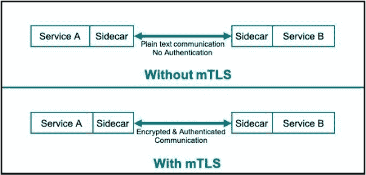
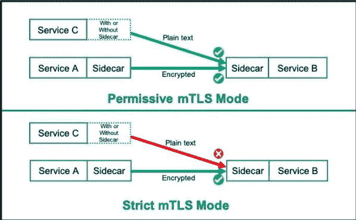

# Mutual TLS:保护服务网格中的微服务

> 原文：<https://thenewstack.io/mutual-tls-microservices-encryption-for-service-mesh/>

世界正朝着基于微服务的应用发展。服务网格正成为部署和管理微服务环境的主要架构之一，因为它带来了先进的流量管理、整体可观察性和更好的安全性。微服务通过 API 相互通信，因此保护各个服务之间的通信变得比以往任何时候都更重要，并且必须得到解决。

Mutual TLS (mTLS)保护服务网格中微服务之间的通信。它使用加密安全技术来相互认证各个微服务，并对它们之间的流量进行加密。

## 为什么是 mTLS？

 [潘卡伊·古普塔

Pankaj Gupta 是 Citrix 云原生应用交付解决方案高级总监。Pankaj 为客户提供混合多云微服务应用交付策略建议。在思科任职期间，他领导了网络、安全和软件产品组合的战略营销计划。Pankaj 热衷于与 DevOps 社区就基于微服务和 Kubernetes 的应用交付的最佳实践进行合作。](https://twitter.com/PankajOnCloud) 

据谷歌称，90%的互联网流量被加密，以防止窃听和中间人攻击。然而，如今许多云原生应用部署并不具备微服务之间的加密通信，这是基于一个薄弱的假设，即集群内部的流量是安全的，不易受到攻击。这是一个冒险的假设。不仅微服务之间的通信应该是安全的，而且许多法规(如 GDPR 和 HIPAA)也建议端到端加密来保护传输中的所有数据。

在这个零信任安全的时代，每个单独的微服务通信(请求-响应)都必须经过身份验证、授权和加密。原因如下:

*   身份验证可唯一识别每个微服务，并确保恶意微服务无法访问您的敏感数据。
*   授权决定了哪些微服务可以相互通信。您不会希望处理您公司信用卡处理的微服务与管理您办公楼的门卡读卡器的微服务进行通信。
*   加密不仅可以防止第三方拦截和查看传输中的数据，还可以阻止中间人攻击。您肯定不希望网络上未经授权的实体看到信用卡数据。

随着公司转向零信任安全，mTLS 提供了一种加密的安全方式来验证、加密和执行微服务之间的通信策略。

## 什么是 mTLS？

Mutual TLS(或 mTLS)指的是传输层安全性，它在服务器和客户端之间使用双向加密通道。如今，mTLS 是保护云原生应用中微服务之间通信的首选协议。

图 1:什么是 mTLS？

虽然传输层安全性(TLS)已被用于保护互联网上客户端和服务器之间的流量多年，但它通常使用单向身份识别，即服务器向客户端出示证书来证明其身份。这种单向认证的一个基本例子是当你在线访问你的银行账户时。服务器会向您的计算机发送一个证书，证明它确实是您正在连接的银行。该证书包含一个公共加密密钥，用于在您和银行之间创建一个加密的安全链接，通过该链接传输数据。

Mutual TLS 扩展了客户端-服务器 TLS 模型，以包括双方的身份验证。如果银行依赖其他特定于应用的机制来确认客户的身份，如用户名和密码(通常伴随着双因素身份验证)，mTLS 使用 x.509 证书来识别和验证每个微服务。每个证书都包含一个公共加密密钥和一个身份，并由一个可信的证书颁发机构签名，该机构证明该证书代表提交它的实体。

在 mTLS 中，服务网格中的每个微服务都会验证另一个微服务的证书，并使用公钥来创建每个会话独有的加密密钥。这使得微服务对之间的通信能够被认证和加密。

## mTLS 如何在服务网格中工作

我们在 [Citrix](https://www.citrix.com/networking/microservices.html?utm_content=inline-mention) 中学到的是，在高层次上，在服务网格中使用基于证书的相互认证来认证和建立加密通道的过程包括以下步骤:

1.  微服务 A 发送对微服务 b 证书的请求。
2.  微服务 B 回复其证书，并请求微服务 a 的证书。
3.  微服务 A 向证书颁发机构检查该证书是否属于微服务 b。
4.  微服务 A 将其证书发送给微服务 B，并共享一个会话加密密钥(用微服务 B 的公钥加密)。
5.  微服务 B 向证书颁发机构检查它收到的证书是否属于微服务 a。
6.  随着两个微服务相互认证并创建会话密钥，它们之间的通信可以加密并通过安全链路发送。

## mTLS 的服务网格控制平面的角色

Istio 可能是最著名、功能最丰富和最成熟的服务网格控制平面，它提供安全的服务到服务通信，而不需要任何应用程序代码更改。从 mTLS 的角度来看，Istio 和所有服务网格控制平面必须提供:

*   处理证书签名和管理的证书颁发机构。
*   向代理分发通信策略(如身份验证策略、授权策略和安全命名信息)的配置 API 服务器。

控制平面将证书和授权策略分发给侧柜。当两个微服务需要通信时，边站会建立一个安全的代理-代理链接，并负责加密通过它的流量。

## 边车在 mTLS 中的作用

虽然可以在应用微服务本身中定义通信安全策略并执行认证和加密，但需要在每个微服务的代码中实现认证机制、定义授权策略和流量加密。

这是低效的，因为您必须将这些代码写入每个微服务中，您必须在应用程序发生变化时更新它，并且您需要在每个版本上测试它，以确保新代码不会中断通信。这对开发人员来说可能是一种负担，会导致错误，使他们无法专注于实现业务逻辑的代码。在服务网格中，保护通信的开销被卸载到 sidecars 代理，如 Citrix ADC CPX 或 Envoy，它们位于每个微服务旁边。

当两个微服务需要通信时，是边站建立 mTLS 连接，加密的流量将通过该连接流动。sidecars 交换证书，并与证书颁发机构相互认证。它们检查由控制平面推送的配置中的授权策略，以查看微服务是否被允许通信。如果是，sidecars 将使用生成的会话密钥建立安全链接，这样微服务之间的所有数据都将被加密。实际的微服务应用程序代码本身不受影响。因此，Sidecars 使应用程序开发更加敏捷和高效。

## 为什么非 mTLS 沟通仍然重要

有时，微服务与外部源或可能未启用 mTLS 或可能不属于同一 mTLS 生态系统的微服务进行通信是很重要的。在这些情况下，数据必须通过未加密和/或未认证的通道以纯文本形式发送。

微服务可能需要发出或接收对其他应用程序的 API 调用，这些应用程序可能属于无法启用 mTLS 的不同应用程序团队，甚至是外部第三方。同样，微服务可能需要将遥测数据发送到非 mTLS 可观测性堆栈-毕竟，每个 SRE 都需要遥测数据来获得根本原因分析和故障排除的可见性。

> 您需要了解您选择的服务网格控制平面是如何实现 MTL 的，以及默认情况下实现了哪些功能，否则您将面临破坏应用程序的风险。

此外，随着多集群部署变得越来越流行，MTL“不匹配”的数量将会增加，因为一些集群将启用它，而其他集群则没有。

调查您的环境中微服务可能需要接受 mTLS 和非 mTLS 流量的地方，以便您可以主动进行规划。

## 在服务网格中实现 mTLS

有许多服务网格控制平面，具有不同的成熟度和独特的功能。就 mTLS 而言，所有服务网格都基于相同的原理来保护微服务之间的通信。许多服务网格提供了可靠的 mTLS 基线，但是它们在整体功能和部署方式上有所不同。您需要了解您选择的服务网格控制平面是如何实现 MTL 的，以及默认情况下实现了哪些功能，否则您将面临破坏应用程序的风险。

例如，Istio 的 mTLS 实现既先进又灵活。它提供了粒度级别来定义您的 mTLS 部署范围。可以针对特定服务、跨名称空间或整个服务网格设置相互 TLS 显然，Istio 为每个服务选择最窄的匹配策略。

这种粒度使您能够将名称空间所有权分配给不同的组织组，并让它们定义自己的 mTLS 设置。也就是说，每个组都需要注意他们部署的 mTLS 限制级别——特别是对于外部通信的微服务。

## 注意 mTLS 默认值:不要在试图保护应用程序时破坏它

您应该注意您的服务网格默认情况下是如何实现 mTLS 的。Istio 支持三种 mTLS 模式，使您能够控制微服务在服务网格中的通信方式:

1.  许可:代理将接受 mTLS 和纯文本流量。
2.  严格:代理只接受 mTLS 流量。
3.  Disable:双方 TLS 被禁用。

图 2: mTLS 部署模式

很明显，缺省情况下，Istio 将每个代理配置为在许可模式下使用 mTLS，这允许服务接受纯文本和双向 TLS 流量。这种灵活性是所有[服务网格实现](https://thenewstack.io/category/service-mesh/)的最佳实践，因为它允许微服务接受来自其他来源的非 mTLS 流量，这样您就不会中断应用程序。

许可模式有助于您以更低的破坏应用程序的风险开始使用 mTLS，因为您可以部署、测试通信并逐步加强安全性。这在工作负载迁移过程中非常有用，因为它允许不能使用相互 TLS 的微服务移动到网格中，并且仍然可以通信。

请注意，许可模式是一个很好的默认模式，但是它实际上削弱了您的安全性，因为它为与其他来源的纯文本通信打开了一扇门。虽然从一开始就实施严格的 MTL 可能很诱人，因为它更安全，但这是一种需要精心规划、完全可见和分析您的通信流的策略。当您转到严格模式时，有许多事情会破坏应用程序。例如:

*   没有边车的微服务不会完成 mTLS 握手；你可能不得不给那些没有边车的微服加个边车。
*   服务端口的不正确命名将导致 sidecars 拒绝 mTLS 请求；要格外注意 Istio 对$protocol-$service 的精确命名约定。

## 注意各种服务网格控制平面中的 mTLS 差异

当然，Istio 并不是唯一一个提供 MTL 来保护通信的服务网格——其他服务网格也提供类似的功能，但也有不同之处。

Red Hat OpenShift 基于 Istio 控制平面，具有类似的 mTLS 特性，包括粒度实现和默认的许可模式，但用 OpenSSL 替换了底层的 BoringSSL。

LinkerD 还提供了 mTLS，默认情况下，通过 LinkerD 代理自动启用 mTLS，以便在网状 pod 之间进行基于 HTTP 的通信。虽然 LinkerD 承认其 mTLS 产品中存在一些差距，但最新的 2.9 版本解决了其中一些问题，并将 mTLS 保护扩展到所有 TCP 连接，这是向零信任通信迈出的一大步。

在库马服务网格中，默认情况下不启用 mTLS。启用时，默认情况下会拒绝数据平面代理之间的每个连接。虽然这是一个值得称赞的安全立场，但它确实意味着您必须使用`TrafficPermissions`特性显式地允许连接。也就是说，库马缺乏 Istio 提供的安全通信功能的广度，库马需要一些发展才能赶上。

[亚马逊网络服务](https://aws.amazon.com/?utm_content=inline-mention)的 AWS 应用 Mesh 也支持微服务之间的加密。您可以使用 AWS 证书管理器或自带证书管理器。AWS App Mesh 支持“严格”和“许可”模式。

## 满足您的 mTLS 要求

Mutual TLS 是零信任网络的关键组件，对于保护服务网格中微服务之间的通信至关重要。然而，实现并不完全简单。您需要注意，微服务经常与非 mTLS 实体通信，因此您应该做出相应的调整。您应该通过权衡便利性和安全性来谨慎选择通信模式。最后，无论选择哪种服务网格控制平面，都要注意 MTL 的具体实现——它们并不完全相同。

适当的规划可以防止表现不佳。对于互 TLS 来说没什么不同。

<svg xmlns:xlink="http://www.w3.org/1999/xlink" viewBox="0 0 68 31" version="1.1"><title>Group</title> <desc>Created with Sketch.</desc></svg>