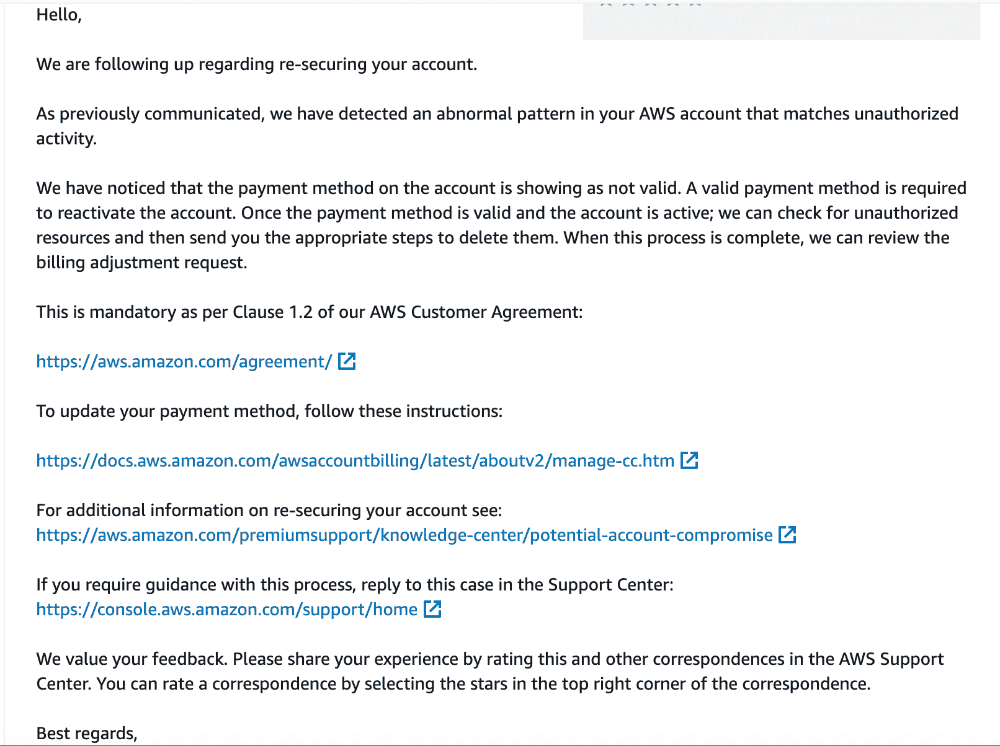

# 这发生在我身上:我怎么突然欠了 AWS 13000 美元...

> 原文：<https://thenewstack.io/my-account-was-hacked-and-suddenly-i-owed-aws-13000/>

当我的亚马逊网络服务账户被暂停时，我非常困惑。它说我的密码无效，但我的帐户被暂停支付。除了探索之外，我从来没有使用过 AWS，所以没有任何东西需要付费。我的收件箱里没有邮件。

然后我检查了我的垃圾文件夹，它就在那里。一张 12，989.60 美元的过期账单。

恐慌开始了。我做了什么？这是怎么发生的？我不小心点击了什么让一张 0 美元的钞票一夜之间变成了 12，989.60 美元？我根本没想到诈骗。然后冷静。我不可能付得起这笔钱，而且这是我第一次犯罪，所以我们必须想办法解决这个问题。我去了现场聊天。一张支持票，包括发票和我的记者证件，以防有所帮助。

如果帐户是活动的，我会看到支持代理所看到的:从 11 月 29 日起，在全球多个可用区域增加 EC2 Spot Instance 服务限制的 14 张关闭的票证从未进入我的收件箱，因为我被黑客攻击了，我的 AWS 帐户上有一个新的电子邮件，【jlwachtel@thailandoc.com。

我也没有看到 AWS 在 11 月 30 日发出的提醒我可能遭到黑客攻击的欺诈警报，因为它被 Gmail 屏蔽了。所以我完全在黑暗中等待 AWS 支持的回复。

AWS 支持部门的第一次回复是这个过程中唯一的失误。我收到了以下电子邮件:

此时，我仍然认为这个错误是我造成的，所以我在我存档的卡片上点击了“验证”。当我这么做的时候，随之而来的是一种不安的感觉，当我收到银行的欺诈警告短信，询问我是否批准亚马逊网络服务的收费时，这种不安的感觉得到了证实。

我回答“不”,然后回到支持控制台。

幸运的是，我最终联系到了安全部门，他们确认我的账户在那之前一直被严重误操作。我不知道这意味着什么，直到后来我的银行证实，我的卡在大约 45 分钟内连续四次被盗刷 12，989.60 美元。

之后就一帆风顺了。帐户已恢复；我能够登录并亲眼看到欺诈行为。我和安全小组相处得很好。他们向我介绍了帐户清理和安全最佳实践的实施。我仔细检查了帐户，删除了访问密钥、安全组、密钥对以及它们所在的许多区域中的启动模板。

一开始，我很生 AWS 的气。他们是如何批准增加新电子邮件地址的限额的？他们为什么让账单变得这么高？他们为什么不在发现潜在欺诈后关闭账户？但是他们做了他们该做的，我也为我该做的负责。

不难看出 AWS 欺诈有多普遍，以及如何在一定程度上避免它。此后，我添加了 MFA、Budgets 和 CloudTrail。所有这些事情肯定应该在第一天就加上去，但是因为我在反思，我会说我没有想过。我从来没有被黑过。我通常遵循最佳实践，但由于我很快就建立了那个账户，并且再也没有回去过，直到为时已晚，我才想到它。

设置 MFA。设置 CloudTrail。定期检查。

<svg xmlns:xlink="http://www.w3.org/1999/xlink" viewBox="0 0 68 31" version="1.1"><title>Group</title> <desc>Created with Sketch.</desc></svg>