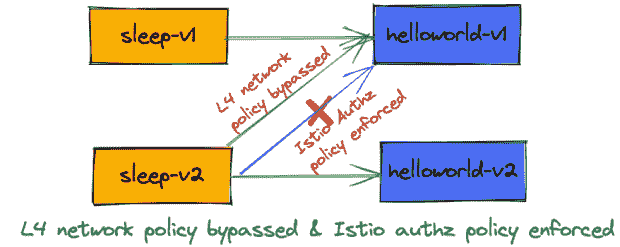
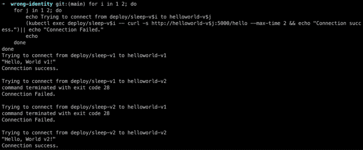
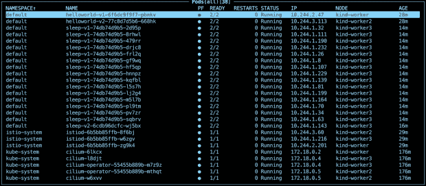
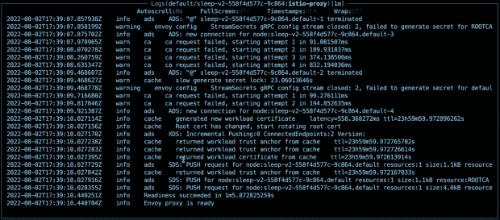
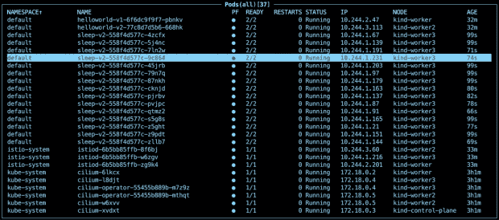
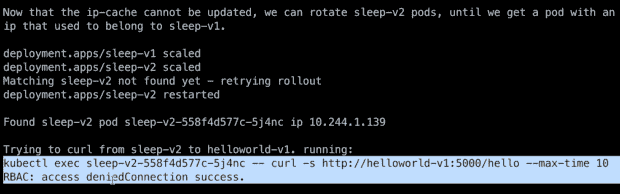
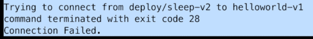

# 我的 Istiod Pod 无法与 Kubernetes API 服务器通信！

> 原文：<https://thenewstack.io/my-istiod-pod-cant-communicate-with-the-kubernetes-api-server/>

[林是 Solo.io 的开源总监，也是的形象大使。她自 2017 年以来一直在 Istio 服务网工作，并在 Istio 技术监督委员会和指导委员会任职。在此之前，她是 IBM 的高级技术人员和主发明家，已经工作了 15 年以上。她是《Istio 解释》一书的作者，拥有 200 多项专利。](https://twitter.com/linsun_unc)

几天前，我发表了一篇关于基于[网络缓存的身份是否会被误认为](https://www.solo.io/blog/could-network-cache-based-identity-be-mistaken/)的博文，其中我介绍了一个导致 Kubernetes“pods”身份被误认为未经授权访问的错误场景。在这篇博客中，我将使用完全相同的场景来演示如何利用[纤毛](https://cilium.io/)和 [Istio 服务网格](https://istio.io/latest/about/service-mesh/)的深度防御来防止这种未经授权的服务访问。

在本实验中，您将设置一个 Kubernetes 类集群，部署客户端应用程序的 v1 和 v2(“sleep”)以及服务器应用程序的 v1 和 v2(“hello world”)，以及仅允许 v1 客户端调用 v1 服务器的 v1 网络策略，以及仅允许 v2 客户端调用 v2 服务器的 v2 网络策略。

您还将设置 Istio 授权策略，只允许 v1 客户端调用 v1 服务器，只允许 v2 客户端调用 v2 服务器。您将首先观察到如预期那样实施的网络策略。然后，您将触发一个错误场景，以及扩展/缩小客户端窗格，并观察到 v1 客户端能够绕过 L4 网络策略，但在 Istio RBAC 检查中失败。让我们开始吧！

## **设置环境**

参考本博客中的[设置说明来设置你的友好集群和 CNI 纤毛。](https://www.solo.io/blog/could-network-cache-based-identity-be-mistaken/)[下载](https://istio.io/latest/docs/setup/getting-started/#download)最新稳定的 *istioctl* ，安装最小概要文件并将 Istiod 部署扩展到三个副本:

`istioctl install --set profile=minimal -y`

`kubectl scale deploy istiod -n istio-system --replicas=3`

### **部署应用** **和网络策略**

标记边车注入的默认命名空间:

`kubectl label namespace default istio-injection=enabled`

克隆 [repo](https://github.com/solo-io/wrong-identity.git) ，然后部署 sleep 和 helloworld 部署，以及 v1 和 v2 CiliumNetworkPolicy 资源。

`kubectl apply -f ./yamls`

应用下面的简单 Istio PeerAuthentication 资源，仅允许默认命名空间中的严格 mTLS 流量:

根据零信任最佳实践，应用下面的简单 Istio 授权资源，在默认名称空间中不允许任何内容—总是从不信任任何内容开始，然后根据需要显式允许访问。

应用下面的 Istio 授权策略以允许 sleep-v1 在 GET 方法上调用 helloworld-v1:

应用下面的 Istio 授权策略以允许 sleep-v2 在 GET 方法上调用 helloworld-v2:

假设您的所有 sleep 和 helloworld pods 都已启动运行，您可以从 sleep-v1 pod 调用 helloworld-v1，从 sleep-v2 pod 调用 helloworld-v2:

您将得到如下输出，其中只有 sleep-v1 可以调用 helloworld-v1，只有 sleep-v2 可以调用 helloworld-v2，其他都不行。当 sleep-v2 调用 helloworld-v1 时，会显示“连接失败”错误，因为 v1 网络策略得到了正确实施:

sleep-v2 在不应该被允许的情况下能否成功调用 helloworld-v1？

部署了上述应用程序以及网络和 authz 策略后，在大多数情况下，网络策略将有效，因此 sleep-v2 将无法成功调用 helloworld-v1。让我们触发一个类似的错误场景，其中节点(helloworld-v1 pod 运行的地方)无法与 Kubernetes API 服务器通信。在我的环境中，在善良工作者节点上，我有一个纤毛 pod 和一个 Istiod pod 在运行:

触发与之前类似的错误:

## **运行测试！**

如果你不熟悉测试，参考[回顾测试脚本章节](https://www.solo.io/blog/could-network-cache-based-identity-be-mistaken/)。只需发出 run-test.sh 来运行测试。您可能会观察到一些 sleep-v2 pod 需要 30 秒左右的时间才能达到运行状态，这是因为当 istio-proxy 容器试图启动时，它的 pilot-agent 使用 k8s 提供并安装到 pod 的服务帐户令牌向 Istiod(在我的测试中充当 CA)发送[证书签名请求](https://en.wikipedia.org/wiki/Certificate_signing_request) (CSR)。

如果 CSR 请求碰巧被发送到不能与 Kubernetes API 服务器通信的 Istiod pod，它将不能验证服务帐户令牌，因此不会处理该请求。这就是重试的作用:istio-proxy 容器上的 pilot-agent 足够智能，可以尝试将 CSR 请求发送到不同的 istio。

很快，您将看到所有的 pod 都已达到运行状态。

您还将观察到找到了具有错误纤毛身份的 sleep-v2 pod，但它仍然无法成功调用 helloworld-v1:

请注意,“RBAC:拒绝访问”错误来自 Istio，其授权策略由 helloworld-v1 的 istio-proxy 容器强制执行。如果您还记得，当正确实施 Cilium 网络策略以不允许 sleep-v2 调用 helloworld-v1 时，错误是不同的:

请观看视频短片，了解我在使用 Cilium 和 Istio 的测试环境中运行上述步骤的情况:

[https://www.youtube.com/embed/ZjTDd52RYSU?feature=oembed](https://www.youtube.com/embed/ZjTDd52RYSU?feature=oembed)

视频

## **包装**

当其中一个 Istiod pods 无法与 Kubernetes API 服务器通信时，您的应用程序身份(基于加密原语)可以继续通过 CSR 请求从其 Kubernetes 服务帐户令牌中正确生成，并且继续实施 Istio 授权策略。这强化了我之前的建议，即在您的安全架构中使用[深度防御](https://en.wikipedia.org/wiki/Defense_in_depth_(computing))方法和零信任模型，以便您可以为各种错误场景做好准备。

<svg xmlns:xlink="http://www.w3.org/1999/xlink" viewBox="0 0 68 31" version="1.1"><title>Group</title> <desc>Created with Sketch.</desc></svg>