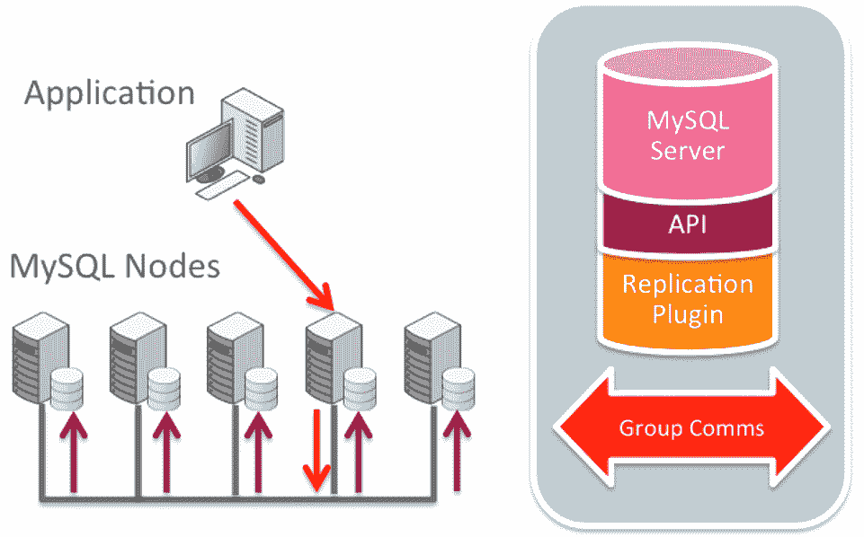
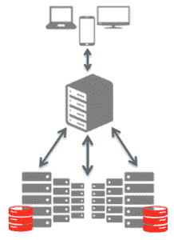
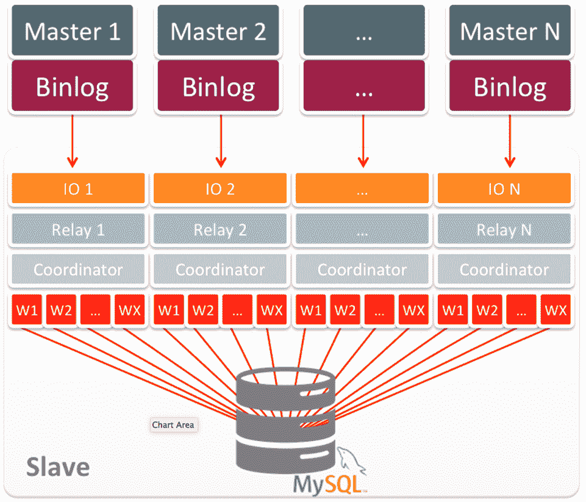

# MySQL 5.7 精通很酷的复制技巧

> 原文：<https://thenewstack.io/mysql-5-7-gets-savvy-with-a-cool-replication-hack/>

当 Airbnb 的 MySQL 数据库变得过于庞大而无法有效处理时，特别是在繁忙的夏季，公司工程师决定将一些数据库表转移到他们自己的服务器上。

通常情况下，移动一个数据库表可能是一个危险的过程，尤其是对于像 Airbnb 这样 24/7 忙碌的操作。不过，Airbnb 的工程师想出了一个巧妙的方法。他们使用 MySQL 复制特性将数据库表复制到他们在亚马逊 Web 服务中的[新的主要位置](http://aws.amazon.com/about-aws/whats-new/2012/10/11/amazon-rds-mysql-rr-promotion/)，并且只产生最小的停机时间，不需要迁移代码。

在 web 级时代，数据库复制比灾难恢复有更多的用途。因此，Oracle 很明智地配备了将于 10 月 27 日在[发布的 MySQL 版本 5.7，其中包括许多增强复制的新选项，以及许多其他新功能，以保持 MySQL 在 LAMP 堆栈中的“M”名称的相关性。](http://dev.mysql.com/downloads/)

“几乎每个人都使用复制，所以我们建立了一个更高性能的复制系统，”甲骨文 MySQL 工程副总裁托马斯·乌林说。

不管你对甲骨文如何处理它在 2010 年收购太阳微系统公司(想想 Java，OpenOffice)时获得的许多开源资产有什么看法，该公司已经[保持了 MySQL 的竞争力](http://db-engines.com/en/ranking)对抗流行的 NoSQL 数据存储的浪潮。

这个版本继续这项工作。正如乌林指出的，最值得注意的修饰是复制方面的重大改进。新的组复制特性提供了跨多个数据库实例同时写入数据的方法。这种方法可以为建立高可用性操作铺平道路，在这种操作中，会维护冗余的相同数据库，这样，如果一个数据库出现故障，另一个数据库可以快速接替它的位置。

MySQL 现在提供本机主动/主动随处写入复制，包括异步、半同步和(虚拟)同步组复制。

Percona Systems 的首席执行官彼得·扎依采夫说，这种方法缓解了使用 MySQL 进行高容量工作的主要瓶颈之一，Percona Systems 提供了一个名为 [Percona Server](https://www.percona.com/software/mysql-database/percona-server) 的 MySQL 版本，为高性能工作进行了调整。

数据可以被即时复制，从而将主数据库从辅助任务中解放出来，例如为分析提供支持，这可能会降低整体性能。扎依采夫说，现在，数据库的复制副本可以承担这一工作量，并提供同样新鲜的数据。

MYSQL 路由器提供了一种在多个后端 MySQL 服务器之间引导流量的方法，便于通过使用多个 MySQL 实例来确保高可用性和可伸缩性。

用户可以设置复杂的工作流，利用复制功能，这要归功于一个新的 MySQL 支持中间件 MySQL Router。MySQL 路由器可以充当应用程序和许多不同数据库之间的中介，遵循一组关于在任何给定时间将流量定向到哪个数据库的管理员规则。

MySQL 现在还支持多源复制，允许单个数据库系统从多个数据库获得输入，这要归功于全局事务标识符(gtid)和多线程处理的改进。

扎依采夫解释说，在 MySQL 的早期版本中，吞吐量是有限的，因为所有的处理都是由运行在单核上的单线程来完成的。现在 MySQL 可以在多个内核上并行运行。

尤林说，多源复制在许多不同的情况下都很方便。例如，一个全国性的零售连锁店可以为每个地区建立不同的销售数据库，然后让每个地区的数据库(每个数据库都有相同的模式)将其数据复制到一个中央数据库，该中央数据库将汇总和分析数据以获得整个公司的概况。

MySQL 数据库现在可以同时接收来自多个来源的事务，这对于合并数据、将多个服务器备份到一个服务器以及合并表碎片非常有用。

MySQL 5.7 是自 2013 年 2 月推出 5.6 版本以来的首次重大更新。在早期版本中，Oracle 主要致力于取悦数据库管理员。扎依采夫指出，这个版本为开发者增加了更多功能。

例如，一个新特性是对 JSON (JavaScript 对象符号)的本地支持。JSON 经常被用于跨 web 应用程序交换数据；MongoDB 是专门为 JSON 创建的数据存储。

在之前的版本中，MySQL 将 JSON 数据——基本上是以键值对编码的纯文本数据——保存为文本字段中的 blobs。然而，以这种方式查询 JSON 很慢。

现在 MySQL 可以将 JSON 保存为一种特定的 JSON 数据类型，这种数据类型是二进制格式的，以便更快地进行搜索。所有的关键字都被编入索引，因此它们可以比普通的文本搜索更快地被搜索到，乌林说。

Ulin 认为，使用 MySQL 而不是 MongoDB 的新实例可以减少管理员的开销，因为该组织不必维护两个独立的数据库系统，或者以第二个数据库系统的新方式培训管理员。

MySQL 5.7 也可以通过改进的在线更新吸引 NoSQL 用户。现在，用户可以在不需要使整个数据库脱机的情况下修改表，这是使用无模式 NoSQL 数据库的优势。这使得组织能够更快地对收集哪些数据的不断变化的需求做出反应。

MySQL 运营人员在这个版本中也获得了一些新工具。一个新的性能模式提供了数据库系统性能的操作数据，包括内存使用情况、事务和预准备语句的速度以及数百个其他因素。关于数据库系统的性能和健康状况的这些最常用的指标被收集在一个名为 MySQL SYS Schema 的新模式中。

下周，在旧金山举行的甲骨文年度大会上，尤林将更深入地研究 MySQL 5.7。该公司还将在 11 月 11 日的[网络直播中透露更多细节。](https://event.on24.com/eventRegistration/EventLobbyServlet?target=reg20.jsp&eventid=1052077&sessionid=1&key=EFEE71759B7B2D0B3FE68FFE140316D1&partnerref=web&sourcepage=register)

专题图片:[国家美术馆](http://joabj.com/Photos/2015/1504-FA-DC-NationalGallery-Sculpture.html)，由约阿布·杰克森拍摄。

<svg xmlns:xlink="http://www.w3.org/1999/xlink" viewBox="0 0 68 31" version="1.1"><title>Group</title> <desc>Created with Sketch.</desc></svg>