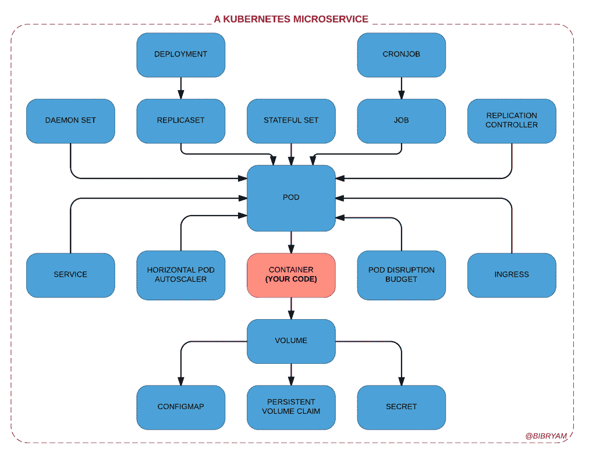
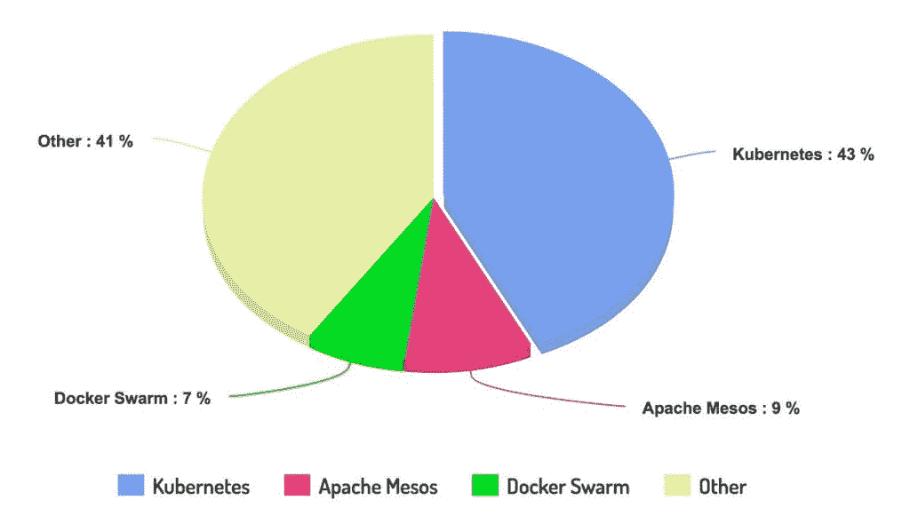

# 云原生可移植性的神话

> 原文：<https://thenewstack.io/myth-cloud-native-portability/>

随着大量新平台和支持工具的出现，云计算的发展势头越来越强劲。这些新平台为开发人员提供了越来越多的功能，以自动化的方式快速开发、部署和管理大量的[微服务](/category/microservices/)。

但这种势头是有代价的，你最好准备好为此付出代价。

最近，我写了一篇关于由云原生平台(如 Kubernetes)提供的“[面向开发人员的新分布式原语”以及这些原语如何与用于应用程序开发的编程原语相融合的文章。例如，看看下面的内容，开发人员为了有效地运行一个容器化的应用程序，需要了解和使用多少个](http://www.ofbizian.com/2017/04/new-distributed-primitives-for.html) [Kubernetes](/category/kubernetes/) 概念:

基于 Kubernetes 的微服务

 [比尔金·伊卜里亚姆

Bilgin Ibryam 是 Red Hat 的架构师，也是 Apache 负责 Camel、OFBiz 和 Isis 项目的开源委员会成员。他是博客作者、演讲者、开源爱好者，也是 Camel 设计模式和即时 Apache Camel 消息路由书籍的作者。在日常工作中，Bilgin 喜欢指导、培训和带领团队在应用集成、分布式系统、微服务、devops 和云原生应用方面取得成功。](https://twitter.com/bibryam) 

请记住，该图不包括 DevOps 团队的 Ops 部门必须管理的任何支持 Kubernetes 对象。也没有在第 2 天操作之前也需要的附加应用程序支持工具(用于日志管理、监控、跟踪、服务网格等)。

很有可能，开发人员将不得不编写与容器中的应用程序代码相同数量的 YAML 代码。更重要的是，应用程序本身将比以前更加依赖平台。云原生应用期望平台执行健康检查、部署、放置、服务发现、运行周期性任务( **cron** job)、或者调度原子工作单元(job)、自动缩放、配置管理等。

因此，您的应用程序已经放弃了所有这些职责，并将它们委托给平台，并期望以可靠的方式处理它们。事实是，现在您的应用程序和相关团队在许多不同的层面上依赖于该平台:代码、设计、架构、开发实践、部署和交付管道、支持程序、恢复场景，应有尽有。

## 赌一个生态系统，而不是一个平台

上图展示了在 Kubernetes 微服务环境中，您的代码有多小。但是，当我们谈论一个基于微服务的生产就绪型系统时，情况还远未结束。任何大规模的系统都需要工具来进行集中监控、指标收集、跟踪、服务网格、集成的构建和部署工具、管道等。

该平台只是冰山一角，要想在云原生世界取得成功，你需要成为工具和公司完全集成的生态系统的一部分。因此，赌注从来都不是关于一个单一的平台，或者一个项目，或者一个很酷的图书馆，或者一家公司。它是关于同步工作的项目的整个生态系统，以及合作并致力于未来十年左右事业的公司(供应商和客户)的整个生态系统。我认为这两个方面同等重要:

*   **技术**:考虑到过渡到原生云是一个多年的过程，只有在长期的成功中才会受益，因此重要的是押注于一项具有未来 5-10 年潜力的技术，而不是过去 5-10 年的历史。
*   **文化**:云原生是通过微服务、容器、持续交付和 DevOps 的组合实现的。成为云原生的不仅仅是给你的应用添加一些依赖/库(与某些会议上宣传的相反)。你可能不得不改变团队结构和惯例、工作习惯和编码实践，并习惯于消费一个仍然非常活跃的技术空间。如果你的公司文化在某种程度上更接近于开发或消费云原生平台和相关工具的公司文化，这就更容易了。一些小事情，比如提出一个拉取请求还是提交一个 bug 报告，检查上游源代码并就一个即将到来的新特性展开讨论还是等到下一次会议发布消息，都会对一个团队是否喜欢使用一个平台产生影响。文化整合和人的因素与技术优势同样重要。

以下内容并不代表全部情况，但我会尝试对我想到的主要云原生生态系统进行分组:

### 中间层和阿帕奇中间层

作为 Apache Software Foundations 的一部分， [Apache Mesos](http://mesos.apache.org/) 有它的好处(成熟的社区)和缺点(缓慢的发展)。诞生于 2009 年左右，是一个成熟的框架，最近增加了对容器(我这里指的是 docker 格式)和 Pods/Task groups 等类似概念的支持。

### 云代工厂和春云

大约在 2009 年， [Cloud Foundry](https://www.cncf.io/) 再次诞生，是云原生世界的先驱之一。当 [Spring Cloud 与 Cloud Foundry](http://cloud.spring.io/spring-cloud-cloudfoundry/) 一起使用时，该平台与应用程序本身融为一体。服务发现、负载平衡、配置管理、重试、超时等一些功能是在服务中执行的(在本例中是 JVM)。这与 Kubernetes 等平台采取的方法相反，在这些平台中，所有这些职责都委托给平台或其他支持容器(如 envoy、 [linkerd](https://linkerd.io/) 、 [traefik](https://traefik.io/) )。我过去对比过 Kubernetes 和 Spring Cloud(注意不是 Cloud Foundry)这里[这里](http://www.ofbizian.com/2016/12/spring-cloud-compared-kubernetes.html)。

### AWS ECS 和 Docker Swarm

当 Docker，Inc .(该公司)仍在[计算](https://thenewstack.io/focused-enterprise-docker-doesnt-fear-kubernetes/)它将开发什么和销售什么时，亚马逊已经使用 Docker 技术创建了一个相当可靠的产品，作为 [AWS 弹性容器服务](https://aws.amazon.com/ecs/)的一部分。带有 [Blox](https://blox.github.io/) (AWS 的开源容器编排软件)的 ECS 本身可能不是什么大东西，但当与所有其他 AWS 产品结合时，它是一个非常有特色的 reach 集成平台。

更不用说从 VMs 时代就一直是 AWS 支持者的网飞正在[向容器世界过渡](https://medium.com/netflix-techblog/the-evolution-of-container-usage-at-netflix-3abfc096781b)并且正在推动亚马逊 ECS 的创新。

### CNCF 和库伯内特

Kubernetes 是这一类别中最新的平台之一，但同时也是有史以来最活跃和发展最快的开源项目之一。再加上集成[云原生计算基础项目](https://www.cncf.io/projects/)和支持[公司](https://www.cncf.io/about/members/)的家族，使得整个生态系统成为这一类别中相当强的竞争者。

作为后来者(2014 年)，Kuebernetes 的优势是从一开始就在以容器为中心的架构上发展。事实上，它是基于十年前的 Google Borg，这意味着这些原则(而不是实现)是成熟的，并且在最高水平上经过了战斗测试。

Sysdig 2017 年 Docker 使用报告中的容器编排器

正如你可以从 Sysdig 最近的[报告](https://sysdig.com/blog/sysdig-docker-usage-report-2017/)中看到的结果，云原生用户似乎很欣赏这一切。

### 选哪个？

也许您认为只要将应用程序打包在容器中，就可以轻松地跨不同的云平台进行移植。你错了。无论您是从 Mesos、Cloud Foundry、Kubernetes、Docker Swarm、ECS 开始，您都必须进行大量投资来学习平台和支持工具，了解文化和工作方式，并与这个仍在快速变化的技术和公司生态系统进行互动。

本文的目的不是比较这些生态系统，而是展示它们之间的差异，并证明进入一个生态系统或在需要时转移到另一个生态系统将需要大量的时间和金钱。

## Kubernetes 作为应用程序可移植层

云原生生态系统在技术、流程和文化方面非常独特。但即使在它们之间，也有一些整合在进行。许多由一个平台推广的概念也在传播到其他平台。例如，部署单元(Kubernetes 中的 Pod)的概念现在出现在 Mesos 中，它也作为任务组存在于 Amazon ECS 中。服务器端负载平衡(Kubernetes 中的服务)和带有策略的调度/放置(Kubernetes 调度器)的概念也出现在 Docker Swarm、AWS ECS 等中。但这是它的极限，从一个生态系统过渡到另一个生态系统，需要很多努力。

那么，如何避免锁定单一供应商呢？一种方法是坚持使用 Kubernetes，并接受它作为云和服务提供商之间的可移植层。Kubernetes 如此受欢迎的原因之一是因为它不是一家公司的玩具，而是由多家大型科技公司支持，如谷歌、红帽( [OpenShift](https://www.openshift.com/) )、Docker、Mesosphere、IBM、戴尔、思科和许多其他公司。

另一个原因是，有许多云公司提供 Kubernetes 作为服务。如果您使用 Kubernetes，那么您可以通过第三方服务提供商轻松地在 Google Container Engine、Microsoft Azure、IBM Bluemix Container Service 甚至 AWS 等云提供商之间移动您的应用程序。这意味着 Kubernetes API 是云平台之间应用程序的可移植层，而不仅仅是容器。独一容器我T5 年代一坠中云原生海洋。

<svg xmlns:xlink="http://www.w3.org/1999/xlink" viewBox="0 0 68 31" version="1.1"><title>Group</title> <desc>Created with Sketch.</desc></svg>