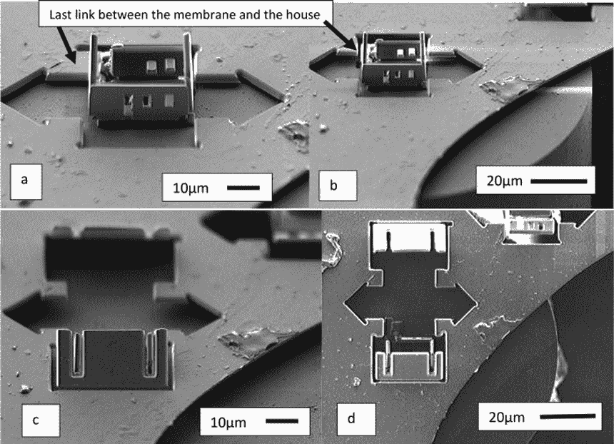
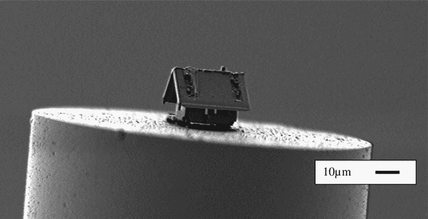

# 纳米机器人建造了一个微型房子

> 原文：<https://thenewstack.io/nanorobots-build-a-microscopic-house/>

你可能听说过最近围绕小房子的趋势:它们的小尺寸、便携性和无抵押贷款为人们提供了一个拥有自己房子的机会，没有债务。这些小房子通常不到 400 平方英尺，可能建在一个有轮子的拖车底座上，或者甚至可能是一辆经过改造的车辆，比如一辆[面包车](https://thenewstack.io/van-life-developers-find-homes-road/)。

但是法国 [Femto-ST 研究所](http://www.femto-st.fr/en/)的研究人员建造了可能是所有房子中最小的房子:一个直径为 20 微米的结构，位于一根光纤的末端(为了让你知道这有多小，一个[微米](https://en.wikipedia.org/wiki/Micrometre)——也称为一微米——等于百万分之一米)。

这个微小的房子是使用名为μRobotex 的纳米机器人制造系统建造的，该系统使用机器人操作的离子枪，位于一个大型真空室中。这种离子枪使用气体注射系统发射出聚焦离子束(FIB)，然后可以以 2 纳米的精度切割各种材料。观看如何了解如何完成:

https://youtu.be/c8NCKxm86qY

首先，将一薄层二氧化硅放在一截比头发还细的光纤顶端。然后，μRobotex 系统使用双光束扫描电子显微镜，让两名工程师在不同的计算机工作站上协同工作，引导聚焦的离子束刻划并切割二氧化硅片，以创建墙壁、窗户和门——所有这些都在仅 300×300 微米的面积上进行。

从视频中可以看出，这座房子被设计成一整块受日本启发的*折纸，可以裁剪成平面布局，然后折叠成形状，而不是通过相对更困难的途径将各个部分连接在一起。事实上，整个过程都是精心策划的，一步一步地将结构组合在一起:通过改变离子束的功率水平，以及在特定的地方刻痕或切割，这些动作产生的力能够促使墙壁自己起皱。*

 *在切开墙壁并让它们折叠到位后，气体注射系统被用来将角落焊接在一起。最后，屋顶从同一张材料上切割下来，放在上面。然后，离子束被置于较低的功率设置，并用于“溅射”设置，以在屋顶上雕刻出两条条纹的“平铺”——考虑到该结构有多小，这是一项相当大的成就。

该论文的作者之一让-伊夫·劳赫说:“在两个光束的交叉点上高精度地驾驶机器人非常具有挑战性。”“我们首次能够以小于 2 纳米的精度实现构图和组装，这对机器人和光学界来说是一个非常重要的结果。”

该项目展示了我们有朝一日如何能够用不同的材料精确地组装出微观结构，从而制造出比人类头发丝还细的部件。例如，这种组件可以用作传感器，能够插入人体血管中以检测病原体。

根据该团队的说法，该实验证明，利用这种纳米机器人系统，可以对金属、聚合物或晶体等各种材料的薄膜进行精确的三维切割、蚀刻、折叠、组装和焊接，这是以前非机器人系统不可能实现的。该团队现在的目标是在碳纳米管的末端构建更小的结构，这将测量更小的 20 到 100 纳米的宽度(记住，一纳米是一米的十亿分之一)。未来的这一步将使陷光[纳米天线](http://www.physicscentral.com/explore/action/nanoantennas.cfm)、[纳米光子](https://en.wikipedia.org/wiki/Nanophotonics)晶体、3D 生物传感器和微小表面或碳纳米管上的纳米图案更容易实现。

要了解更多，请阅读*真空科学杂志&技术 A* 中的[论文](https://avs.scitation.org/doi/abs/10.1116/1.5020128)。

<svg xmlns:xlink="http://www.w3.org/1999/xlink" viewBox="0 0 68 31" version="1.1"><title>Group</title> <desc>Created with Sketch.</desc></svg>*