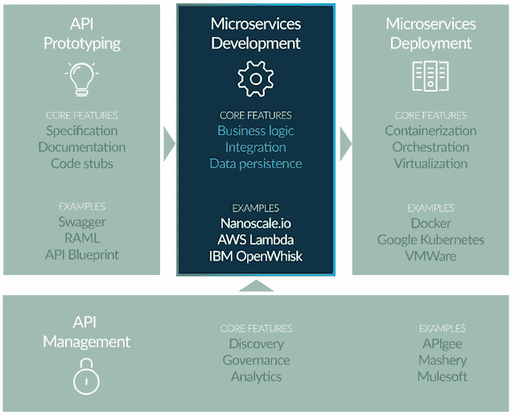

# Nanoscale.io 将传统系统连接到微服务

> 原文：<https://thenewstack.io/nanoscale-io-connects-legacy-systems-microservices/>

来自[nanometry . io](http://www.nanoscale.io/)的新软件旨在填补微服务中间件的空白。Nanoscale.io 平台最初名为 [AnyPresence](http://www.anypresence.com/) 的[justapi](http://www.infoworld.com/article/2948982/apis/build-an-api-for-microservices-in-5-minutes.html)，旨在帮助开发人员构建微服务，这些微服务可以插在本地遗留系统的前面，或者作为可以部署在容器中的无服务器服务。

Nanoscale.io 联合创始人 Richard Mendis 表示，他已经见证了微服务生态系统在过去 18 个月中的发展，特别是在过去的 6 个月中，他见证了市场上供应商的稳定。

一端是 API 原型工具，帮助定义和设计将公开现有或新的服务和数据资产的 API(其中一些包含在我的研究报告[无服务器架构产品](https://thenewstack.io/serverless-computing-growing-quickly/)中，一些列在 [Lawrence Hecht 的无服务器市场分析](https://thenewstack.io/tns-guide-serverless-technologies-best-frameworks-platforms-tools/)中)。然后是部署工具，帮助开发人员管理 DevOps 任务、容器化和编排，以及持续集成。除此之外，还有处理 API 治理、授权和身份管理、速率限制和使用模式的 API 管理供应商。

门德斯在下图中描绘了这个市场:

“将逻辑构建到微服务中的中间件工具还没有达到很高的成熟度，”Mendis 说。他给出了一个开发人员使用他们选择的 IDE 构建应用程序，然后将应用程序放入容器中进行部署的例子。但是该应用程序将需要利用许多业务系统，这些业务系统通常被困在一些后端基础设施中，开发人员最终会在每个应用程序中复制辅助服务:消息传递、通知、后台作业、将 XML 解析为 JSON 和对象存储等服务。

门德斯说，这是纳米尺度 io 关注的领域。它允许架构师和开发人员构建微服务和重构 API，并通过像 [Kubernetes](/category/kubernetes/) 这样的容器编排层将它们部署在云中。

微服务可供开发团队在构建应用程序时使用。与 API 原型架构不同，Mendis 关注的微服务中间件层不仅仅是描述或构建 API，它的目标是构建一个平台无关的微服务架构，以便开发人员仍然可以使用他们喜欢的任何 IDE 或部署工具集。

Mendis 表示，类似服务的现有产品——如亚马逊网络服务、谷歌云平台、IBM OpenWhisk 和微软 Azure——不一定能够链接到现有的遗留系统，为合并助手服务而单独收费，并可能将开发人员束缚在供应商的生态系统中。

像其他一些产品一样，最著名的是 LSQ、 [Dreamfactory](https://www.dreamfactory.com/) 和 [Restlet](http://www.restlet.com) ，Nanoscale.io 的微服务架构构建器可以混合和匹配应用程序中连接的内部和云服务。纳米尺度 io 还提供基于云的托管服务，这样开发者可以从云中管理他们的微服务，从而创建一个完整的[无服务器](/category/serverless/)应用。

Mendis 最近[致力于微服务、无服务器和容器相关产品的生态系统图](http://www.nanoscale.io/ecosystem/)，以更好地展示他们认为自己所处的位置*(参见本文顶部的功能图)*。

有两个特别的竞争优势是 nanomega . io 渴望利用的。

第一个与[微服务](/category/microservices/)模式的发展有关。Mendis 认为，各种规模的企业都在考虑如何将他们的架构转向微服务方法，这已经达到了一个临界点。虽然其他人认为[您必须达到一定的规模才能从微服务中获益](https://thenewstack.io/succeed-failure-microservices/)，但随着无服务器的出现以及各种规模的企业在基于云的基础架构中整合功能以创造新产品和服务的新机遇，这一观点可能会发生变化。即使是那些拥有私人托管服务提供商或内部托管服务的企业，也希望在任何绿地开发中使用微服务作为其技术范式。

因此，当微服务成为企业的优先事项时，nano calibration . io 希望出现在那里。另一方面，如果一家企业正沿着云路线发展，并希望在未来某个时间点灵活地迁移部署，以管理成本范围内的快速增长，或满足特定的服务器合规性问题，如存储政府或 HIPAA 数据，则与局限于一些现有的供应商产品相比，Nanoscale.io 等服务可能更具成本效益，更经得起未来的考验。纳米级 io 创建的微服务可以跨实例迁移。Mendis 指出，开发者甚至可以创建一个微服务，并在他们的笔记本电脑上运行它。

纳米级 io 的第二个优势是物联网领域的边缘计算用例。物联网正在创建庞大的数据集，因为智能基础设施中的每个传感器都在实时收集测量数据。这些数据通常作用很小，而且发送和存储在云中太过昂贵。Nanoscale.io 可以作为二进制文件在小型处理器上运行，这意味着它可以集成到传感器固件中，并作为网关来决定哪些数据应该保留和存储，哪些数据只对测量有用，以确保它处于当前阈值水平之内。在这种工业物联网情况下，Nanoscale.io 的用途将是位于传感器或传感器网关集线器上，在阈值超过一定水平时触发一个动作，并识别和发送任何应长期存储的数据。

纳米尺度 io 的时机至关重要。通过嵌入微服务生态系统地图的核心脊柱(连接微服务、容器、API 创建和管理)，它为下一波市场增长做好了定位。今年，更大的参与者已经通过收购进入或扩展到微服务和 API 领域(RedHat、Google 和 Deloitte)，而其他主要参与者继续将自己打造为这一支柱(特别是 AWS)。在未来六个月内，随着其他科技公司寻求提供支持开发人员在这种架构模式下工作的产品，以及云供应商继续将无服务器平台转变为成熟的产品类别，这种趋势将会加剧。

特征图片:Nanoscale.io 的微服务[生态系统图](http://www.nanoscale.io/ecosystem/)，经许可使用。

<svg xmlns:xlink="http://www.w3.org/1999/xlink" viewBox="0 0 68 31" version="1.1"><title>Group</title> <desc>Created with Sketch.</desc></svg>