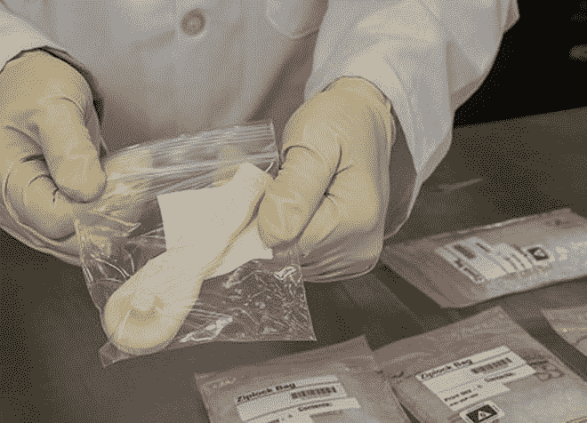

# NASA 3D 打印外太空火箭零件和工具

> 原文：<https://thenewstack.io/nasa-3d-printing-rocket-parts-and-tools-in-outer-space/>

3D 打印已经彻底改变了地球上的设计、制造和分销。现在，它也在改变工具、替换零件甚至建筑物在外层空间的制造方式——节省时间、金钱，甚至可能挽救生命。

今天的太空探索缺少了 20 世纪 60 年代那种年轻的、理想主义的热情，因为那些早期的、令人兴奋的日子最终让位于令人清醒的现实:巨大的成本超支、广为人知的灾难。尽管如此，在 3D 打印的帮助下，航空航天业经受住了考验，并继续创新，推动人类可能性的极限。

## 3D 打印世界上第一个全尺寸铜火箭部件

为了降低未来在其他星球上执行任务的成本，美国宇航局最近用铜 3D 打印出了第一个全尺寸火箭发动机部件。但它不是任何旧的铜部件:美国宇航局精心设计的铜火箭发动机衬里是例外，因为它经过精心设计，可以承受极端的高温和低温。

为了制造这种发动机缸套，美国宇航局马歇尔太空飞行中心 [材料和加工实验室的一台选择性激光烧结机](http://www.nasa.gov/centers/marshall/home/index.html) 在 10 天 18 小时的过程中将 8255 层铜粉熔化在一起。这种材料是 GRCo-84，这是一种由俄亥俄州克利夫兰市美国宇航局格伦研究中心的材料科学家开发的铜合金，上面印有 200 多个复杂几何形状的内部通道，允许冷却气体在内部再循环——防止火焰筒壁在燃烧过程中熔化，因为火焰筒外部的温度将超过 5000 华氏度。

马歇尔太空飞行中心的推进工程师克里斯·普罗茨说，这是一项重大突破，有助于让太空飞行变得更加经济实惠

> 我们的目标是制造火箭发动机零件的速度提高 10 倍，成本降低 50%以上。我们不只是试图制造和测试一个零件。我们正在开发一种可重复的流程，行业可以采用这种流程来制造具有先进设计的发动机零件。最终目标是让每个人都能负担得起建造火箭发动机的费用。

然而，还有更多的测试在进行中:下一步是在缸套表面喷涂镍超合金的“结构外套”，然后在马歇尔中心进行最后的[热火测试](http://www.nasa.gov/exploration/systems/sls/3dprinting.html)，以观察它在极端温度和压力下的表现，模拟发动机内部的条件。

## 外太空的 3D 打印工具

增材制造不仅可能改变地面的航天工业，还将对轨道产生巨大影响。4 月早些时候，马歇尔航天飞行中心的工程师收到了一箱由一台机器在太空中 3D 打印的第一批工具，这台机器于 2014 年 11 月安装在国际空间站(ISS)上。

其中的第一个，棘轮扳手，是由 3D 打印公司 [太空制造有限公司](http://www.madeinspace.us/)在地球上设计的。这些文件然后被电子发送到太空，以便国际空间站上的宇航员可以打印出来。该公司目前正在与美国宇航局合作，在国际空间站上建立一个附加制造设施。

总共打印了 14 种设计的 21 种工具，并与之前用同一台 3D 打印机打印的对照品进行了比较，然后将其送入太空。目标是了解微重力如何影响 3D 打印，项目工程师使用结构光扫描、电子显微镜和计算机断层扫描(ct)对两组打印项目进行耐用性、强度和结构测试。

[https://www.youtube.com/embed/gLY04N7chOs?feature=oembed](https://www.youtube.com/embed/gLY04N7chOs?feature=oembed)

视频

据美国国家航空航天局发言人特雷西·麦克马汉称，这第一轮工具更多的是用于测试目的，并不会实际用于太空。但其目的是最终允许宇航员在太空任务中打印替换零件，而不必等到下一次供应任务启动。随着每一次为期六个月的国际空间站考察同时进行 200 多个科学实验，快速制造任何所需部件或工具的能力将节省时间和金钱。紧急维修可以进行得更顺利。此外，美国宇航局还在考虑在太空中尽可能回收打印材料的可能性，这样新材料就不必被送上太空(显然，将一磅设备送上太空需要大约 1 万美元)。

## 在月球和火星上打印建筑

除了为太空任务轻松制造工具的短期实用性之外，从长远来看，增材制造有朝一日还可以用于在月球和火星上建造可居住的建筑。为此，美国宇航局为 3D 打印的支持者提供了资金，比如南加州大学的教授 Behrokh Khoshnevis，他是 Contour Crafting 项目的负责人，该项目正在开发大型便携式打印机，可以从数字文件中快速制造全尺寸建筑，从而降低成本、时间和建筑垃圾。

很明显，航空航天工业通过集成这些新工具受益匪浅。3D 打印不仅使地面和太空的设计、开发和生产更具成本效益，甚至可能拯救生命，降低太空飞行仍然存在的巨大风险。无论如何，美国宇航局最近采用 3D 打印是一个明确的信号，表明增材制造技术正在成熟，成为更主流和更重要的应用。随着 3D 打印融入[医学](https://thenewstack.io/robo-prosthetics-for-the-masses-is-a-future-ready-to-happen/)、[可持续和可负担得起的住房](https://thenewstack.io/wasp-3d-printing-affordable-mud-housing-for-the-developing-world/)、[产品设计](https://thenewstack.io/kinematics-origami-inspired-4d-printed-clothing-might-actually-comfortable-wear/)甚至[食品](https://thenewstack.io/delicious-and-nutritious-3d-printed-food-represents-a-new-way-of-eating/)，NASA 似乎只是众多参与 3D 打印革命的实体之一，采用新技术来拓展太空探索的独特前沿。

图片来源:美国宇航局/MSFC/埃米特·吉文。通过 Flickr 知识共享的特色图片[。](https://www.flickr.com/photos/futurilla/4525593054/in/photolist-7TUR9s-a7XKBV-5uHa2e-63FZT6-dygpsD-a81CVw-a81Cyo-7dDJK3-9cMCG3-gk87VS-8KSzte-63EKCT-gk7Nij-skFzu-63EDwF-q4ujFt-69hS2X-6vKf2k-poPEts-8UXD1k-cQHgKG-q4g4Zd-63EGU4-63ExtD-8Y9hsg-63EBiF-63JLMm-63JT9G-63JR75-63JPK7-63JX1u-63EH8H-63EyYT-63JWBm-63Eyta-63EHtZ-63EwZc-63JZu3-pp4fip-duXtAt-dv44WU-dv442U-duXtc2-9b9Bog-dw2V1E-dvWqpR-63JYcf-9zac7Y-63EJsZ-63EBKF)

<svg xmlns:xlink="http://www.w3.org/1999/xlink" viewBox="0 0 68 31" version="1.1"><title>Group</title> <desc>Created with Sketch.</desc></svg>