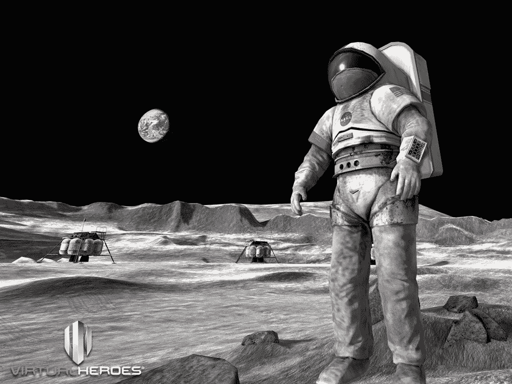

# 美国宇航局正在建造一个虚拟的火星

> 原文：<https://thenewstack.io/nasa-building-virtual-mars/>

美国宇航局今年将发布一个免费的虚拟现实程序，该程序将模拟探索火星表面。在 UnrealEngine.com 宣布的消息称，火星 2030 体验将在 Oculus Rift、谷歌 Cardboard 和三星 Gear VR 上提供，并且“还将扩展到索尼 PlayStation VR 和 HTC Vive”。还会有针对 Android 和 iOS 设备的版本，甚至会在 Twitch 上播放。他们承诺在今年 3 月的西南偏南会议上提供更多细节。

“借助 Epic Games 的虚幻引擎 4，任何拥有虚拟现实耳机的人都可以在 2016 年探索这颗红色星球……玩家可以在这颗红色星球上行走，也可以驾驶火星漫游车，”美国国家航空航天局(NASA)宣称，并承诺一项模拟将“使发生在火星栖息地和火星表面的一系列迷你任务变得栩栩如生。"

在现实生活中，美国宇航局的[因其在实际载人火星任务中的模糊进展而受到抨击。但是在视频游戏的世界里，NASA 的 making magic happen 与麻省理工学院的空间系统实验室、Fusion Media 以及一些来自非理性游戏公司(《生化奇兵》的创作者)的游戏开发者合作，构建精细的虚拟火星模拟。](http://www.theverge.com/2016/2/3/10908408/congress-nasa-journey-to-mars-no-plan-or-money)

“我们希望人们真正感觉到他们在火星上，”融合虚拟现实制作人朱利安·雷耶斯说。“引擎非常适合在 VR 中实现这一点。”

这不是政府机构第一次利用免费游戏引擎。2002 年，美国政府资助了一款名为[“美国军队”](https://www.americasarmy.com/)的免费多人射击游戏，该游戏也使用了虚幻引擎。2010 年，陆军游戏工作室还使用虚幻引擎为美国宇航局创建了另一个模拟器，名为[“月球基地阿尔法”，](http://www.moonbasealphagame.com/)与虚拟英雄合作，创建了一个模拟月球殖民地生活的免费 Steam 游戏。美国宇航局 2010 年[的新闻发布会上写道:“在陨石撞击破坏了太阳能电池阵列和生命支持设备后，玩家必须努力恢复关键系统和氧气流。”。](http://www.nasa.gov/home/hqnews/2010/jul/10-148_Moonbase_Alpha.html)

该游戏旨在成为以美国宇航局为主题的大型多人在线游戏的前身，“旨在提供需要玩家获得并展示 STEM 知识才能成功的内容和任务。”

[斯卡莱特宇航员学院](https://en.wikipedia.org/wiki/Starlite_%28video_game%29)于 2014 年在 Steam 上发布，但现在乐趣显然转移到了虚拟现实护目镜上。据非理性游戏公司的前技术设计师贾斯汀·索纳卡尔布(Justin Sonnekalb)说，虚幻引擎使创造下一代太空模拟器变得容易，他现在正在为美国宇航局的项目工作。

“在开发的第一天结束时，我们有一个共享的项目环境，玩家可以根据亚利桑那大学 HiRISE 项目的真实火星测高数据在地形上行走和驾驶，”Sonnekalb 说。“能够如此快速地获得基础知识，对于有时间和空间真正将火星带入生活并创造真正身临其境的体验来说至关重要。”现在，美国宇航局正在计划未来更多的虚拟现实体验——全部由虚幻引擎 4 驱动

这个特殊的 VR 项目始于去年 Fusion 的一些游戏开发者开始试验虚幻引擎的时候。“它已经进化了，”雷耶斯说，“我们认为它是一种非常令人兴奋的东西，可以用来以前所未有的方式讲述故事。”

事实上，美国宇航局已经与 Fusion 合作，分享他们在太空运输方面的研究成果。像这样的模拟甚至可以起到鼓励孩子成长为下一个宇航员的作用。“美国宇航局火星之旅的一个重要部分是我们正在做的工作，使个人和非政府实体更容易进入太空，”美国宇航局在一份声明中说。

“我们的火星宇航员现在可能在幼儿园到九年级，所以能够与这一代人分享我们现在正在做的将他们送往火星的工作是一个巨大的机会。”

* * *

# WebReduce

<svg xmlns:xlink="http://www.w3.org/1999/xlink" viewBox="0 0 68 31" version="1.1"><title>Group</title> <desc>Created with Sketch.</desc></svg>