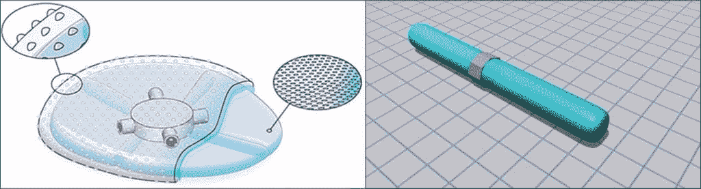
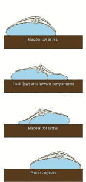
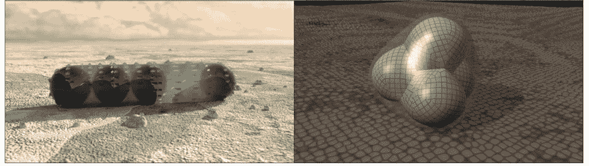

# 美国宇航局计划用光滑的“膀胱机器人”探索恶劣的地形

> 原文：<https://thenewstack.io/nasa-creating-slitherly-bladder-bots-explore-harsh/>

当我们想到在遥远的行星或卫星上进行太空探索时，我们通常会想到巨型[火箭](https://thenewstack.io/how-to-print-a-rocket-engine-and-make-business-in-space-affordable/)，在太空中疾驰的遥远的[探测器](https://thenewstack.io/from-a-computer-in-space-the-night-region-of-pluto-illuminated-by-the-moon-of-charon/)，以及在未知地形上行进的多轮[太空漫游车](https://thenewstack.io/tumbling-hopping-hedgehog-robot-explore-asteroids/)，收集科学样本和数据。但不利的一面是，车轮往往会卡在危险的多沙环境中，使得沉重的车轮漫游者在这种情况下几乎毫无用处。

为了解决这个非常现实的问题，美国国家航空航天局的兰利研究中心最近获得了一项专利，开发无轮子的“无定形表面机器人”作为替代品。受变形虫和蠕虫的启发，这些柔软的机器人可以在困难的地形上滑行、滑动和翻滚，以改善对地面上和地下难以到达的区域的探索。

左:基于“变形虫”的膀胱机器人。右图:尺蠖机器人。

正如[主板](http://motherboard.vice.com/read/nasas-latest-rover-concept-is-inspired-by-worms-and-amoebas)所言，在 NASA 的[专利摘要中](http://patft.uspto.gov/netacgi/nph-Parser?Sect1=PTO2&Sect2=HITOFF&u=%2Fnetahtml%2FPTO%2Fsearch-adv.htm&r=1&f=G&l=50&d=PTXT&p=1&S1=(20160105.PD.+AND+aeronautics.AANM.)&OS=isd/1/5/2016+and+aanm/aeronautics&RS=(ISD/20160105+AND+AANM/aeronautics))描述了这些无定形表面机器人相对于传统火星车的优势:“一旦部署在表面上，传统火星车通常会沿着表面推进。特别是在沙质或壤土环境中，如月球或火星表面，传统的推进装置可能会被污染和卡住。目前公开的机器人在预定行进方向上改变形状，以提供改善的表面机动性以及增强的对自然环境的保护

## “膀胱机器人”和尺蠖

带有旋转液体隔间的膀胱机器人。

现在，请告诉我们，基于变形虫或蠕虫的机器人看起来像什么，它将如何工作？NASA 提出的第一个无定形机器人是膀胱机器人，它看起来像一个无实体的囊，当其高粘度液体内部围绕内部泵和阀系统移动和循环时，它就会移动，从而推动它前进。根据总结，这个团块状机器人可能有两个版本:一个更像变形虫，或者一个有旋转的流体隔间。科学家们解释了这个血滴机器人是如何移动的，它实际上相当巧妙:

阀组件选择性地从至少一个隔室中抽取一些流体，并将抽取的流体排放到指定的一个隔室中，以相对于地面移动指定的隔室。这使无定形机器人向放电方向移动。”

另一种可能的设计是所谓的尺蠖机器人，其特点是一种长管状设计，一个致动器和一个控制单元。从尺蠖的运动中获得线索，当它的控制单元被激活时，这个机器人能够四处走动，给致动器和它所连接的电磁体通电，这反过来磁化铁磁流体，并在所需的方向上延长管道。当控制单元断电时，铁磁流体被消磁，从而缩短管子。这个过程一遍又一遍地重复，让机器人“以一种类似于蠕虫的方式”移动，蠕虫向所需的方向延伸，抓住表面，然后向前拉它的尾部。

## 电磁铁和聚合物电池

还有一个提议是电磁球体机器人，正如它的名字所暗示的，它是由几个电磁球体在一个灵活的充满液体的囊中组成的。当电磁体的极性以一定的顺序改变时，球在内部移动，导致它向某个方向移动。

聚合物细胞机器人在概念上也是类似的，但使用了一系列封装在由柔性材料制成的更大外壳中的聚合物细胞。这些内部细胞可以彼此独立地改变大小，从而重新定位整体重心，并使整个机器人向前滚动。

除了没有任何轮子、腿或关节可以积聚沙子之外，这些机器人将完全独立，并与外界环境密封隔离，使它们耐用并适应多尘的环境。由于它们也没有严格定义和不变的形状，它们可以放大到任何尺寸。正如该项目网站所指出的，这些机器人还可以用于地球上自然灾害后的搜索和救援行动，以及管道或下水道系统检查等更普通的任务。

左图:电磁球体机器人。右图:聚合物细胞机器人。

虽然这些无形的机器似乎与机器人的传统概念相去甚远，但它实际上是向更柔软的、[生物启发的](https://en.wikipedia.org/wiki/Bio-inspired_robotics)机器人发展的一部分，这种机器人从自然中学习概念，并将它们应用于现实世界的工程问题。类似于建筑和产品设计等学科中受自然启发的趋势，这种对自然的仿生正在导致一个新的研究分支，称为软机器人学，在这个分支中，设计通过柔韧而不是包裹在金属中而变得耐用。随着配备有[机器学习](https://thenewstack.io/machines-learn-learn-like-humans-new-breakthrough-algorithm/)——甚至潜在的[情商](https://thenewstack.io/affective-computing-emotionally-intelligent-machines/)——的机器人的出现，现在以自动驾驶汽车、乐于助人的[送货机器人](https://thenewstack.io/self-driving-grocery-delivering-robots-ready-roll-door/)甚至协作机器人[共同工作机器人](https://thenewstack.io/collaborative-robots-will-help-human-workers-not-replace/)的形式出现，使它们尽可能柔软可能有助于它们轻松融入我们的日常生活。

更多信息请见[美国国家航空航天局](http://technology.nasa.gov//t2media/tops/pdf/LAR-TOPS-156.pdf)和[美国专利商标局](http://patft.uspto.gov/netacgi/nph-Parser?Sect1=PTO2&Sect2=HITOFF&u=%2Fnetahtml%2FPTO%2Fsearch-adv.htm&r=1&f=G&l=50&d=PTXT&p=1&S1=(20160105.PD.+AND+aeronautics.AANM.)&OS=isd/1/5/2016+and+aanm/aeronautics&RS=(ISD/20160105+AND+AANM/aeronautics))。

图片:美国宇航局

<svg xmlns:xlink="http://www.w3.org/1999/xlink" viewBox="0 0 68 31" version="1.1"><title>Group</title> <desc>Created with Sketch.</desc></svg>