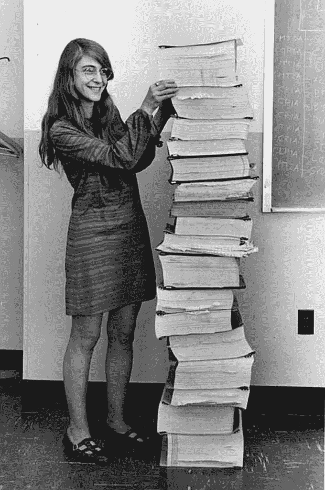

# 玛格丽特·哈米尔顿回忆了她作为编程先驱的生活

> 原文：<https://thenewstack.io/nasa-programming-legend-margaret-hamilton-gives-rare-interview/>

在 20 世纪 60 年代早期，玛格丽特·哈米尔顿开始了她的先锋程序员和系统设计师的职业生涯。当美国国家航空航天局启动一系列任务，导致第一批宇航员登上月球时，汉密尔顿是麻省理工学院仪器实验室软件工程部门的主任，开发任务的机载飞行软件。

该项目包括为登陆月球的登月舱和它的“母舰”编写 [40，000 行代码](https://thenewstack.io/fifty-year-old-apollo-11-source-code-gets-fresh-review-github/)，母舰是运载指令舱和服务舱的轨道飞行器。

这仅仅是已经持续了半个多世纪的计算机科学生涯的开始，并且还在继续。

然而，尽管取得了这些成就，汉密尔顿[“很少接受采访或公开谈论自己，”大卫·c·布洛克](https://computerhistory.org/blog/margaret-hamilton-in-her-own-words/)写道，他是技术历史学家，也是硅谷计算机历史博物馆软件历史中心的馆长/主任。

因此，2017 年 4 月，布洛克怀着格外兴奋的心情前往波士顿，与她一起记录口述历史。在本周给新堆栈的一封电子邮件中，他称这个机会是“令人难以置信的特权”，并指出汉密尔顿的历史意义在于“深度参与了美国计算机最初几十年中一些最重要的背景和项目。”

本周，那次采访终于在网上发布了——包括他与这位 81 岁的先驱的对话视频。

[https://www.youtube.com/embed/6bVRytYSTEk](https://www.youtube.com/embed/6bVRytYSTEk)

视频

但那次采访也让我瞥见了作为另一种先锋的感受——在一个男性占主导地位的领域里做一名女性。

汉密尔顿记得自己是大学物理课上唯一的女性——“当时，我认为教授认为女性不应该学习物理，因为他……嗯，你必须了解时代。”

她补充道，“这是大学里唯一一次有人质疑我可能无法利用这一点。”

但汉密尔顿仍然不为所动:“我只是说，‘因为我想接受它’，你知道。”

## 历史性项目和获得信贷

20 世纪 60 年代初，汉密尔顿曾计划攻读数学研究生学位，但当她的丈夫在法学院上学时，汉密尔顿通过在麻省理工学院教授爱德华·n·洛伦茨那里找工作来养家。

洛伦茨后来被认为是混沌理论的创始人之一。“是洛伦茨普及了‘蝴蝶效应’的概念，”布洛克在博客中写道，“这一概念认为，在某些系统中，微小的差异可以产生巨大的变化，就像海鸥扇动翅膀引起风暴，或者蝴蝶扇动翅膀决定龙卷风的路径。”

汉密尔顿为这位教授编写了气象模拟程序，她在采访中称之为“我做过的最好的事情之一……我以前从未真正靠近过计算机。”

为了代替她编写模拟程序，汉密尔顿雇佣了[艾伦·费特](https://en.wikipedia.org/wiki/Ellen_Fetter)，她刚刚从蒙特霍约克大学毕业，获得了数学学位。然而，虽然今天他们被列为合著者，但在讲述混沌理论的历史时，这两位程序员很少被提及。

> 汉密尔顿回忆说，她的一位男同事曾经问她，“当你家里有一个孩子的时候”，她怎么能接受一份编程工作
> 
> “我说，‘嗯，你知道，你必须做对你来说正确的事情，我也必须做对我来说正确的事情。’他说，‘哦，好的。’"

“这是科学和技术历史上一个太常见的故事，”麻省理工学院科学、技术和社会项目系主任[詹妮弗·莱特](https://sts-program.mit.edu/people/sts-faculty/jennifer-s-light/)在 2019 年接受科学杂志《广达》采访时指出。

在布洛克的采访中，汉密尔顿说她得到了洛伦兹本人的认可:“后来，几年后，大概五年前，我在他的一篇著名论文中意识到，他感谢我所有的编程。我从来不知道他会这么做。这对我来说真的很重要。”

## 在麻省理工学院学习更多

从事洛伦茨的项目给汉密尔顿带来了大量使用世界上最早的计算机的经验。不久，她在面临程序员短缺的麻省理工学院林肯实验室(由国防部资助)找到了报酬更高的工作。(汉密尔顿研究了一个程序，试图在雷达读数中辨别敌机的声音。)

当她被邀请去参加一个关于实验室使用的计算机指令的课程时，汉密尔顿回答说她必须留下来照顾她年幼的女儿。“但我会做一笔交易，”她告诉她的经理们。“我会学到和所有参加课程的人一样多的东西，如果不是更多的话……你会明白的。

“所以每个人都去上课。我不记得了，大概六到八周，我一个人呆在家里……他们回来的时候，我已经完成了大部分需要完成的工作！”

林肯实验室的工作人员大多是男性，但也包括女性。回顾过去，考虑到当时的态度，这是不寻常的。汉密尔顿回忆说，她的一位男同事曾经问她，“当你家里有一个孩子的时候”，她怎么能接受一份编程工作

“我说，‘嗯，你知道，你必须做对你来说正确的事情，我也必须做对我来说正确的事情。’他说，‘哦，好的。’"

当她看到一则新闻报道说麻省理工学院的仪器实验室赢得了美国宇航局阿波罗项目的工作合同时，她的想法是，“我想我应该再次推迟读研，因为我想从事这个把所有人送上月球的项目。”

## 在美国宇航局没有“愚蠢”的问题

阿波罗是一次丰富的经历，充满了许多人生教训。(“我学会了如果你不知道，就问。提问。不要害怕问一个愚蠢的问题。没有愚蠢的问题。重要的是学会你需要学习的东西。”)

她说，对于整个团队来说，失败是一位伟大的老师:“我们变得更聪明的方式是犯了错误并从中吸取教训，承认错误，然后说，‘这不会再发生了。’"

阿波罗项目的所有代码都必须在模拟中进行广泛的预先测试，汉密尔顿与各种各样的工程师和“硬件人员”一起工作，她回忆说，这些人对“软件”这个词并不熟悉

> 汉密尔顿证实，阿波罗计划的策划者没有为创建他们的软件分配足够的时间。“任何软件项目都是如此，”她笑着补充道。

在模拟中，硬件和软件功能看起来是一样的，所以有必要区分它们。然而，她说，程序员“有点像二等公民……我们拿走东西，然后‘让它运行’，对吗？”因此，当她提议将这两个领域命名为硬件工程和软件工程时，她回忆起了当时的怀疑态度。

然后，在决定性的一天，“一个硬件专家在一次大型会议上站起来说，‘你知道，玛格丽特是对的。这是…’——几乎让我热泪盈眶—“这是工程，你们这些人正在做的事情，就像我们正在做的事情一样多，”指的是硬件。他说，‘她试图使它正规化，我认为它应该变得正规化’，每个人都尊重这个硬件家伙。”

直到今天，汉密尔顿被认为创造了软件工程这个术语。但是她总是意识到程序员的工作所承载的巨大责任。

“如果它不起作用，一个人的生命就会受到威胁，如果不是结束的话，”她说。"这一直是我最关心的问题，可能其他许多人也是如此。"

汉密尔顿证实，阿波罗计划的策划者没有为创建他们的软件分配足够的时间。(“任何软件项目都是如此，”她笑着补充道。)但这并不是她唯一一次面临内部产生的挑战。

当她不得不在晚上和周末工作时，汉密尔顿带着她的女儿劳伦来上班。有一次，她的女儿设法让一个任务模拟器崩溃，最终导致了一个关键的教训。“我不能忽视这一点，因为这可能发生在真正的任务中，”汉密尔顿说。

> 在美国宇航局，汉密尔顿总是意识到程序员的工作所承载的巨大责任:“如果它不工作，一个人的生命就会受到威胁，如果没有结束的话。”

在任务后期选择预发射程序意味着可擦除内存被共享——但汉密尔顿的高层担心增加任何额外的代码，而是在手册中添加了一种注释来解决这种不太可能的情况。

汉密尔顿告诉布洛克，果然，在阿波罗 8 号任务中——第一艘离开地球轨道的载人飞船——这种情况发生了。

汉密尔顿回忆说，事故发生时，她正在剑桥的实验室里。“我说，‘这是劳伦虫。我知道这是劳伦的错误…”

宇航员们很好。“他们只是必须把数据放回去，”汉密尔顿告诉布洛克，“这需要一段时间。”但在那次飞行之后，她得到了美国宇航局的许可，可以添加额外的代码。

## 阿波罗 11 号之后，几十年的创新

2003 年，美国宇航局发明与贡献委员会[认可了汉密尔顿的贡献](https://www.nasa.gov/pdf/251093main_The_NASA_Heritage_Of_Creativity.pdf)(这为指导未来的美国宇航局太空计划如天空实验室甚至航天飞机奠定了基础)。

“她的异步软件、优先级调度、软件重用和人在回路中的决策能力(如优先级显示)的概念，成为了超可靠软件设计的基础，”引文中写道。

"在任何载人航天阿波罗任务中，都没有发现软件错误."

1969 年，玛格丽特·哈米尔顿站在她和她的团队为阿波罗计划做的一堆计算旁边。(美国宇航局拍摄)

事实上，在汉密尔顿为阿波罗计划工作期间，“她和同事们对出现的软件错误进行了仔细的研究，”布洛克在他的博客帖子中指出，“根据原因对它们进行了仔细检查和分类。”

布洛克在本周的一封电子邮件中补充道，尽管汉密尔顿因其在阿波罗制导计算机方面的工作而闻名，“我特别高兴的是，在她的口述历史中，她能够展示自阿波罗计划结束以来她一直关注的工作。这是她致力于创造软件和其他系统的方法，通过设计避免错误并确保可靠性。”

布洛克称它们为“过去 50 年来她所做的不太为人所知的努力，今天仍在积极地进行着”

或者，正如他在博客中所说，“通过绕开错误的原因来避免这些错误，从此成为她职业生涯的焦点。她创建了两家公司来从事这项工作，领导开发新的形式化方法和语言来创建无错误和可靠的软件和系统。

"在写这篇文章的时候，她还在继续这项工作."

* * *

## WebReduce

<svg xmlns:xlink="http://www.w3.org/1999/xlink" viewBox="0 0 68 31" version="1.1"><title>Group</title> <desc>Created with Sketch.</desc></svg>