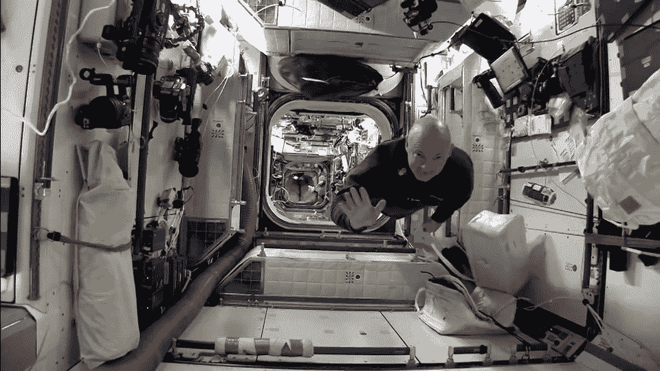
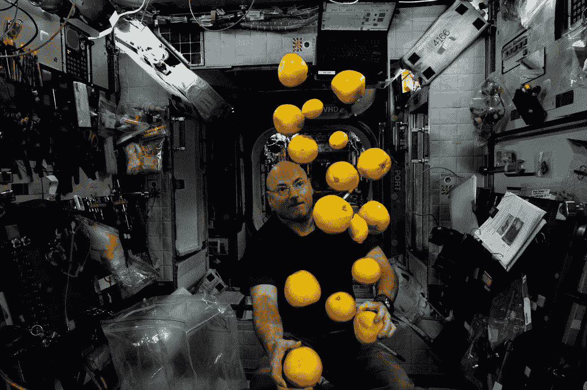
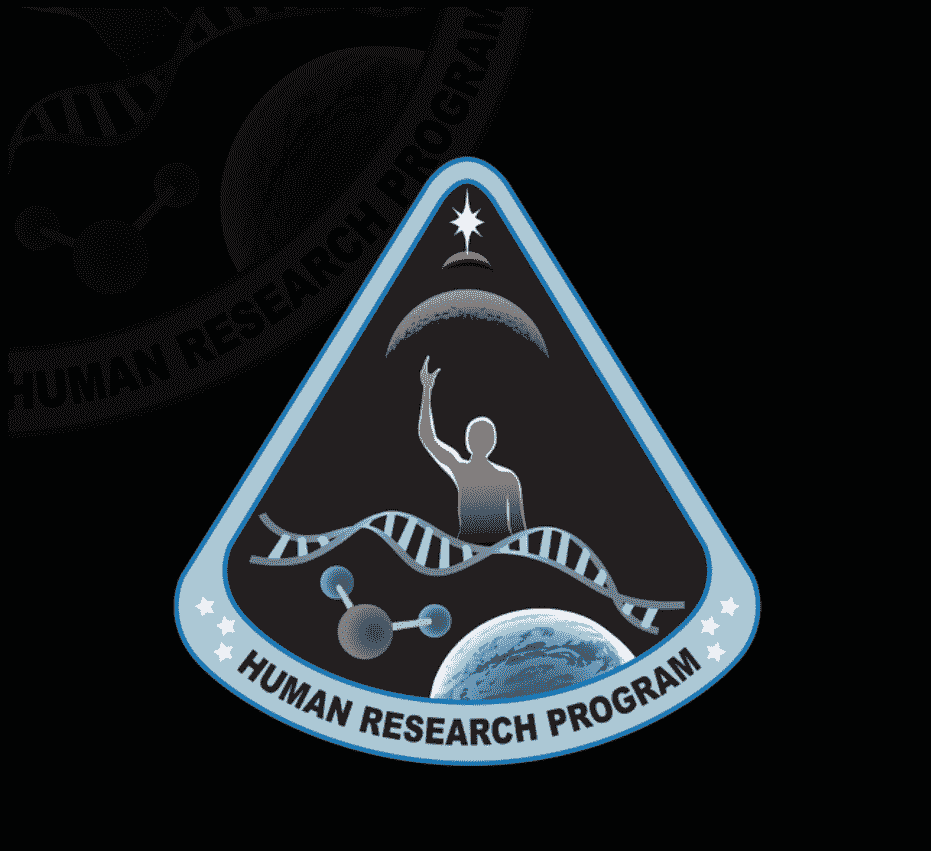
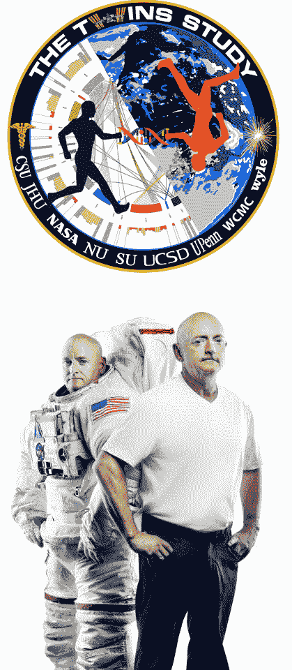

# 美国宇航局公布“太空双胞胎”研究结果

> 原文：<https://thenewstack.io/nasa-reveals-results-twin-space-study/>

这是一个科学家的梦想:一年的医学测试已经在两个同卵双胞胎身上进行了——具体来说，是两个出生在新泽西的 52 岁爱尔兰人——一个在太空，一个在地球。

上周，美国宇航局公布了其实验的第一批结果。在推特上，美国国家航空航天局宇航员[斯科特·凯利](https://twitter.com/StationCDRKelly)对这个消息感到很开心:

斯科特的哥哥马克是*也是*一名宇航员，在几次任务中驾驶航天飞机，也是一名海军飞行员。马克在海湾战争中执行了 39 次战斗任务，最终晋升为上尉，根据他在 NASA 的[网页，“已经在 50 多种不同的飞机上飞行了 5000 多个小时。”但是这项任务要求他留在地球上——一年的时间被美国宇航局描述为“戳、刺激和质疑”](https://www.jsc.nasa.gov/Bios/htmlbios/kellyme.html)

根据 Inverse 的说法，马克说他想念外太空，即使作为一个普通公民，“我也会在一秒钟内爬进航天飞机。”但事实上，是他的哥哥斯科特创造了在轨道上停留时间最长的记录——520 天，其中 340 天连续停留在国际空间站。Gizmodo [指出](https://gizmodo.com/why-mark-kelly-is-now-older-than-his-older-twin-brother-1785799892)多亏了爱因斯坦形式化的相对论，斯科特现在也比他的兄弟姐妹年轻了 5 毫秒。但是斯科特也“回到这个星球时高了两英寸，视力更差，心脏更小，”根据 Inverse.com 的说法，斯科特在 2016 年[国际空间站 R & D 会议上发言。“所有宇航员从太空回来后都会经历挥之不去的影响，他提醒观众——他的情况只是一种更极端的形式。”](http://www.issconference.org/)

在地球上呆了一整年后，马克后来开玩笑说他是“收入最低的政府雇员”。

美国宇航局想比较这对双胞胎，以了解太空时间对人类的影响，特别是 DNA、RNA 和人体内全部生物分子的变化。

12 所大学仔细研究了长达一年的研究数据。他们的研究技术包括基因测序——表观遗传学家分析他们的生物样本时使用“太空基因组学”这个词——就像美国宇航局探索的那样

“这些数据是如此的新鲜，以至于其中一些还在测序仪上，”威尔康奈尔医学院的遗传学家[克里斯托弗·梅森](http://physiology.med.cornell.edu/faculty/profile.php?id=mason)[告诉*自然*](http://www.nature.com/news/astronaut-twin-study-hints-at-stress-of-space-travel-1.21380) 。

果然，当斯科特返回地球时，RNA 测序显示超过 200，000 个 RNA 分子以不同方式表达，尽管独特的突变完全正常，但美国宇航局表示，研究人员“将更接近地观察[，看看‘太空基因’是否可能在斯科特在太空时被激活](https://www.nasa.gov/feature/how-stressful-will-a-trip-to-mars-be-on-the-human-body-we-now-have-a-peek-into-what-the-nasa)。”

一名研究人员注意到，两个男人都发现延长他们染色体端粒的酶增加了——而斯科特的实际上延长了他们测试的白细胞。科罗拉多州立大学的辐射生物学家苏珊·贝利告诉《自然》杂志说:“这与我们所想的正好相反。”尽管美国国家航空航天局认为这一结果“可能与任务期间增加锻炼和减少热量摄入有关。”

这是一个反复出现的主题。血脂检测显示斯科特有一些炎症，而马克的 3-吲哚丙酸(由肠道细菌产生)水平较高。一项对它们肠道微生物组的研究发现，它们一直存在“明显”的差异，但美国宇航局表示，“由于它们不同的饮食和环境，这是意料之中的。”毕竟，他们让斯科特进行了更多的锻炼，也让他进行了更严格的节食。

那天，一船新鲜水果到达了

另一项研究也发现“剧烈运动对策”增加了斯科特体内 IGF-1 激素的水平。

其他结果没有那么引人注目。两个双胞胎都接种了流感疫苗——两人的表现都符合预期。根据另一个生化标记——C 反应蛋白——判断，在重返大气层期间，“炎症似乎出现了峰值”，但当然，重返大气层是有压力的。

最终还不清楚是否所有的数据都会被公开——不仅仅是因为有大量的数据。PBS Newshour 报道称:“这对双胞胎协商了在发布前检查信息的权利，以防其中包含任何敏感信息。”。

但是不管发生什么，斯科特在太空的一年已经是一个突破性的努力。“美国宇航局非常了解宇航员在轨道上六个月后会发生什么，”他们的美国宇航局生命科学负责人[Craig kundro](https://www.linkedin.com/in/craigkundrot/)解释道。"深空探测任务将需要更长的时间."但是他们也想调查这一切的*心理*，让宇航员填写关于他们想法和情绪的问卷。最终，他们的答案将与他们的生物样本相互参照，看看是否有任何相关性。昆德拉用近乎诗意的语言解释了它的意义。

*“当我们离开家 6 个月的时候，就像是一次漫长的出差。离家一年是另外一回事。我们会错过每一个生日、周年纪念、毕业典礼和许多其他里程碑。这感觉就像生活中的一大块——这可能会影响太空旅行者的情绪或行为。”*

美国宇航局正在调查的事情之一是空间是否会影响人的感知——不仅仅是空间关系，还包括他们是否保持警惕并继续做出正确的决定。除了来自太空的辐射，还有身体上的压力，还有低重力体验(更不用说持续的禁闭了)。

结果呢？“测试发现，机组人员在执行需要姿势控制、稳定性和肌肉灵活性的任务时有最大的困难，”美国宇航局的一页报道说，“但大多数其他措施没有显示六个月和一年飞行时间变化之间的实质性差异。”

他们甚至在 iPad 上测试了精细动作技能——指向、拖动、形状跟踪和捏转。这项研究还发现，为期一年的任务中，宇航员睡眠更多——可能是因为他们的时间表更轻松…

但是现在有了硬数据来规划 NASA 的下一步行动，Kundrot 称这项研究为“该机构的探路者”。

[https://www.youtube.com/embed/cnM_ZVvZA_o?feature=oembed](https://www.youtube.com/embed/cnM_ZVvZA_o?feature=oembed)

视频

“通过这项研究，我们能够了解人类如何应对这些挑战，并使我们能够更好地探索地球以外的世界，更好地了解我们人类是如何运作的。”

事实上，美国宇航局称他们的最终目标是去火星旅行——甚至更远。早在 2004 年，美国宇航局的太空计划就开始重新聚焦于探索太空。因此，根据[美国宇航局*人类研究项目*的网站，这两项研究是通过确保宇航员保持健康来实现更长距离旅行的更大努力的一部分。](https://www.nasa.gov/hrp)

为此，他们已经调查了从月球尘埃和辐射到太空中适当饮食的一切。

但是这项双胞胎研究给了他们一个全新的视角。

* * *

## WebReduce

<svg xmlns:xlink="http://www.w3.org/1999/xlink" viewBox="0 0 68 31" version="1.1"><title>Group</title> <desc>Created with Sketch.</desc></svg>