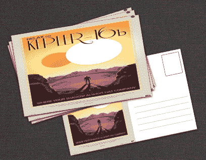
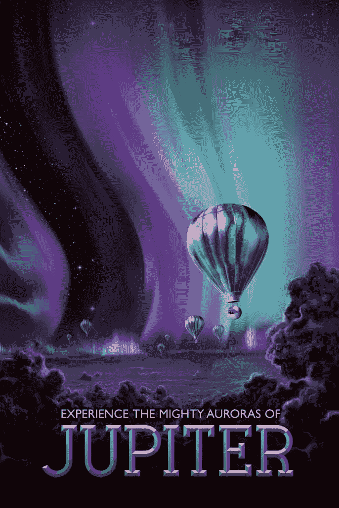
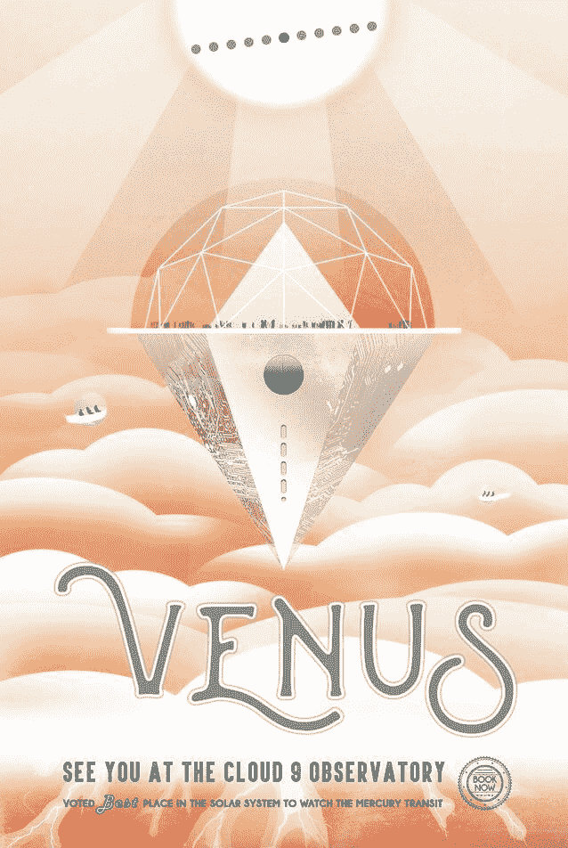

# 美国国家航空航天局的复古未来主义旅行海报赞美太空旅行的奇迹

> 原文：<https://thenewstack.io/nasas-retro-futuristic-travel-posters/>

美国宇航局喷气推进实验室刚刚发布了一个新的艺术作品系列,想象着一个奇妙的未来，外太空的奇异地点已经成为受欢迎的旅游目的地。令人惊叹的插图纪念了木星的极光，泰坦的神秘水域，以及新发现的行星开普勒-16b 的双太阳，“在那里你的影子总是有公司。”

模仿复古旅行海报，美国宇航局将地球描述为“你在太空中的绿洲”。在那里，空气是自由的，呼吸是容易的。”

甚至还有谷神星的海报，谷神星是一颗直径 587 英里的矮行星，位于火星和木星之间的小行星带。“木星到来之前水的最后机会…”

美国宇航局鼓励游客打印出 14 幅插图作为免费海报——并继续梦想我们想要生活的世界。“当你浏览这些充满想象力的旅游目的地的图片时，请记住，你可以成为未来的建筑师。”JPL 商店也在[出售海报的明信片](http://thejplstore.com/index.php?route=product/category&path=61_65)，所以你可以问候来自三个未来目的地的朋友——开普勒-16b、开普勒-186f 和“超级地球”HD 40307g。

海报和明信片是由两兄弟创作的，他们在西雅图开了一家名为[隐形生物](http://www.invisiblecreature.com/about/)的设计公司。“最初……有激情，只表现为在学校教科书的空白处涂鸦，”他们的起源故事写道。

有趣的是，他们的祖父花了超过 25 年的时间[作为 NASA 的插图画家](http://blog.invisiblecreature.com/from-the-alfred-paulsen-files/)，他们[在他们的博客](http://blog.invisiblecreature.com/new-posters-for-nasa/)上承认“这个项目显然是一个特别的项目。”在业余时间，他们的创造力也在一个名为[恶魔猎手](http://www.demonhunter.net/)的金属乐队中迸发出来，他们说这个乐队有几十万张唱片。但是他们的 NASA 海报变得非常受欢迎。

隐形生物一直通过其网站销售印刷品(和变体)[，但现在它的两款产品已经销售一空。“](http://blog.invisiblecreature.com/new-posters-for-nasa/)[大旅行](http://blog.invisiblecreature.com/new-posters-for-nasa/)”印刷品纪念了美国宇航局的旅行者号飞船如何通过利用每颗行星的引力来收集木星、土星、天王星和海王星的数据，这种情况每 175 年才会发生一次。同时售出的还有一套特殊的三张签名照片，其中还包括了关于火星和土星第六大卫星恩克拉多斯的海报。

但是享受这种神奇的最好方式可能是浏览 NASA 网站上展示的图片。我最喜欢的想象是[坐落在金星粉色云层中的天文台](http://www.mnn.com/earth-matters/space/photos/nasas-space-tourism-posters-will-make-you-want-explore-galaxy/venus-cloud-9-observatory)。(“被评为太阳系中观看水星凌日的最佳地点。”)

很难不把这些海报看作是美国国家航空航天局试图为所有即将到来的新太空计划建立强大的公众支持。或者就像 NASA 在他们的网页上写的那样，“想象力是我们通向未来的窗口。”

<svg xmlns:xlink="http://www.w3.org/1999/xlink" viewBox="0 0 68 31" version="1.1"><title>Group</title> <desc>Created with Sketch.</desc></svg>