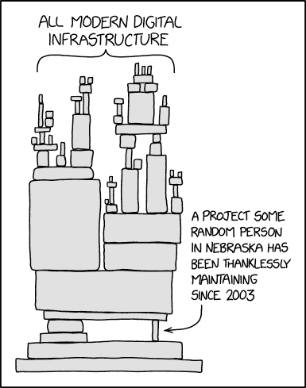

# 美国宇航局对开源软件和开放科学的渴望

> 原文：<https://thenewstack.io/nasas-thirst-for-open-source-software-and-for-open-science/>

从太空旅行到宇宙最深处的图像，软件一直是 NASA 所有主要成就的重要组成部分。自然，美国宇航局对高质量科学软件的需求使其转向开源开发者，现在又转向一个基于“开放科学”更大原则的雄心勃勃的新计划。

将美国宇航局的开源信息带到年度 FOSDEM 会议的是[史蒂夫·克劳福德](https://crawfordsm.github.io/about/)，一位热爱太空的天文学家，现在也是美国宇航局科学理事会的数据官，该组织让科学界参与定义问题和扩大研究。

此前，克劳福德管理团队为[韦伯太空望远镜](https://thenewstack.io/james-webb-space-telescope-and-344-single-points-of-failure/)构建校准软件，克劳福德开玩笑说，组织者说他的讲话听起来像“一个乐观的、伟大的方式，以大量漂亮的图片结束会议。”

克劳福德发表了内容广泛的演讲，他首先指出，从行星监测数据库到任务运行软件，“开源软件对于解决美国宇航局在气候变化、探索太阳系和发现地球以外的生命方面的最大挑战至关重要。”

对于一个成功的故事，克劳福德提到了火星独创性直升机，该直升机于 2021 年成功交付火星，并在除地球之外的大气层中进行了人类物体的首次飞行。"我们实际上是在另一个星球上驾驶直升机."虽然它原本预计只进行 5 次飞行，但现在已经完成了 40 多次，而且“它仍在飞行——它仍在探索！”

但更重要的是，它由开源飞行控制软件引导——美国宇航局喷气推进实验室在 2017 年发布的 [F Prime](https://nasa.github.io/fprime/) 软件。为了庆祝，美国宇航局和 JPL 与 GitHub 合作，以表彰所有众多软件贡献者-超过 12，000 人-在其 GitHub 个人资料上印有“火星 2020 直升机贡献者”徽章。

甚至詹姆斯·韦伯太空望远镜——一个最初构想于 20 世纪 90 年代的项目——也涉及开源软件。望远镜的发射前过程和软件测试依赖于基于 Python 的 [NumPy 库](https://thenewstack.io/5-steps-to-propel-python-into-the-next-decade/)的公开校准代码。

但克劳福德随后解释说，美国宇航局和在美国宇航局工作的人也发布了“大量”开源软件，包括“涉及行星科学、天文学、太阳物理学、地球科学以及技术发展和其他方面的广泛不同项目。”

一个例子是云计算平台 [OpenStack](https://en.wikipedia.org/wiki/OpenStack) ，T2 将其起源追溯到 NASA 和 RackSpace 的内部平台。“我们仍然在我们的 [ADAPT](https://www.nccs.nasa.gov/systems/ADAPT/) 超级计算机中心和我们的内部云计算中使用它…但是通过 RackSpace，我们已经将它交给更广泛的社区进行进一步开发。”

Crawford 还提醒观众注意 code.nasa.gov，它是 NASA 开源软件的仓库，目前有超过 500 个官方发布的项目。但现在还有刚刚发布的[科学发现引擎](https://sciencediscoveryengine.nasa.gov/app/nasa-sba-smd/#/home)，“一个探索我们所有数据集、软件和技术文档的系统，跨越所有科学任务理事会。”

克劳福德估计，超过 44，000 件软件已经由不同的美国宇航局研究人员和任务发布。

除了美国宇航局的 [GitHub 仓库](https://github.com/nasa)，克劳福德指出，美国宇航局的[喷气推进实验室](https://github.com/nasa-jpl)、[太空望远镜科学研究所](https://github.com/spacetelescope)也有单独的仓库。美国宇航局的软件目录也在网上(“你可以免费下载数百个新的软件程序，用于各种各样的技术应用，”其主页吹嘘道。甚至还有[天体物理学数据系统](https://ui.adsabs.harvard.edu/)，这是一个超过 1500 万份主要天文学和物理学出版物的摘要和全文的索引和可搜索集合。

## 回馈社会

克劳福德求助于另一个源自美国宇航局的软件程序 [NASTRAN](https://en.wikipedia.org/wiki/Nastran) ，这是一个有限元分析程序，于 20 世纪 60 年代开发，并于 20 世纪 70 年代发布到公共领域，以及 JPL Spice 工具包，克劳福德称之为“如果你想知道你想着陆的彗星或小行星在 10 年后会在哪里，你可以使用该软件。”Spice took kit 导致了一个名为 SpiceyPy(由大学本科生 Andrew Annex 创建)的 Python 包装器，该包装器现在被广泛用于航天局的任务中。

克劳福德称该软件是开源的成功故事——Annex 在业余时间继续开发它——但也是项目面临挑战的一个例子。克劳福德指出:“我们的许多开源系统实际上依赖于少数实际维护它并保持代码活跃和工作的开发人员，”他指的是关于可持续发展的经典 XKCD 漫画。

为了改善这种情况，美国宇航局的科学理事会正在资助开源软件，尤其是与科学相关的项目。在过去的两年里，它为 22 个不同的开源项目提供了 300 万美元的财政支持。

但除此之外，美国宇航局还接受了更广泛的开放理念。上个月，NASA 科学理事会发布了一项新的关于科学信息的官方政策。克劳福德说:“我们希望事情尽可能公开，尽可能限制，并始终保持安全。”。

这意味着没有研究和出版物不能与公众共享的“禁运”期——支持研究的数据和软件也在出版时共享。甚至任务数据也将尽快发布，不受限制地公开——任务软件也是公开开发的。

克劳福德称这是他们从詹姆斯·韦伯太空望远镜中学到的一课:“让每个人都可以使用该软件，实际上既可以访问它，也可以重复使用它——改善了科学的工作方式。”展望未来，他们计划在像 Creative Commons Zero 这样的许可使用许可下发布数据和软件。

最后，新政策鼓励 NASA 员工使用开源项目并为之做出贡献。

但是，除了美国国家航空航天局之外，还有一个面向世界的项目——包括一个新的 4000 万美元的五年计划，名为“向开放科学转变”。开放科学的理念包括免费提供研究信息，以鼓励外部贡献，美国宇航局正积极努力带领我们实现这一目标。

官方 TOPS 网页称其为美国宇航局的“全球社区倡议，旨在通过将改变当前范式的事件和活动引发变化并激励开放的科学参与。”在整个 2023 年，NASA TOPS 将与科学界的 12 个科学专业协会合作，“推动开放科学的采用，推出开放科学课程，并通过奖励、挑战和黑客马拉松来支持为少数群体服务的机构与 NASA 合作。”

WhiteHouse.gov 的一项声明承诺，更广泛的联邦计划将包括“面向学生、研究人员和公众的开放科学新课程，以及与历史上在科学领域代表性不足的人和团体的积极接触，全年的开放科学会议，以及其他新举措。”

NASA 对开放的承诺一直在传播。该局最重要的工作之一是研究气候变化的影响，克劳福德提醒观众，他们通过开放的 API 在云中开放所有数据——超过 70PB，在不同的系统中甚至更多,“开放给你以任何你喜欢的方式使用，以帮助解决这些问题。”

有许多不同的项目，包括关注环境的[全球能源资源预测](https://power.larc.nasa.gov/)(或电力)。但最终的目标总是授权更广泛的开源社区“实际开发应用程序，在此基础上构建开源工具，以不同的方式实际使用它……实际回答我们围绕气候变化和环境面临的一些最棘手的问题。”

美国宇航局科学理事会的顶部徽章

现在，美国国家航空航天局正与日本和欧洲航天局合作建设[地球系统观测站](https://science.nasa.gov/earth-science/earth-system-observatory)，以提供“对气候对地球影响的更近距离观察”将会有 600PB 的数据——“所有的数据都是免费的，可以被世界所访问，能够访问它，查看它，并在它的基础上构建东西……”

克劳福德说，美国宇航局自己的转型计划目标包括培训 20，000 名研究人员，这可以为他们赢得美国宇航局“开放科学”徽章，该计划包括开放源代码软件的课程。

“我们也在遵循自己的建议。我们在这个项目中所做的一切都将在 GitHub 上开源，这样社区成员就可以为之做出贡献。”其他目标包括将历史上被排除在外的群体的参与度提高一倍，以及在开放科学原则下实现五大科学发现。

克劳福德也希望 FOSDEM 的与会者也能“采取措施，让你的科学和结果更加公开。”

<svg xmlns:xlink="http://www.w3.org/1999/xlink" viewBox="0 0 68 31" version="1.1"><title>Group</title> <desc>Created with Sketch.</desc></svg>