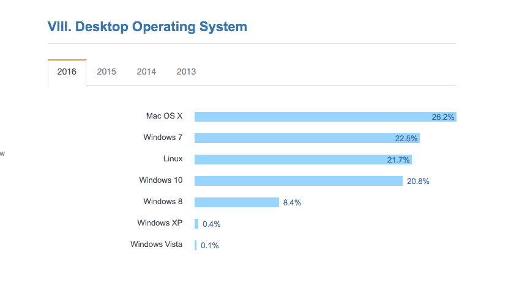
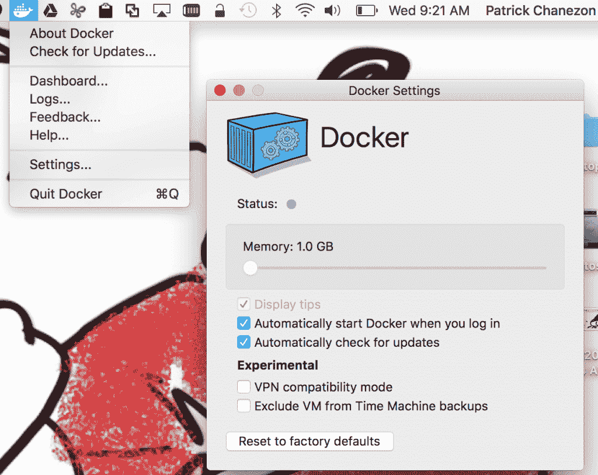

# 原生 Docker 来到 Windows 和 Mac

> 原文：<https://thenewstack.io/native-docker-comes-windows-mac/>

Docker [发布了 Docker for Mac 和 Docker for Windows 的测试版，这两个软件包代表了软件架构的重大变化，旨在优化 Docker 的操作系统原生体验。](https://blog.docker.com/2016/03/docker-for-mac-windows-beta/)

虽然用户以前可以在 Windows 和 Mac 上使用 Docker，但这些软件包消除了额外的依赖层，并提供了原生的、紧密集成的用户体验。Docker 现在可以作为本地 Windows 或本地 Mac 应用程序安装，从系统工具栏启动和使用，就像任何其他打包的应用程序一样。

底线是 Mac 和 Windows 用户可以享受更快的 Docker 驱动的迭代周期，因为他们的代码更改可以在笔记本电脑上即时测试，而无需首先构建 Docker 应用程序映像。

Docker 创始人、首席技术官兼首席产品官 Solomon Hykes 表示:“Docker for Mac and Windows 反映了我们的 [Unikernel Systems](https://thenewstack.io/docker-buys-unikernel-systems-plans-bring-unikernels-data-center/) 团队在操作系统层面所做的深入工作，并展示了未来我们如何利用原生平台功能，在所有平台上为用户提供相同的优化 Docker 体验。这些集成软件包旨在通过允许 Mac 和 Windows 开发人员直接在容器内开发，为他们消除一层额外的“依赖地狱”。"

发布似乎来的正是时候。由 Stack Overflow 进行的[最新调查表明，Mac OS X 已经成为开发者机器的顶级平台。2013 年，Windows 7 以 48%的份额位居榜首，Linux 以 19.9%的份额位居第三，Mac OS X 以 18.7%的份额位居第三。2016 年，Mac OS X 以 26.2%的份额位居榜首，Windows 7 以 22.5%的份额位居第二，Linux 占 21.7%。](https://thenewstack.io/javascript-popularity-surpasses-java-php-stack-overflow-developer-survey/)

StackOverflow 开发者调查 2016

## 当前事态

目前，在 Mac 和 Windows 上使用 Docker 需要使用 Docker 工具箱。你必须下载它，安装一堆工具和依赖项，它才能工作。由于 Docker 使用特定于 Linux 的工具，你不能在本地运行它。相反，您必须使用 docker-machine 并连接到系统上的 VirtualBox 虚拟机。此虚拟机托管您的 Docker。虚拟机运行专门为运行 docker 守护进程而设计的 Boot2docker Linux 发行版。

Docker 首席开发人员 Patrick Chanezon 解释说，随着这两个测试版的发布，这种情况正在发生变化。他解释说，Docker for Mac 和 Docker for Windows 利用这些操作系统的本机虚拟机管理程序，无需安装额外的组件。这个集成的软件包包括 Docker Compose 和公证人提供了一个简化的安装过程，不再需要像 VirtualBox 非系统的第三方软件。因此，用户获得了显著更快的性能和更好的用户体验。

## **Windows Docker**

要在 Windows 上运行新应用，需要 Windows 10 (1511 年 11 月更新，Build 10586)及以上版本，安装 Hyper-V 包。Docker for Windows 用户 Windows 的 hypervisor 层，然后安装一个最小的 [Alpine Linux 发行版](http://www.alpinelinux.org/)，上面安装 Docker 引擎。结果，开发者获得了完全的本地体验和与 Windows 机器的深度集成。你可以通过点击系统托盘图标来监控正在运行的 Docker 守护进程，它也可以让你访问你的引擎，日志和其他东西。当你在 Windows 上进入命令行界面并输入 Docker 命令时，它们会直接指向 Docker 引擎。

## **Mac 版 Docker(和 Linux 版)**

运行 Mac 版 Docker 需要 Mac OS X 10.10.3 Yosemite 或更高版本。您的 Mac 必须是 2010 年或更新的型号，具有英特尔对内存管理单元(MMU)虚拟化的硬件支持；即延伸的。

Docker

Docker for Mac 利用了 Mac OS X 的新管理程序框架，该框架利用了名为[xyve](https://github.com/mist64/xhyve)的开源项目。Docker 在增强 xhyve 方面投入了资源，以改善体验。与 Windows 类似，Alpine Linux 发行版安装在 xhyve 虚拟机上，然后作为原生 Mac 应用运行。下载应用程序，放在应用程序文件夹中。当它第一次运行时，它会安装所需的工具。

到目前为止，使用 Linux 工作站的开发人员能够更容易地进行容器内开发，但是对于那些使用 Mac 或 Windows 工作站在 Linux 机器上部署应用程序的人来说，这是一个很大的挑战。

“在集装箱发展方面有很大的变化。自从 Docker 出现以来，Linux 开发者已经能够通过将他们的应用安装到容器中来进行容器内开发。但由于 Virtualbox 的局限性，这在 Mac 和 Windows 上效果不佳。

## 依赖地狱

有了 Docker for Mac 和 Docker for Windows，开发者现在就不用担心依赖关系和虚拟机了。“现在你有了超级简单的工具，只需在 Mac 上的容器内进行开发，将代码作为一个卷安装，然后使用修改后的合成文件来创建和推送 docker 映像以供生产，”Chanezon 说。

这两个版本都有许多额外的好处。Docker for Mac and Windows 包括一个用于容器的 DNS 服务器，并与 Mac OS X 和 Windows 网络系统集成在一起。Docker 现在可以完美地工作在 VPN 上，因为他们在改进 VPN 支持方面做了大量的工作。开发人员可以灵活地选择任何 IDE 或文本编辑器来编写他们的应用程序，并使用任何版本控制管理器。

Docker for Windows 和 Docker for Mac 的所有组件要么基于开源项目，要么是开源的。Chanezon 告诉我，他们将在正式发布时发布许多开源组件。

Windows 版 Docker 和 Mac 版 Docker 的测试版[即将上市](https://beta.docker.com/)。这些是私人测试版。当我问的时候，Chanezon 确认没有选择的标准，它的先来先服务的基础。

“我们只是在建立一个等待名单，随着项目质量的提高，我们将接受越来越多的人，这是基于我们从开发人员那里得到的反馈，”Chanezon 说。

<svg xmlns:xlink="http://www.w3.org/1999/xlink" viewBox="0 0 68 31" version="1.1"><title>Group</title> <desc>Created with Sketch.</desc></svg>