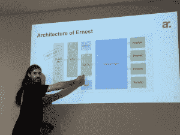

# NATS，一个 REST 替代品，如何为分布式系统提供消息传递

> 原文：<https://thenewstack.io/nats-rest-alternative-provides-messaging-distributed-systems/>

毫无疑问，微服务是许多公司的解决方案，这些公司希望通过发布独立于结构或语言需求的服务来快速扩展业务。但是，像任何趋势一样，有如此多的服务——开源的和专有的——被创造出来以满足这种需求。但是，所有这些同类最佳的服务如何协同工作，看起来就像一个应用程序呢？他们需要互相交流。

在 Apcera 的支持下， [NATS.io](http://nats.io/) 是一个面向分布式系统的开源云原生消息传递系统。NATS 最初是用 Ruby 编写的，后来被移植到 Go (gnatsd)上。在基于 Golang 的服务器上运行，NATS 每秒可以发送超过 700 万条消息。

在过去的三年里，NATS 一直充当着微服务运输的角色，充当着一些现代分布式系统的神经系统。NATS 支持的一些集成是基本的消息传递模式，如发布-订阅、排队和请求-回复。NATS 客户端可以在许多最广泛使用的语言中使用，包括 Go、C 和 C#、Java、PHP、Python 和 Rust。

NATS 社区和生态系统经理 Brian Flannery 在最近的一次 NATS 会议上表示:“性能和简单性——这在微服务中非常重要，”考虑到大规模涉及的系统数量。NATS 没有试图复制企业消息传递，因为开发人员“不想让消息传递层过于复杂”，并保持他们对速度和简单性的关注。

弗兰纳里说，NATS 提供了“永远在线的拨号音”。NATS 通过让 gnatsd 服务器软件不惜一切代价“保护自己”而实现了这一点，并且不对受众做任何假设，而不是在出现有问题的订户时降低整个网络的性能。

## **但是谁会使用 NATS 呢？**

除了支持华为、Workiva 和百度等公司运营的大规模环境，NATS 还为 Avoxi、LittleBits、Pressly 和 Happyco 等快速增长的公司提供用户。YieldBot 使用 consul 和 consul-template 自动调度 NATS 集群。YieldBot 公司的法提赫·切廷卡亚也是监控 NATS 的仪表板 [NATSboard](https://github.com/cmfatih/natsboard) 的维护者。

Carrenza Cloud Services 决定使用 NATS 来构建 Ernest，即该公司的 IaaS 和 PaaS 混合云平台和微服务，因为它可以快速重写和重放，简单的应用程序可以由较少的开发人员处理，开发人员不需要了解整个平台就可以提高工作效率。他说，通常公司会说你在六个月后就能有所作为。

“有了微服务，这就不是问题了，因为从第一天起，你就可以在一家新公司里高效工作，”Carrenza 的首席软件工程师 raül pérez T1 说。“开发者知道哪里会出问题，也知道如何解决，”他说。

“在我们的情况下，NATS 是什么？它是一个云原生消息平台，旨在支持现代云架构。就是快！”佩雷斯说。“在卡伦萨，当我们研究不同的信息系统时，当我们在我的笔记本电脑上的一个简单测试中发现 NATS 时——我有一台很好的笔记本电脑——让我告诉你，你必须小心，因为如果你试图推 NATS，你可能会融化你的整个笔记本电脑。”

佩雷斯特别选择了 NATS，因为二进制文件是一个轻量级的单个文件，你可以把它放在你的服务器上，然后“大功告成”，他说当你部署一个复杂的平台时，这是一个很好的选择。

佩雷斯还选择了 NATS，因为它支持各种消息模型和用例，如请求/响应、发布/订阅和分布式排队。他相信 NATS 给了开发者清晰的产品。“当然，这也很重要，这是一个简单的文本协议。你可以调试，你可以嗅探，你可以监控微服务之间的所有通信，因为它只是短信，”他继续说道。

劳尔·佩雷斯在巴塞罗纳 NATS 会议上解释了卡伦萨的 NATS 用法。

NATS 现在充当 Ernest 的中央通信系统，执行用户定义的工作流来构建环境。用户发布用 YAML 文件编写的工作流，有限状态机为平台处理状态。执行的每个动作都是一个微服务，现在有 57 个。

“在所有这些微服务中，我们使用发布/订阅模式，因为我们需要异步通信，”他们的团队由三名开发人员和一名 QA 组成。“每个开发者都拥有一个组件或微服务。这很棒，因为开发人员成为了这方面的专家，”佩雷斯说。“我们真的遵循做一件事并把它做好的 Unix 哲学，”花更多的时间运行测试，而不是编写代码。

“我们使用 NATS 是因为它的发展速度非常快，你只需要做一件事，而且做得很好。你不需要学习整个互联网。”佩雷斯接着说，“NATS 允许我们不要对你用信息平台做什么做任何假设。”

“在这里，开发人员想知道一切，所以我们记录一切。但在这里获取日志很容易，因为 NATS 可以记录数百万条消息，”佩雷斯说。

<svg xmlns:xlink="http://www.w3.org/1999/xlink" viewBox="0 0 68 31" version="1.1"><title>Group</title> <desc>Created with Sketch.</desc></svg>