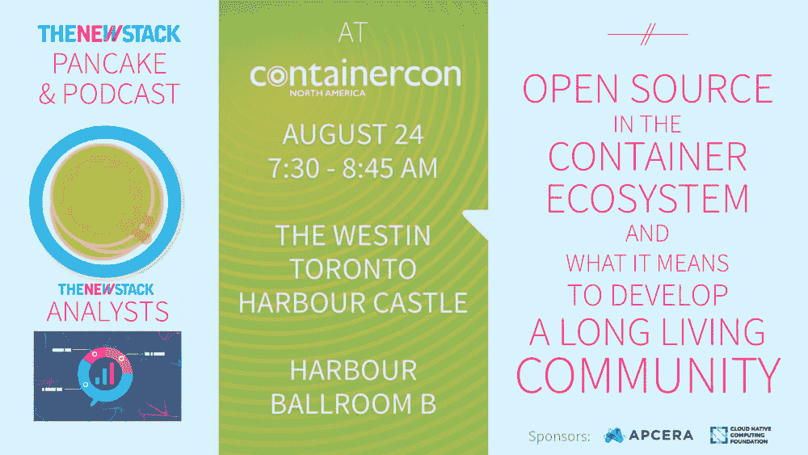

# 导航开源星系

> 原文：<https://thenewstack.io/navigating-open-source-galaxy/>

在许多方面，开源世界有点像一个星系。它是相互关联的，尽管某些部分可能不会走到一起，或者根本不会对齐。随着开源项目不仅在今天的初创企业中，而且在整个企业中迅速成为基石，所有企业都必须适应开源软件不断变化的本质。

“如果你只是在一个星系中工作，或者使用一组项目坐标，所有这些都可以很好地协同工作。思科云系统首席技术官 [Ken Owens](https://www.linkedin.com/in/kenowens12) 在我们的第 102 集[新堆栈分析师](https://thenewstack.io/podcasts/)中说道:“我们在客户那里看到的最大问题是，在试图用来自不同星系的不同产品构建解决方案时，有很多投诉。”。

在这一集里，我们将探索开源项目之间相互联系的方式，开源项目如何增加和改善它们的贡献，以及希望规模化运营的开源项目所面临的问题。New Stack 创始人 Alex Williams 与 Owens 以及 Github 社区项目研究员 [Nadia Eghbal](https://www.linkedin.com/in/nadiaeghbal) 进行了交谈，听听他们对开源现状的看法。

[#104:导航开源星系](https://thenewstack.simplecast.com/episodes/104-navigating-the-open-source-galaxy)

你也可以在 YouTube[上收听播客](https://www.youtube.com/watch?v=FJVtJyDEDT0)。

随着开源软件的兴起，项目维护者和基金会可能会发现他们自己在问如何让更多的社区成员为他们的项目做出贡献。Eghbal 指出，在正在进行的关于这些公司应该在开源项目的开发和维护中发挥多大作用(如果有的话)的辩论中，仍然存在着一些激烈的争论。

“我们在开源方面遇到的大多数问题都是大规模发生的。这些项目没有能力部署在 10 万台服务器上，它们主要在笔记本电脑上工作，”Owens 说。“在大多数情况下，他们甚至没有考虑过如何大规模实施。我合作过的大多数开源项目，他们总是假设自己走在幸福的道路上，不会发生任何不好的事情。”

Owens 探讨了健康的开源社区的基础，包括长期致力于增加多样性、活跃的工程社区以及项目生态系统的整体多样性。Eghbal 提到，较小的开源社区也可能希望考虑让更多的人参与到他们的项目中来，并重新考虑他们自己固有的偏见。

在 Eghbal 的开源星系和平愿望清单上名列前茅？“开源项目中更多的善良和轻松，以及他们之间的对话。对别人粗鲁是没有效率的，就这样。不管你是谁，你在做什么。它最终与可持续发展密切相关，因为如果你的环境中人们不友好，就会把人们拒之门外。”

思科是新堆栈的赞助商。

专题图片:不断增长的星系 UGC 1382 ，照片来自美国宇航局。

<svg xmlns:xlink="http://www.w3.org/1999/xlink" viewBox="0 0 68 31" version="1.1"><title>Group</title> <desc>Created with Sketch.</desc></svg>