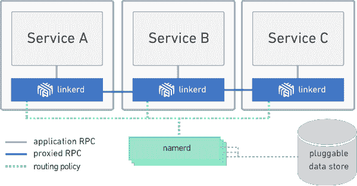
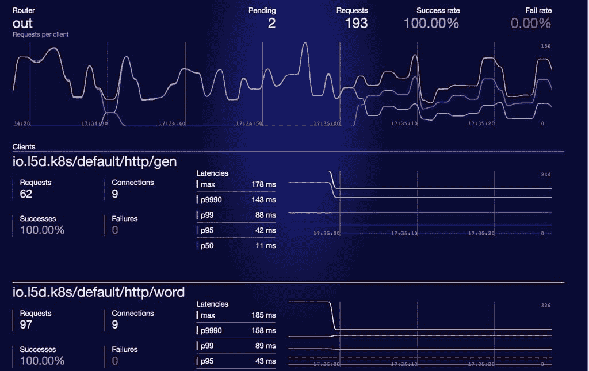

# 浮力的 Linkerd 提供基于 RPC 的微服务通信

> 原文：<https://thenewstack.io/navigating-service-discovery-buoyants-linkerd/>

随着越来越多的公司过渡到以微服务为中心的基础架构堆栈，个人工作流的适应和扩展需求仍然至关重要。在 [Buoyant](https://buoyant.io/) 公司，微服务的起步过程始于其首席执行官[威廉·摩根](https://twitter.com/wm)与[克里斯·阿尼斯奇克](https://twitter.com/cra)在 Twitter 的工作，后者是云计算原生计算基金会的现任代理主席。

由于 Twitter 的“失败鲸”时代带来的反复试验，摩根帮助开发了基于 JVM (Java 虚拟机)的开源工具 [linkerd](https://linkerd.io/) ，以帮助开发人员改善微服务之间的通信。它基于 Twitter 的 [Finagle](https://twitter.github.io/finagle/) 库，用于利用远程过程调用(RPC)。

## 中断通信

通过利用 RPC，linkerd 允许微服务从位于另一个网络上的程序请求服务，而不必输入其网络细节。当调用在本地和远程机器之间发送和接收时，运行时程序将执行它们的请求并返回结果。它还为开发人员提供了识别试图相互连接的服务之间的单点故障的能力。

通过利用多线程发送 RPC 请求，微服务可以并发发送请求，而不必等待单个请求完成。

“我将 RPC 调用视为可以迭代和应用函数的东西。它有一个操作模型，在负载平衡和连接池等方面，有点像如何进行服务对服务通信的困难机制，”摩根说。

Linkerd:命名实例解析

随着 Twitter 的不断发展，Finagle 也在发展。在整个堆栈中实现 Finagle 之后，Twitter 能够解决各种运营问题。特别是，linkerd 等服务发现工具对于从传统软件方法过渡到采用微服务的公司至关重要。

“我们知道他们会遇到和 Twitter 一样的问题，所以我们希望避免每个人都必须从头开始重新发明轮子的情况，而是你将利用 Finagle 已经拥有的现有价值，”摩根说。

## 这完全是关于弹性

在使用基于微服务的基础设施时创造弹性，是许多专注于大规模应用的组织的首要任务。另一家公司 [Datawire](https://www.datawire.io/) 最近宣布发布其开源工具 [Datawire Connect](https://github.com/datawire/datawire-connect) ，该工具以断路、超时和负载平衡的形式为现有的微服务添加了弹性 RPC。

与传统的负载平衡相比，Buoyant 的 linkerd 和 Datawire Connect 与众不同，因为它们都采用了流量路由和整个基础设施的端到端通信方式。

“您希望能够根据我的应用程序级别 SLA 来运营，而不是根据每个单点的 SLA 或我的应用程序级别延迟来运营，也不是根据我在整个应用程序拓扑中每一跳的延迟来运营，”Morgan 继续解释道。

通过在 [OSI 网络模型](http://www.freesoft.org/CIE/Topics/15.htm)的第 5 层实施会话控制，linkerd 不仅可以根据延迟做出路由决策，还可以根据跨区域或跨服务故障转移做出决策。通过抽象服务之间的这一层控制，bubbly 的目标是让 linkerd 在大规模实现服务发现时为开发人员提供额外的灵活性，而不必重新发明轮子。

随着企业转向基于微服务的基础设施方法，理解大规模运营时的服务发现可能意味着成功与失败的区别。有了 linkerd，在考虑如何最好地将他们的服务连接在一起时，bubbly 为使用 JVM 的开发人员提供了一个强大的解决方案。Datawire Connect 是这一领域的另一个强有力的竞争者，它为开发人员提供了另一种开源替代方案，让他们能够利用 RPC 的力量为其堆栈创建更具弹性和响应能力的微服务架构。

请听威廉·摩根的采访:

[【威廉·摩根】](https://thenewstack.simplecast.com/episodes/william-morgan-buoyant)

TNS 总编辑亚历克斯·威廉姆斯为本文做出了贡献。

通过 Pixabay 的特征图像。

<svg xmlns:xlink="http://www.w3.org/1999/xlink" viewBox="0 0 68 31" version="1.1"><title>Group</title> <desc>Created with Sketch.</desc></svg>