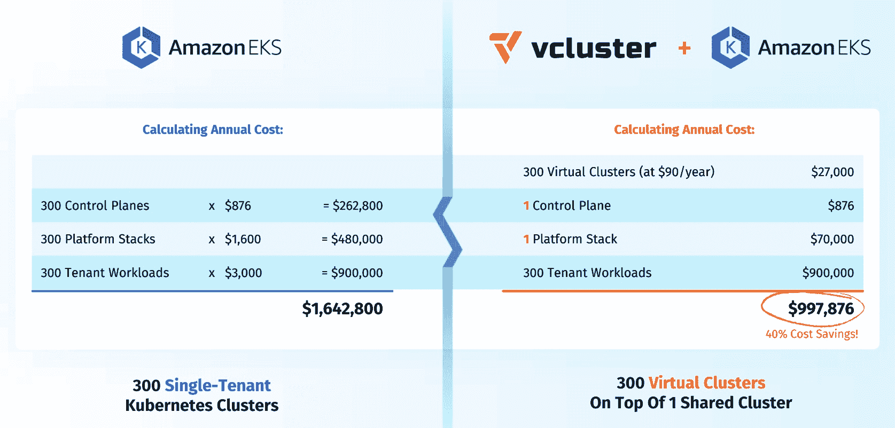

# 浏览扩展 Kubernetes 开发环境的权衡

> 原文：<https://thenewstack.io/navigating-the-trade-offs-of-scaling-kubernetes-dev-environments/>

欢迎来到云原生天堂，在这里，开发团队可以从自助服务工程平台获得他们需要的精确预配置的 Kubernetes 集群，并且他们随时准备以多租户方式跨混合云基础架构进行扩展，无论他们部署在何处。

自助式供应和多租户消除了软件交付中的无用劳动和资源限制。当开发团队需要集群时，他们不会浪费宝贵的时间来获得他们需要的集群，所以成本也更低。

因此，我们可以计划用交付给业务的总价值与软件总拥有成本的更好比率来打动 CFO。问题解决了！

但是就像软件开发中的其他事情一样，我们必须预料到意想不到的事情。开发人员可能仍然发现自己在摆弄基础设施而不是编码，当支付开发、测试、试运行和生产环境的云账单时，惊喜不可避免地等待着他们。

纵向扩展云原生环境时，我们应该如何平衡成本和性能目标？

## 云成本:难以衡量，难以评估

根据我的最新统计，有数十家供应商声称通过帐户界面限制消费的各种形式来降低公共云计算和存储费用。

这有助于一次性降低成本，但它没有考虑到满足云原生开发团队需求的复杂性和隐藏成本，该团队的环境非常复杂，足以满足他们的大规模需求。这给平台团队留下了几个未解决的问题:

*   如何优化组装“黄金路径”云原生架构的入门成本？
*   如果自助服务环境的代码脚本和权限没有完全成熟，是否需要多余的劳动力来配置基础架构？
*   除了云费用，在不断变化的 Kubernetes 堆栈上维护如此多的开发和试运行实验室的支持成本是多少？

显然，基于费用和许可的简单的[成本等式](https://thenewstack.io/managing-the-cost-of-kubernetes/)只能告诉我们关于如何评估提高软件交付生产率、减少辛劳和防止人才流失的能力的一半。

组织如何获得成本和性能指标的真正价值？

## 以 FinOps 的观点看待挑战

[FinOps](https://www.finops.org/) 已经成为一门学科，通过管理企业的[技术支出决策](https://thenewstack.io/finops-how-kubernetes-teams-can-best-work-with-finance/)与通过技术投资产生的业务成果的价值，来解决平衡 CFO 的预算约束与 CIO 的技术交付要求的跷跷板问题。

旧服务器、容器和虚拟机蔓延造成的高昂环境污染困扰着成熟的组织，在这些组织中，概念验证的实验性部署和测试环境通常会在每个项目结束时被遗忘或放弃，导致长时间的大扫除。

云计算和软件即服务供应商的引入使公司能够用按需付费的运营支出(或 opex)取代数据中心、硬件和企业孤岛的巨额资本支出(或 capex ),从而灵活扩展容量和成本。

这种蜜月期不会永远持续下去，因为在许多情况下，云环境成本开始逐年成倍增长。公司开始意识到，他们需要对运营支出进行更多的财务运营监管，而不仅仅是购买资本支出。

开发人员自然希望按需扩展云原生环境，以满足他们的确切需求。为了避免等待集群启动，他们构建并提供多个集群来支持 Amazon Web Services (AWS)中的每个用例，然后让它们全天候运行，每个集群都有自己的 EC2 控制和工作节点。

这是多么浪费电力和云费用啊— 10 倍的相同基础架构比它需要的多运行了 10 倍。

这不像 AWS 或 Azure 或 GCS(谷歌云服务)想要向他们的客户出售他们不会有效使用的云容量。但与此同时，超大规模开发人员也绝不会建议关闭任何租户的保留实例或集群，因为开发人员将来可能会用到它们。

## 合适的规模和合适的时机

FinOps 的一个核心原则是合理调整规模:为完成工作支付和提供适量的容量或资源，仅此而已。

[Loft Labs](https://loft.sh/) 通过共享控制和管理平面的多租户 Kubernetes 平台，提供了一种合理调整云原生开发环境的有趣方法。这种共享平台堆栈可在几秒钟内启动就绪的“黄金状态”配置(包括日志记录、监控和网络等底层微服务)，并在不再使用时立即停止运行。

驱动该平台的核心技术是其开源 [vCluster](https://www.vcluster.com/) 技术，该技术允许[多个虚拟集群](https://thenewstack.io/loft-labs-vcluster-provides-secure-multitenant-kubernetes-clusters/)在单个 Kubernetes 名称空间内作为瞬时工作负载运行，同时保留开发人员工作隔离和基于每个 vCluster 的访问控制。

这种方法的早期成本节约估计是有希望的。Loft 对一家企业进行了场景分析，该企业有 300 个单租户 Kubernetes 集群运行在亚马逊弹性 Kubernetes 服务(EKS)上，年运营成本为 1，642，800 美元。通过在一个共享的 Kubernetes 集群上使用 300 个虚拟集群，该公司一年将花费约 997，876 美元，减少了近 40%。开发人员在他们的体验中看不到任何区别。

图一。单独的 EKS 集群与基于单个共享多租户 EKS 集群的虚拟集群的估计成本分析。来源:Loft 实验室

此外，睡眠模式允许 vClusters 在非高峰使用时间或空闲时自动暂停操作并“小睡”一会儿，然后在几秒钟内刷新。这在不规则的项目时间表中考虑了资源的使用，并且估计在不影响开发人员可用性的情况下节省了额外的 30%的云成本。

## 智能带

当然，开发平台团队可以为每个开发/测试环境创建独特的 Kubernetes 名称空间，然后每个人可以随意绘制自己的集群，如果组织不关心配置和云成本，这是很好的。毕竟，这都是免费的开源工具，对吗？

云原生开发范例最酷的特性之一是，它故意“让电线悬着”，而不是规定一种方法来服务复杂的分布式应用程序和组织。

Kubernetes 为高度紧凑的虚拟集群敞开了大门，这些集群可以共享昂贵的云资源，同时仍然为高度分散的多租户开发人员提供高性能开发环境，从而节省不必要的人力成本，并在预算审查中表现出色。

<svg xmlns:xlink="http://www.w3.org/1999/xlink" viewBox="0 0 68 31" version="1.1"><title>Group</title> <desc>Created with Sketch.</desc></svg>