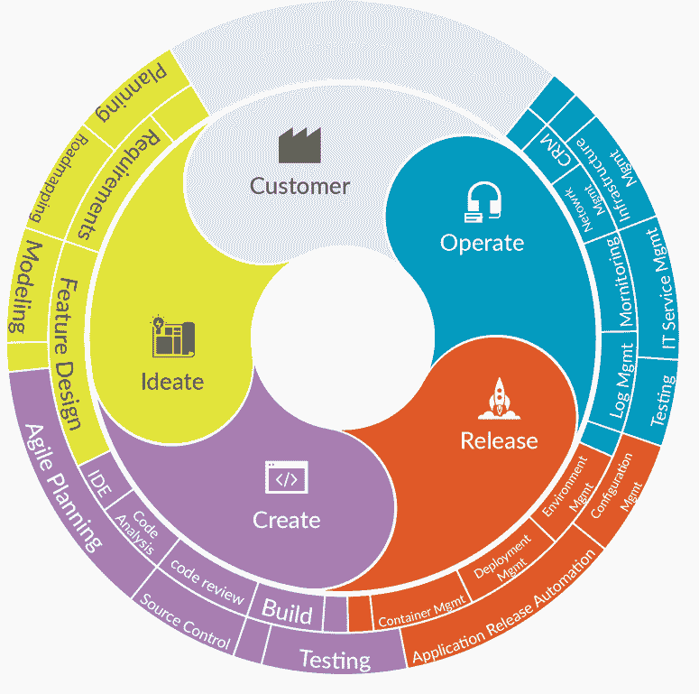

# 为什么您需要企业工具链集成以及发布自动化

> 原文：<https://thenewstack.io/need-enterprise-toolchain-integration-alongside-release-automation/>

 [娜奥米·卢里，Tasktop 的产品营销总监

娜奥米·卢里是 Tasktop 的产品营销总监。她热衷于通过有效的以客户为中心的沟通使企业取得成功。她拥有超过 15 年的 B2B 产品管理和营销经验，专门研究大型企业及其数字化转型。](http://www.tasktop.com/) 

如果你刚刚获得了发布自动化的预算——恭喜你！您可能迫不及待地想要归档您的旧 Excel 电子表格、工作流和脚本，转而使用实际的发布自动化工具来规划、自动化和管理您整个发布渠道的状态。

你也在好公司里。根据最新的 [Gartner 应用程序发布自动化幻方图](http://electric-cloud.com/resources/whitepapers/gartner-magic-quadrant-application-release-automation/)，到 2020 年，50%的全球企业将实施至少一个应用程序发布自动化解决方案，而目前这一比例还不到 15%。

发布自动化工具对于实施 [DevOps](/category/devops/) 计划的企业至关重要，因为它们有助于简化和自动化从“代码提交”到生产的活动。

在当今竞争激烈的市场中，小公司拥有令人羡慕的灵活性，您需要尽可能以最高的速度和质量发布。

问题是:发布自动化是你所需要的吗？

## 对发布自动化有什么期望

发布自动化的核心是一个工作流引擎，它协调将应用程序发布到产品中所需的所有步骤。虽然有些任务可能是手动的，但许多是自动化的，并在其他工具中启动流程。

一些最流行的发布自动化工具包括[XL Release](https://xebialabs.com/products/xl-release/)(XebiaLabs)[UrbanCode Release](https://www.ibm.com/us-en/marketplace/urbancode-release)(IBM)[Electric flow](http://electric-cloud.com/)(电云) [Serena Release Control](https://www.microfocus.com/products/release-control/) (微焦点)，以及[自动发布自动化](https://www.ca.com/us/products/ca-release-automation.html) (CA Technologies)。

> 如果发布没有与整个软件开发过程完全集成，包括规划、设计和实现，组织将仍然难以实现短的端到端交付时间。

就其本质而言，发布自动化工具需要许多轻量级的集成，通常以插件的形式，来触发其他工具中的过程，比如开始冒烟测试、设置或拆除环境，以及部署发布。

所以毫不奇怪，发布自动化软件很快成为 CI/CD 管道的中心，在那个阶段使用的所有工具的中心。

然而，尽管这是一个巨大的飞跃，但是发布自动化仅仅是通过你的软件交付过程实现优化的工作流程的一部分。

## 用发布自动化避免重蹈敏捷的覆辙

发布自动化虽然至关重要，但它关注于优化“构建、发布和部署”阶段。尽管如此，如果该版本没有与整个软件开发流程(包括规划、设计和实施)完全集成，组织仍将难以实现帮助初创公司和数字巨头赢得市场的端到端交付周期。

如果你还记得，当敏捷第一次出现时，开发加速了，但是瓶颈转移到了操作上。没有人关注端到端的工作流程，也没有人意识到优化一个工作中心意味着在制品(WIP)会堆积在下一个工作中心。DevOps 就是在这场危机中诞生的。

高瞻远瞩的 IT 领导者已经可以看到，即使是敏捷和开发运维的结合，包括发布自动化，也是不够的。瓶颈和延迟将出现在其他阶段，如构思、规划、功能设计或支持。

要吸取的教训是:如果您正在投资奠定任何类型的 IT 优化基础，您应该用一种整体的、面向系统的方法来做。

考虑一下这个:

Forrester [预测，在 2018 年](https://www.forrester.com/report/Predictions+2018+CIOs+Make+The+Chief+Digital+Officer+Obsolete/-/E-RES139879),“首席执行官们将期望他们的首席信息官们通过精心策划使能技术、缩小数字技能差距，以及与首席信息官和其他更有能力解决跨业务孤岛的转型问题的高管同行携手合作，来领导数字化工作。”(【2018 预测:首席信息官让首席数字官过时，作者 Pascal Matzke 和 Matthew Guarini，2017 年 11 月 6 日出版)。

这意味着当您完成发布自动化实现时，您的 CIO 将会要求一套全新的指标:

*   她会想知道是什么阻碍了公司交付更多更快的产品。
*   她会希望你证明你的发布绩效指标是如何对实际的商业结果做出贡献的。
*   她会希望你衡量端到端的交付时间，从最初的想法或客户的要求，直到它实际运行在生产中。

您的 IT 工具链战略需要记住这一点。

## 您能通过发布自动化创建端到端的可见性吗？

发布自动化对于发布之前或之后的阶段中发生的活动具有有限的可见性或洞察力。它可以在吉拉或 ServiceNow 上触发的少量操作只是复杂、错综复杂的相关信息的一小部分，这些信息需要在工具之间流动，以创建可跟踪的端到端流程。

为了准备好您需要向 CIO 展示的度量标准，您需要将发布自动化与整个软件交付过程联系起来。软件价值流包括四个主要阶段，每个阶段都有自己的一套工具:构思、创建、发布和运行。这些阶段涵盖了从一个特性或新功能的开始到最终交付的工作流程，然后通过反馈循环返回。

图片来源:Tasktop

整个工具链将需要被集成，以产生原始特征请求的可追踪记录，因为它从一个阶段移动到另一个阶段。发布自动化工具被设计来编排发布工具集群，但是不能集成端到端的工具链。

## 利用企业集成基础架构优化发布自动化

有趣的是，在您的组织中，可能有其他 IT 工具链集成计划或正在进行中，其动机是生产力、质量或可追溯性挑战。这些集成计划正在创建一个可测量的端到端价值流，您可以利用它将发布性能与您发布的功能的商业价值结合起来。

现成的企业工具链集成基础架构是您将所有这些联系在一起所需的缺失层。集成基础设施将同类最佳的工具连接起来，这些工具可以处理诸如需求、特性、测试、缺陷和故障单等家务项目，并在它们之间自动传递工件。由于这种集成，以前通过电子邮件、聊天和重复数据输入进行的非正式和容易出错的交接被正式、可跟踪和可测量的信息流所取代。

以下是财富 100 强企业中流行的价值流整合的几个例子，包括:

*   **需求管理< - >敏捷规划< - >测试管理**
    开发安全关键软件的组织必须追踪每一个代码变更到相应的需求，并证明代码确实满足需求并经过测试。这种集成模式创建了必要级别的可追溯性。
*   **敏捷计划< - >测试管理< - > IT 服务管理(ITSM)**
    软件交付组织正在集成这些工具，以自动化缺陷报告和解决，以及生成对他们的平均修复时间(MTTR)性能的洞察。
*   **敏捷规划< - >敏捷规划**
    你会惊讶于有多少组织拥有多种敏捷规划工具，比如 [LeanKit](https://leankit.com/) 、吉拉和 [Targetprocess](https://www.targetprocess.com/) 。他们需要通过创建所有正在发生的工作的主视图来创建一个统一的工作接收和跟踪系统。

与短命的发布编排活动不同，这些重量级的集成跨工具存储库流动和同步长寿命的工作项目。协作工件包括一组丰富的信息——文本、图像、评论、附件和关系。为了实现这种级别的同步，需要一个复杂的集成基础设施。

集成基础设施也可以从发布工具集群中捕获事件，例如，将变更集或构建链接到一个故事；从失败的自动化测试、代码扫描或 APM 警报中产生缺陷；或者在部署新代码时生成变更请求。

来自高性能 IT 组织的真实见解是，他们正在将企业集成基础设施和发布自动化工具相结合，以实现端到端的特性可追溯性。他们能够向首席信息官展示自动化发布如何更快地将功能交付到生产中，这些功能可以产生业务成果，如收入。

但是这提出了一个问题:什么时候您应该使用您的发布自动化工具的集成能力，而不是集成基础设施层本身？

## 通过企业工具链集成基础设施保持敏捷性

我们非常幸运地生活在一个工具丰富的时代——一流的工具正在蓬勃发展。IT 从业者可以从数百种工具中挑选，仅 DevOps 领域就有 200 种。你可以选择最大限度地提高个人和团队生产力的组合。

虽然每个十年在每个集群中都有一些“明星”——像[吉拉](https://www.atlassian.com/software/jira)和 [ServiceNow](https://www.servicenow.com/) 这样最受欢迎的工具——但是工具链一直在发展。没有一种工具能够满足如此多种多样、多学科角色的需求。敏捷工具架构有助于工具经理准备好支持实践者今天正在使用的工具以及他们明天将要使用的工具。

在模块化工具架构中，工具是松散耦合的，以确保简单性并增加稳定性。就像在软件中一样，最好通过可扩展的集成基础设施来集成模块化工具，而不是点对点连接。

实现集成基础设施层和发布自动化有几个好处:

*   当所有工作项目流经价值流时，为它们创建一个可追踪的记录:如果主要的工件，像特性、史诗、故事、测试用例、缺陷、发布和故障单都通过集成层在工具之间流动，你将有一个跨功能区域的工作进展的单一系统记录用于追踪和报告。
*   改进对您的发布自动化工具的输入:假设您的发布自动化工具有一个到吉拉的插件，并且可以向吉拉查询开放的问题，将所有的缺陷流动到它们在吉拉的相应史诗和故事实际上帮助了发布自动化检查是否满足一个发布标准(例如，“没有开放的 sev 1 缺陷”)。您的测试管理工具与吉拉之间的集成将使所有这些信息都可以被发布自动化使用。
*   消除整合合并、收购或重组时的中断:整合基础架构可帮助您快速整合来自合并、收购和重组的新工具链，而不会中断工作。
*   在不中断现有工作流程的情况下，尝试新工具或替换旧工具:如果您有一个集成基础架构，您可以测试新工具或更换现有工具，而不必投入任何资源来开发点对点集成。
*   通过在工具之间传输数据来降低工具许可的成本:防止从业者登录两个或更多的工具。有了集成的工具链，从业者可以继续使用他们喜欢的工具——他们需要的信息将在那里交付给他们。

## 发布自动化、工具链集成如何相互补充

## IT 工具链集成的最佳实践

我们已经研究了敏捷工具架构对发布自动化工具在集成中应该扮演的角色的影响，并且提出了三个保持敏捷的最佳实践:

*   使用发布自动化插件来协调发布和部署活动，并在发布工具集群中执行命令。
*   使用企业集成基础架构在 Ideate 中的工具之间流动复杂的工件数据，创建和操作工具集群，并连接没有可用插件集成的工具。这对于创建可追踪的价值流是必不可少的，它可以将发布绩效与业务结果联系起来。
*   在您的发布自动化工具和您的企业集成基础设施的功能之间有重叠的地方，选择最适合将发布自动化集成到您的工具链的其余部分。如果您的工具具有很强的本地集成性——就像 IBM UrbanCode 版本和 IBM Rational Team Concert 之间的集成——请使用它。如果您的工具没有可用的插件，请使用您的集成基础设施。

归根结底，这不是做一个或另一个的问题，因为发布自动化和集成基础设施为不同的团队解决不同的问题。然而，要让 CIO 看到发布自动化的全部价值，两者都需要到位。面向系统的企业工具链集成方法对于 IT 优化至关重要。

Tasktop 的图像。

<svg xmlns:xlink="http://www.w3.org/1999/xlink" viewBox="0 0 68 31" version="1.1"><title>Group</title> <desc>Created with Sketch.</desc></svg>