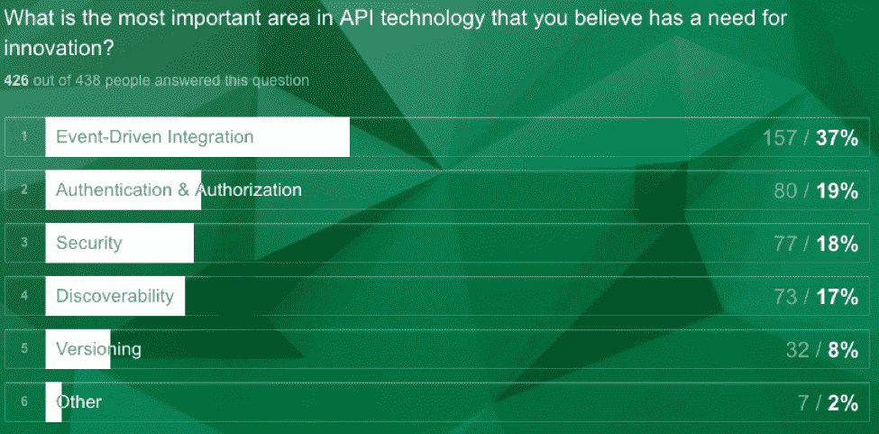
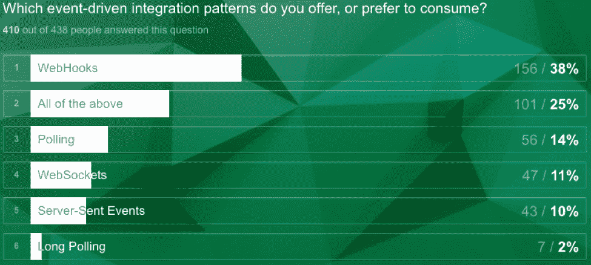

# 对事件驱动集成的需求

> 原文：<https://thenewstack.io/need-event-driven-integration/>

开发人员的情绪很明确:开发人员和架构师对事件驱动集成的兴趣和采用是一个主流目标，正如一个关于 API 集成现状的研究项目所证实的:

 [罗斯·加雷特

Ross Garrett 是 Cloud Elements 的战略主管，负责市场战略、产品定位和宣传。他是开发者大会和其他行业会议上的知名演讲者。Ross 在集成领域拥有超过 10 年的产品和营销领导经验，最近任职于 Push Technology，之前任职于 Axway、CA 和 Layer 7。](https://cloud-elements.com/) 

这些组织中的大多数正在创建他们自己的“可组合企业”,并将依靠多种基于云的服务来实现这一愿景。然而，这些 SaaS 应用程序中有许多是尚未针对集成进行优化的孤岛，许多开发人员依赖轮询(大量的轮询)来创建他们需要的工作流和集成场景。

“可组合企业”一词最早是由华纳音乐集团的执行副总裁兼首席技术官 Jonathan Murray 在 2013 年创造的。默里有效地为企业定义了一种全新的运营模式，因为他们正在努力应对对新数字产品、持续创新和提高敏捷性的需求。论文原文可以在这里找到。

对于许多应用程序提供商来说，要提供开发人员期望的特性和事件驱动的功能还有很长的路要走，所以现在取得进展很重要。公司应该停止投票，转向可扩展的事件驱动集成模型。

## 实时需求推动了事件驱动的需求

对事件驱动架构的需求和日益增长的兴趣可以说是与实时应用程序集成和数据移动的需求联系在一起的。实时的世界可能被误解了，用在了错误的上下文中，或者充其量是一个过载的术语，其中延迟或等待时间的容忍度根据用例而变化。

可以肯定的是，许多人对定义持有强烈的意见，但在这种情况下，实时意味着 web 技术使应用程序能够在相关业务事件发生时做出反应，或者至少在可理解的延迟时间内做出反应(4 毫秒的延迟可能会使金融交易平台失去竞争力，而 400 毫秒的延迟对于大多数应用程序集成用例来说是可以忍受的)。

在当今的大部分应用程序集成中，系统没有能力实时对事件做出反应。通常，系统 A(客户机)会根据一组查询参数询问系统 B(服务器)是否有新的数据可用，这是一种 web 固有的广为人知的请求/响应模式。事件驱动模式是实时应用程序集成的基础——消除了客户反复询问给定系统是否有新数据可用的需要。

事件代表系统中发生的事情、用户操作，甚至是由现有请求/响应接口引起的操作。这些事件中的每一个通常都涉及描述刚刚发生的事情的新的或变化的数据。对于事件驱动的集成，不需要询问给定的系统事件是否发生。相反，系统会告诉任何其他感兴趣的系统或应用程序。然后，事件和相关数据将被传递给其他系统，使它们能够实时做出反应。

## 事件驱动技术

好消息是，要实现实时，有多种技术选项和架构最佳实践可供选择。WebSockets 标准现在已经作为一种有效的实时数据流机制得到了很好的确立，而 WebHooks 作为事件驱动 API 的协议和模式选择的势头越来越大。HTTP 2.0 和服务器发送事件的出现代表了一种不断发展的技术前景，这种前景可能会用于其他事件驱动的用例。

*   **服务器发送事件:**首先，对于许多人来说，[服务器发送事件](https://html.spec.whatwg.org/multipage/comms.html#server-sent-events) (SSEs)这个术语可能并不熟悉。在过去的几年中，该规范一直处于不断变化的状态，并且已经被功能更加完善的通信协议(WebSockets)所掩盖。然而，SSEs 背后的思想应该是熟悉的:允许 Web 应用程序“订阅”由服务器发起(发送)的数据更新，并随后在这些数据事件发生时得到通知。这里的问题是，虽然它在技术上取消了轮询，但它也取消了用户的大部分控制权，迫使他们处于被动状态。
*   **web sockets:**[web sockets](https://developer.mozilla.org/en-US/docs/Web/API/WebSockets_API)提供了更丰富的协议来执行双向、全双工通信。对于游戏、消息应用、互动体验以及需要双向实时更新的情况，拥有双向通道更具吸引力。但是，这个解决方案并不完美，因为集成模式有效地破坏了 HTTP 的语义。

在过去的 18-24 个月中，越来越多的人开始谈论 Web APIs 的局限性，以及如何根据价值和概念的优美性来选择架构。这导致了标准的发展，比如开放 API 规范的 3.0 版，它现在包含了一种将 WebHooks 作为 RESTful API 的一部分进行文档化的方法。

[WebHooks](https://webhooks.pbworks.com/w/page/13385124/FrontPage) 的工作原理是自动将新的事件数据发布到用户定义的 URL，该 URL 由用户链接的应用程序监控。每次有新事件发布到 URL 时，链接的应用程序都会更新以包含新数据。与轮询不同，轮询只为不到 2%的请求提供可用数据，WebHooks 只在有新信息时更新。由于效率的提高，Wufoo 调查的 82%以上的开发者表示他们更愿意通过 WebHooks 而不是轮询来接收新数据。尽管有这种偏好，目前只有[29%的](https://resources.cloud-elements.com/the-api-economy/the-state-of-api-integration-2017)API 支持 WebHooks。

没有一个设计决策可以完美地回答所有的集成问题，但是轮询的风险是显而易见的——增加了网络开销、成本和糟糕的用户体验。当您构建下一个 Web API 或集成场景时，请考虑 WebHooks 之类的替代方案。

<svg xmlns:xlink="http://www.w3.org/1999/xlink" viewBox="0 0 68 31" version="1.1"><title>Group</title> <desc>Created with Sketch.</desc></svg>