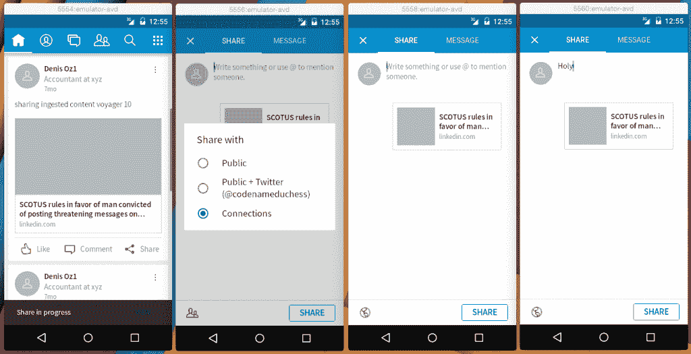
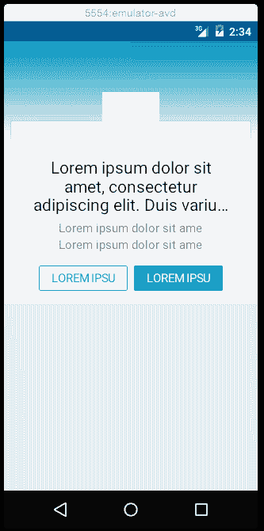

# 速度的需要:LinkedIn 移动应用开发的快速发布渠道

> 原文：<https://thenewstack.io/need-speed-linkedins-rapid-release-pipeline-mobile-app-development/>

去年 12 月，LinkedIn [发布了该服务的移动应用 Voyager](http://blog.linkedin.com/2015/12/01/our-new-linkedin-app-is-here-making-it-easier-than-ever-to-stay-in-touch-with-the-people-and-information-you-need-to-be-successful/) 。但对于工程师来说，这次发布的有趣部分是本月在 LinkedIn 工程博客上发布的。事实证明，成功的秘密在于测试。和自动化测试。

他们从头开始重建了新的旗舰应用程序。产品副总裁[乔夫·雷德费恩](http://blog.linkedin.com/author/Joff%7CRedfern/)在一份声明中宣布:“新的应用程序通过将更多的注意力放在主要的旗舰应用程序上，也完全实现了我们的多应用程序战略。”。“有了新的应用程序启动器功能，可以非常无缝地启动到其他 LinkedIn 应用程序，获得专门和更深入的体验，如 Pulse、Groups、Job Search 等。”

这是一个很大的整合。Voyager 需要与这些 LinkedIn 应用程序中的每一个、在幕后工作的其他工程师团队以及移动应用程序本身的每一个变化所需的所有测试保持同步。“如果这听起来像是大量的测试，确实如此，”开发者工具工程总监[延斯·拉森](https://www.linkedin.com/in/jenspillgram)说。

即使移动应用程序代码没有改变，其他东西也会改变。根据 Larsen 的说法，Voyager“与 LinkedIn 宇宙中的许多东西有多维度的联系”。

存在大量依赖关系、调用多个 API、后端数据迁移以及其他大数据离线更改。此外，处理大数据以提供个性化内容为该应用的许多功能提供了燃料。很多事情都在不断变化，新功能也在不断部署。

跨多个仿真器测试 Android UX

“这是循环的一个重要部分，”拉森在电话采访中解释道。“输出、模式和形式可能会发生变化，并会影响 Voyager。所有的世界都通过用户体验相互联系。”

为了让 Voyager 与所有使 LinkedIn 成为无缝用户体验的移动部件一起工作，测试必须自动化。

员工软件工程师德鲁·汉内在 LinkedIn 工程博客[上解释道:](https://engineering.linkedin.com/blog/2016/02/3x3--speeding-up-mobile-releases)[有这么多连接点，看起来测试会占用工程师的大部分时间。如果工程师要花 80%的时间来修复 UI 错误，那么这个产品就不能被认为是成功的。](https://engineering.linkedin.com/blog/authors/d/drew-hannay)

## 三乘三

根据 Hannay 的说法，解决方案是“从代码提交到产品发布的每一步的完整自动化管道。这条管道需要足够快，以适应我们的三小时窗口，并且足够可靠，以保持我们对发布的信心。”

“我们确定了一个规则，我们称之为‘3×3’，”汉内说。每天发布三次，从提交代码到代码可供成员使用的时间间隔不超过三小时

因此，LinkedIn 的工程师全面自动化测试，静态分析的编码过程，代码风格检查，甚至生成生产二进制文件，并在不同的移动版本上运行多个 UI 测试。然后进行另一组测试，以确保用户升级体验是无缝的。

并非所有领域都完全符合 3×3 理念，这些领域需要大量工作来实现自动化。Larsen 说，本地化团队的工作就是一个例子，他们的任务是“为世界各地翻译和本地化应用程序”。

例如，无论用户语言是英语、阿拉伯语还是中文，搜索结果在用户界面上的显示方式都是一样的吗？或者具有特殊字符的语言，或者非常长或非常短的名称。从右向左阅读的阿拉伯文本尤其棘手。

Voyager 的工程师与本地化团队一起工作，找出常见的错误，然后编写自动化测试流程来捕捉这些错误。

Android UI 布局测试

“对于 UI 测试，”Hannay 说，“我们利用了谷歌 Android 版的 Espresso 工具和 iOS 版的 KIF 工具。这两个都已经很快了，但是我们希望能够在不同的 Android/iOS API 级别和不同的配置下运行大量的测试(例如，从左到右和从右到左的 UI 布局)。类似于我们的分布式构建概念，我们开发了一个系统，用于将我们的测试套件分布在 CI 池中的多台机器上，并在所有机器都完成时收集结果。在 Android 上，我们还能够利用运行多个仿真器的优势(多达 15 个！)上，这极大地提高了我们的容量和可扩展性。”

iOS 布局测试方法的细节可以在[这篇文章](https://engineering.linkedin.com/blog/2016/01/effective-layout-testing-library-for-ios)中找到。

一旦所有的语言测试都实现了自动化，下一步就是将测试时间控制在 3×3 的窗口内。这是通过将测试分散到多台机器上实现的。Hannay 写道，“父节点构建运行测试所需的最小二进制文件集，并在 UI 测试并行运行时将“子作业”发送给其他构建剩余二进制文件的节点。”

点击此处阅读了解更多关于 LinkedIn 测试平台 XLNT 的信息。

所有这些都在 3×3 模型中进行了测试。一旦新功能通过了所有的自动化测试，它就会进入一种叫做“已知良好”的状态然后每隔 3 个小时，另一个自动化过程将所有“已知良好”的代码扫入下一次发布。实际上，每个工作日进行 3 次扫描，因为工程师发现最佳的内部发布时间表。

除了解放工程师编写新代码之外，将所有测试保持在 3×3 模型中还有许多优点。“如果有什么东西坏了，你可以很容易地重新稳定下来，”拉森说。“恢复的时间要短得多。”

“测试模型挑选所有的依赖关系、API 调用等。因此，当出现问题时，您知道可能是依赖项或 API 调用在其他人的项目中发生了变化。”

Voyager 工程师在 GitHub 上的开源库中发布了他们的一些工具。包括 Espresso 和 [KIF](https://github.com/kif-framework/KIF) 中的测试框架。

那么作为一个终端用户，你需要多久更新一次你的 LinkedIn 应用程序呢？

显然，我们不会一天三次向客户推送更新，”Larsen 说。除了不希望用户不断被窃听来更新应用程序，还有一些技术问题需要考虑。新的二进制文件可能非常大，世界各地的客户都可以访问，其中许多人将通过无线方式下载更新。Larsen 解释说，要求频繁更新对这些客户来说是不必要的负担。

关于何时通过谷歌和苹果应用商店推出新版本的决定是由产品营销团队做出的，而不是由工程师决定的。产品团队在改进功能的需求和更新时间表的频率之间进行平衡，以免惹恼他们的客户。

拉森就没这么幸运了。“每次我打开 Voyager，我都会收到一条更新应用程序的消息，但这是因为我会在所有内部更新发布之前获得它们。”

<svg xmlns:xlink="http://www.w3.org/1999/xlink" viewBox="0 0 68 31" version="1.1"><title>Group</title> <desc>Created with Sketch.</desc></svg>