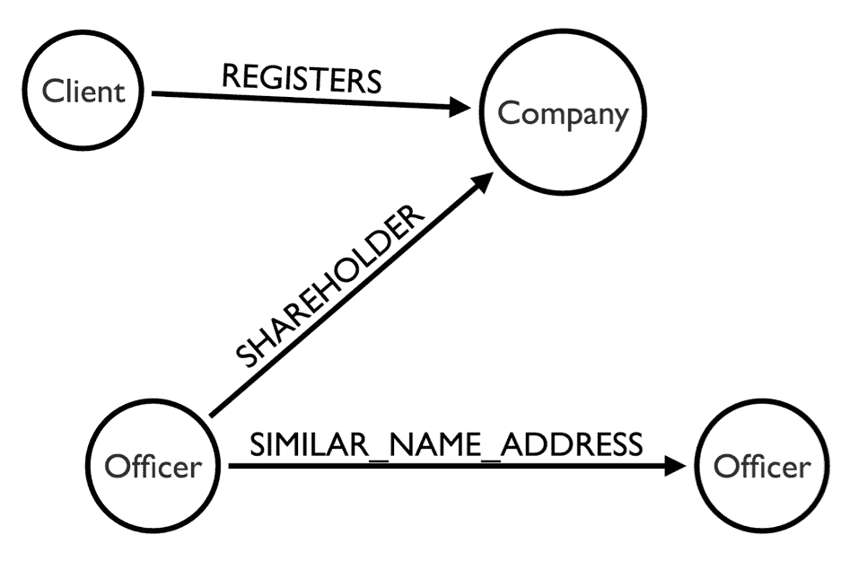
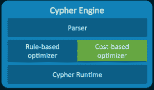
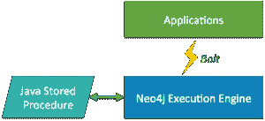

# Neo:图形数据库不仅仅是为了社交媒体

> 原文：<https://thenewstack.io/neo4j-defends-turf-graph-database-field/>

多亏了脸书，几乎所有人都认为图形数据库是社交网站的天下。毕竟，这是一项擅长连接遥远实体的技术。

然而，事实上，除了联系朋友和亲戚之外，图形数据库正变得越来越有用。看看 Neo4j 发生了什么，这可能是使用最广泛的图形数据库。

Neo Technology 的首席执行官埃米尔·艾弗雷姆(Emil Eifrem)说:“对我来说，社交是福也是祸。"关于图形数据库的一个很大的误解是它们只用于社交."

Eifrem 很快注意到，“我们看到企业中图形数据库的使用更加复杂，比如欺诈检测。”

周二， [Neo 发布了图形数据库系统的第 3 版](http://neo4j.com/blog/neo4j-3-0-massive-scale-developer-productivity/)，它带来了许多新功能，使图形数据库的使用更符合主流开发者的口味。在这里下载比特。

## 绘制星座图

Neo4j 于 2007 年推出，已经获得了一些大型公司的青睐，尤其是在零售、电信和医疗保健领域。福布斯全球 2000 大上市公司名单中约有 100 家使用该数据库。例如，沃尔玛利用它为其在线零售业务生成产品推荐。

IT 巨头也越来越支持这项技术。例如，IBM 已经着手优化数据库，使其能够与 Power8 系列服务器配合使用，这为完全在内存中运行万亿字节大小的 Neo4j 实例提供了可能性。

上个月，当国际调查记者联盟(ICIJ) [揭露](https://panamapapers.icij.org/)一些[世界上最富有的人的离岸避税天堂](https://www.theguardian.com/news/series/panama-papers)时，他们在用 Apache Solr 和 Tika 索引材料后，使用 Neo4j 建立了联系。

Neo 的 Michael Hunger 和 William Lyon 在一篇博客文章中解释说:“ICIJ 使用的领域模型非常简单，只包含四种类型的实体(官员、客户、公司、地址)以及它们之间的四种关系。”这篇文章详细介绍了如何使用 Neo4 j 进一步分析这些文档。

用 Neo4j 模拟的巴拿马文件

通过分析这种联系，记者们初步确定了五名政府领导人在离岸或空壳账户中持有资金，这导致至少一人辞职，冰岛总理辞职。

neo4j 3.0 的基于成本的优化器现在可以优化写查询和读查询。

图形数据库[与标准关系数据库](https://www.youtube.com/watch?v=Go3P73-KV30)的不同之处在于，它不是将数据存储在表中，而是通过外键来链接数据；数据存储在各个节点中，这些节点通过指定的关系连接在一起。一个节点可能保存产品名称，而另一个节点可能保存供应商名称，[，它们之间的关系](https://www.youtube.com/watch?v=IRTgsxL9V8g)指定供应商提供该产品。

图形计算，如果不是图形数据库的话，[最广为人知的是通过社交媒体网站](https://www.facebook.com/notes/facebook-engineering/tao-the-power-of-the-graph/10151525983993920/)如脸书和 LinkedIn，这两个网站通过在不同的人之间建立联系来产生大量潜在有用的信息(想想脸书的“你可能认识的人”功能，它根据共同的朋友来建议可能的朋友)。

传统的关系数据库在生成关于实体间关系的信息方面相当糟糕。每个关系查询都需要至少一个连接函数，这会很快降低性能。

因此，想想任何需要理解不同实体之间关系的计算。这是图形数据库的权限。

以检测信用卡欺诈为例。欺诈检测依赖于一种称为链接分析的技术，该技术检查谁在信用卡上收费，这些交易在哪里发生，并将它们与信用卡持有人的历史记录进行比较。理想情况下，欺诈检测应该实时进行，这样骗子就不会拿走太多的钱。

## 盒子里有什么？

对于这个 3.0 版本，Neo 架构师创建了一个新的二进制有线协议，称为 Bolt，[旨在加速应用程序和数据库系统之间的通信](https://dzone.com/articles/introducing-bolt-neo4js-upcoming-binary-protocol-p)，此前这项工作由 REST 处理。该公司还为 Java 开发了运行该协议的驱动程序。NET，JavaScript 和 Python。

RedMonk 联合创始人兼分析师 James Governor 在一份声明中指出，这些驱动程序将使开发人员更容易为 Neo4j 构建应用程序。

对 Java 存储过程的支持也有可能使 Neo4j 更易于开发人员使用，这为模式自省奠定了基础。

Neo4j 3.0 还改进了其核心技术，以处理更大的数据集。该公司发现，它的一些客户正在推进数千亿规模的图表，尽管该软件更适合数百亿记录的范围。多亏了新的存储引擎，这一限制已经消除。

专题图片:约翰内斯·赫维留，[《天文学大成》，第三卷:Sobiescianum，sive Uranographia](https://commons.wikimedia.org/wiki/File:Orion_constellation_Hevelius.jpg) ，表 QQ: Orion，1690。

<svg xmlns:xlink="http://www.w3.org/1999/xlink" viewBox="0 0 68 31" version="1.1"><title>Group</title> <desc>Created with Sketch.</desc></svg>