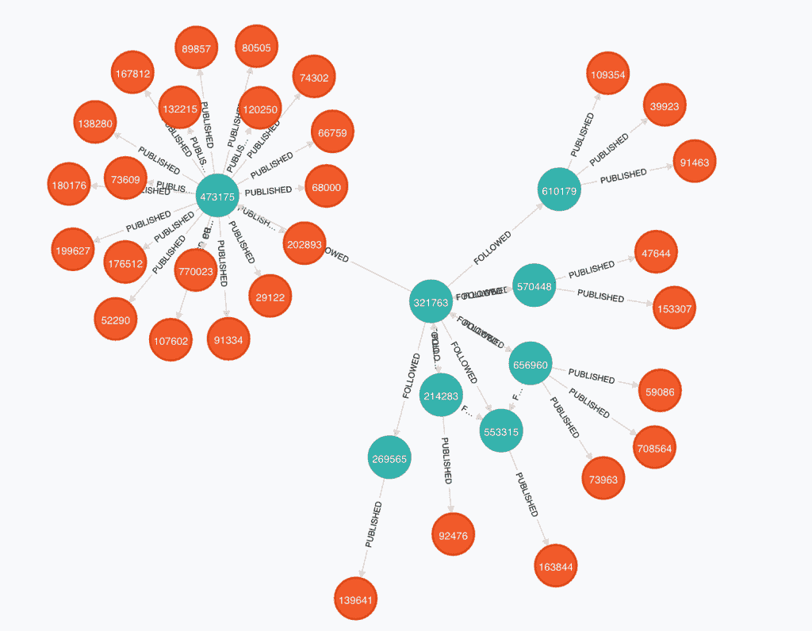

# Neo4J 基金显示了图形数据库是如何获得更多认可的

> 原文：<https://thenewstack.io/neo4j-funding-shows-graph-databases-gained-acceptance/>

Neo Technology，Neo4J 图形数据库的幕后公司，今天筹集了 2000 万美元，表明通过使用提供比关系数据库更多东西的工具，更好地理解数据的需求正变得越来越被接受。

Neo4J 图形数据库提供了一种更容易理解的方式来更好地查看网络中不同节点的连接。例如，Medium 使用 Neo4J 来查看人与他们发布的故事之间的联系。在这个例子中，绿松石代表这个人，橙色代表他们提交的帖子。

【T2

在[中期文章](https://medium.com/medium-eng/how-medium-goes-social-b7dbefa6d413)中，他们指出数据存储在节点和关系中，而不是数据表或键值对中

中等用户、帖子和收藏由图节点表示，它们之间的边描述关系——用户关注用户、用户推荐帖子或用户编辑收藏，仅举几个常见的例子。使用图形数据库也使我们的查询更简单:我们不必做任何复杂的连接或其他查询魔术。

Medium 选择 Neo4J 是因为它的开源根和社区。该社区的规模在数据库的下载中显而易见。Neo4J 2.0 自去年推出以来已有超过 50 万次下载。

正如我去年在 TechCrunch 中所写的，2.0 版本让开发者能够使用可视化指南和简单查询创建自己的推荐引擎。查询语言 Cypher 得到了更新和简化，使其更容易被商务人士使用。它现在还支持引用图中节点子集的标签，将一种模式形式引入到该技术中。这意味着数据可以被更好地索引，允许开发人员告诉数据库更多关于数据的信息。

根据加拿大 IT World】援引 451 Group 的消息，Neo4J 与“[Objectivity Inc .](http://www.objectivity.com/)的 InifineGraph，YarcData 的 Urika，以及 IBM 的用于 DB2 的 NoSQL graph store，用于 Oracle 数据库的 Oracle Spatial 和 Graph option，以及用于 Aster Discovery 平台的 Teradata 的 graph analytics engine 竞争。"

传统上，数据管理系统是由关系数据库驱动的。随着新的 NoSQL 选项和 Neo4J 等新服务的出现，这种情况正在改变。

同样来自我在 [TechCrunch](http://techcrunch.com/2014/02/02/neo4j-a-graph-database-for-building-recommendation-engines-gets-a-visual-overhaul/) 的帖子，“传统的 SQL 引擎不是用来收集数据和寻找关系的。相反，它们更多地是为面向事务的系统设计的。图形数据库在建模、存储和查询数据时，处理负载要容易得多。一切都是相连的。随着时间的推移，随着数据集的增长，关系数据库的性能通常会下降。这可能是依赖于联接的联接表或查询的结果。与密集连接且易于查询的图形数据库相比，这可能会使它非常慢。”

Forrester Research 预计，到 2017 年，图形数据库将覆盖超过 25%的企业。

特色图片[通过](https://www.flickr.com/photos/arwilkinson/10830400356/in/photolist-hv3CGC-d6Yeo9-7Fm6HC-2xdo6Y-jR9gc-4Y4DhU-pHL64-7BT5xh-8Gh5ed-8Ge5Qa-4XhhJ2-cvA52j-89sq7P-8XecHa-3Q3rrJ-eKFSJQ-eKut52-755p5W-8JAsGw-eNg3nj-dYvDL5-eN4qL4-eNfNtS-dMDErt-eN4DHK-eNfSTQ-eNg1cN-eNfM8b-eN4uNc-eN4rPX-eN4vSK-eN4z2Z-eN4pFD-eNg6Q9-eNfYaU-eN4BsP-eN4EZZ-eNfWRQ-eNg7R7-eNfTPN) Flickr 知识共享。

<svg xmlns:xlink="http://www.w3.org/1999/xlink" viewBox="0 0 68 31" version="1.1"><title>Group</title> <desc>Created with Sketch.</desc></svg>