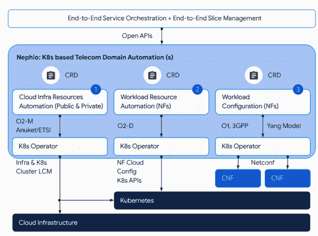

# Nephio 扩展 Kubernetes 解决云原生自动化

> 原文：<https://thenewstack.io/nephio-extends-kubernetes-to-solve-cloud-native-automation/>

[Sagar Nangare](https://coredge.io/)

[Sagar Nangare 是科技博客作者，专注于数据中心技术(网络、电信、云、存储)和边缘计算、物联网、机器学习、人工智能等新兴领域。他目前在浦那担任 Coredge.io 的产品营销总监。](https://coredge.io/)

[Nephio 项目](https://nephio.org/)由 [Linux 基金会](https://training.linuxfoundation.org/training/course-catalog/?utm_content=inline-mention)于 2022 年启动，该基金会与谷歌和一系列电信运营商、解决方案供应商和集成商一起着手建立一个统一的平台，使用 Kubernetes 为大规模 5G 电信网络部署提供意图驱动的云原生自动化。

Nephio 社区相信，在容器和虚拟机的大规模部署中，云原生自动化还没有完全实现。采用完全云原生堆栈仍然需要在资本和运营投资方面做出努力，而且结果对于采用者来说也不是 100%完美的。

目前，Kubernetes 部署正在促进容器的带外自动化。Nephio 使 Kubernetes 能够:

*   在其上部署云基础架构和网络功能，无需带外管理和…
*   管理自己的基础设施和网络功能的配置，减少对外部协调的需求。

Nephio 首先改变了对 Kubernetes 如何大规模部署和配置的看法。我们知道，对于大规模网络或电信网络，Kubernetes 非常适合作为一个统一的自动化控制平面来配置每个基础设施的所有方面，这些基础设施可能是分布式的，并承载网络功能。

但是据观察，Kubernetes 还没有被用来自动化云原生功能(CNFs)和 VNFs。Nephio architecture 除了托管 CNFs 和 VNFs(虚拟网络功能)之外，还将在自动化方面使用 Kubernetes。

典型的大型电信网络涉及来自多个供应商的网络功能和不同的网络管理标准。但是，如果我们实施来自不同供应商的配置，并针对一种网络功能或云基础架构进行比较，情况就不一样了。比如有类似 [O-RAN](https://thenewstack.io/not-just-for-telcos-open-ran-opens-5g-networks-to-devs-enterprises/) (开放无线接入网)或者 3GPP 这样的标准，但是部署的配置是有区别的。

为了自动化供应，Nephio 将 Kubernetes 的声明式、主动协调的方法与机器可操作的配置结合起来。它是声明性的，在某种意义上，配置将被提供作为基础设施自我协调的意图，直到它达到预期的状态，如从观察状态检查的那样。

在这一点上，大多数现代基础设施管理员都在使用[掌舵图](https://thenewstack.io/helm-3-is-almost-boring-and-thats-a-great-sign-of-maturity/)进行如此复杂的 Kubernetes 工作负载部署和配置，但使用它们仍然很复杂。舵图表是数以千计的嵌套 YAML 模板文件。使用舵图的缺点是它产生有条件生成的配置输出。

使用舵图，基于意图的持续协调是不可能实现的，因为它会生成带有条件的配置。在 Nephio 中，这种方法将被 CRDs(自定义资源定义)所取代。

为了解决大规模 Kubernetes 环境的配置问题，Nephio 将为不同的网络功能生产 CRD 和运营商，以管理生命周期和配置。此外，Helm 提供的基础架构即代码(IaaC)将被配置即数据(CaD)所取代。这些将部署在公共云和私有云基础架构中，以实现自动化。CRDs 和运营商的实施将遵循 3GPP、ORAN、O2 等标准。

<svg xmlns:xlink="http://www.w3.org/1999/xlink" viewBox="0 0 68 31" version="1.1"><title>Group</title> <desc>Created with Sketch.</desc></svg>