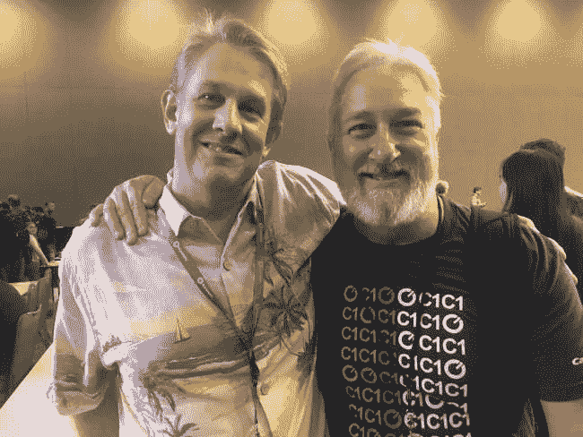
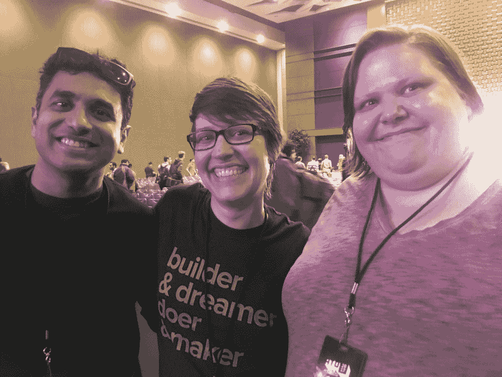
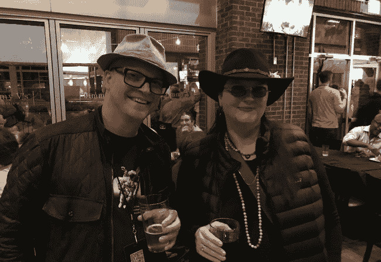

# 书呆子 Herd:卡车到罗利所有的东西开放

> 原文：<https://thenewstack.io/nerd-herd-trucking-raleigh-things-open/>

本周在北卡罗莱纳州罗利举行的[万物开放](https://allthingsopen.org)会议上，[丹麦人库珀](https://www.linkedin.com/in/danesecooper/)向与会者指出,*开源就是*人。库珀(上图)是一位著名的开源倡导者，她的信息与会议热情友好的氛围产生了共鸣，这是对不知疲倦的组织者杰森·希贝茨的热爱。Safia Abdalla 的一次鼓舞人心的演讲强调了人对技术的重要性，他提醒观众，在这个有时令人生畏的行业中，不仅要分享代码，还要分享知识，尤其是对新手来说。杰夫·阿特伍德强调了开源软件的本质，“鼓励我们成为更好的自己。”

罗利是一个值得参观的可爱的医院城市。下次你发现自己在市中心的时候，一定要去 Poole ' s Diner[尝尝奶酪通心粉。太神奇了！](https://www.facebook.com/poolesdiner/)

## 派对图片

庞德思咨询公司的沙恩·库尔库鲁和第一资本公司的吉姆·贾格尔斯基。

(从右至左):Jenna Tollerson、Kendra Skeene、Nikhil Deshpande，全部来自格鲁吉亚数字服务公司。

Danese Cooper(左)与 TNS 创始人 Alex Williams

## 引用、观察、陈述

<svg xmlns:xlink="http://www.w3.org/1999/xlink" viewBox="0 0 68 31" version="1.1"><title>Group</title> <desc>Created with Sketch.</desc></svg>