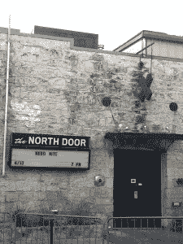
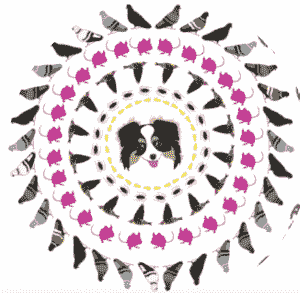

# 书呆子之夜在德克萨斯州奥斯汀庆祝 DNA 日

> 原文：<https://thenewstack.io/nerd-nite-celebrates-dna-day-austin/>

书呆子夜奥斯汀

“不见不散”是书呆子之夜的座右铭，这是一个月一次的聚会，各种书呆子聚在一起喝酒，学习新的书呆子知识。星期三晚上在德克萨斯奥斯丁是为了纪念 [DNA 日](https://www.genome.gov/10506367/national-dna-day/)，庆祝 1953 年双螺旋结构的发现，每年 4 月 25 日庆祝。

这三个演讲都与 DNA、发现或适应有关。奥斯汀的书呆子们也来了:站着的 150 多名观众男女各半。披萨在活动开始前就卖光了，酒吧也有很多生意。

简单介绍了 Nerd Nite 之后，我们就开始过去了。[在高尔特项目工作的动物考古学家艾琳·基南](https://www.linkedin.com/in/erin-keenan-msc-b179a910)讲述了新技术如何帮助确定 12000 年前动物骨骼碎片的年代。

她令人愉快的演示风格传递了惊人的信息量(例如，考古学家、古生物学家和动物考古学家之间的区别是什么？).Keenan 使用伟大的视觉图像和毛茸茸的猛犸象卡通，讲述了我们的生活每天与动物互动的次数。了解哪些动物在哪个时间层，可以让动物园考古学家了解人类如何与动物互动。

一种名为 ZooMS 的新工具正在彻底改变骨骼，尤其是动物骨骼碎片的识别方式。这个工具太酷了，它可以从骨头所在的塑料袋里的残留物中识别出动物的种类。

描绘在人类附近茁壮成长的动物的相互依赖性的详图。从考尔德.卡曼的网页上。

考尔德·卡明斯将我们带入当下，在一次题为“走出森林，走进我们的垃圾:动物如何在人类世界茁壮成长”的演讲中，谈论动物如何适应人类

作为一名艺术家和公民科学家，Kamin 被我们与动物和环境的矛盾关系所吸引。她指出，鸟类现在使用塑料袋和烟头来筑巢。奇怪的是，烟头中的尼古丁有助于害虫远离巢穴，因此对幼鸟有益。

休息了一会儿，我们回到了未来。澳大利亚人乔·汉森是一名生物学家和科学作家。你可能知道他是 PBS 科学和 YouTube 热播系列节目“[聪明没关系”的创作者/主持人](https://www.youtube.com/user/itsokaytobesmart)

他风趣的演讲，“CRISPR 的时代——既然我们可以做任何事情，我们还能做什么？”关注科学家修改 DNA 序列的新能力带来的道德问题，这种能力可以导致从定制生物燃料到治愈艾滋病毒感染细胞到编辑人类胚胎的一切事情。

CRISPR(成簇的有规则间隔的短回文重复序列)今年在新闻中出现得很多，被[自然](http://www.nature.com/news/crispr-gene-editing-is-just-the-beginning-1.19510)、 [IFL 科学](http://www.iflscience.com/health-and-medicine/scientists-china-edit-human-embryos-second-time)、和[连线](http://www.wired.com/2015/07/crispr-dna-editing-2/) **所覆盖。**

管理这种新力量的科学远远超过了法律。汉森谈到了使用这种权力使某些东西变得更健康(例如，编辑胚胎以抵抗疾病)和使某些东西变得更好(例如，说你希望你的宝宝拥有你认为比别人更好的特征，如平静的气质或棕色的眼睛)之间的区别。

汉森说取决于你对转基因的感觉，CRISPR 是生物学有史以来最酷或最可怕的工具。****

科学家们去年开会提出了使用 CRISPR 的指导方针，但汉森指出，中国人跳过了这些建议，使用了强大的基因编辑技术 CRISPR，转基因胚胎使它们对艾滋病病毒更具抵抗力。他指出，他们没有违反法律，因为目前没有法律规范这一工具的使用。

书呆子之夜现在正在全球 90 个城市上演。如果周三晚上是展示质量的指标，那就有很多值得期待的。

<svg xmlns:xlink="http://www.w3.org/1999/xlink" viewBox="0 0 68 31" version="1.1"><title>Group</title> <desc>Created with Sketch.</desc></svg>