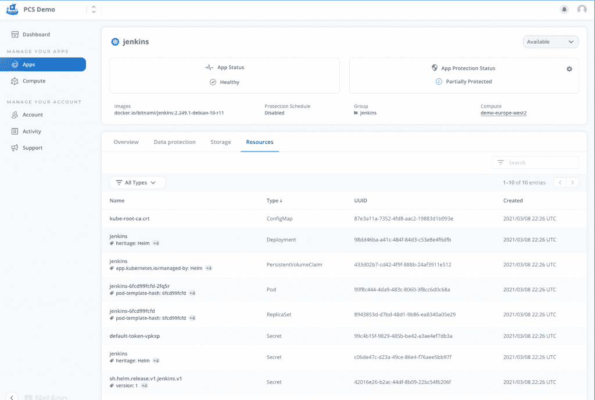
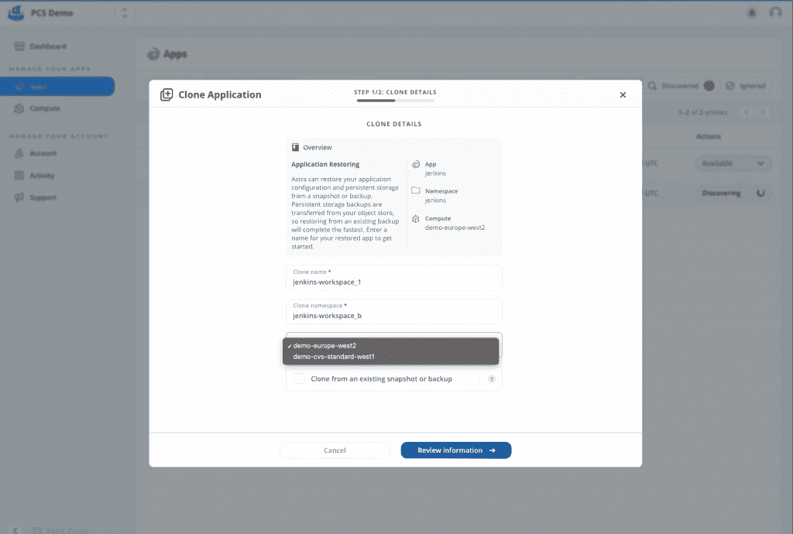

# NetApp Astra 为 Kubernetes 部署带来了数据优先的方法

> 原文：<https://thenewstack.io/netapp-astra-brings-a-data-first-approach-to-kubernetes-deployments/>

存储巨头 [NetApp](https://www.netapp.com/) 在[发布了基于](https://cloud.netapp.com/blog/blg-astra-data-management-services-for-kubernetes-applications) [Astra](https://cloud.netapp.com/astra-register) Kubernetes 的数据平面的生产版本，为开发团队提供了一种通过单一界面在 Kubernetes 环境中部署和[管理数据和应用](https://thenewstack.io/netapps-project-astra-brings-data-management-to-kubernetes/)的方式。

考虑到如何在不同的集群和云环境之间移动 Kubernetes 上的应用程序或自动化可靠的存储等挑战，Astra 特别设计为帮助 DevOps 团队应对与管理 Kubernetes 上的有状态应用程序和数据相关的固有复杂性。

“Kubernetes 中的有状态应用程序可能会很复杂，涉及许多零碎的步骤，并且缺乏清晰的声音来处理有状态工作负载，这可能会使从业者感到更加畏缩。NetApp 云数据服务产品管理副总裁 Eric Han[告诉新堆栈:“客户在将有状态工作负载转移到生产中时会遇到困难，因此可能会对在 Kubernetes 中运行它们感到犹豫。”。“Astra 为有状态的 Kubernetes 工作负载提供了一套丰富的存储和应用感知型数据管理服务，这些服务由 NetApp 的数据保护技术提供支持。”](https://www.linkedin.com/in/eric-han/)

事实上，到目前为止，工具“还没有全面地解决企业对其关键业务应用程序的数据管理，”韩说。“将应用从一个 Kubernetes 命名空间移动到另一个集群涉及从应用平台到基础设施的多层堆栈，因此很难实现自动化，”韩说。

韩介绍了该平台的具体优势:

*   在多混合云中以及跨多混合云“轻松、快速”地管理、保护和迁移 Kubernetes 应用。
*   “业务关键型应用程序”的数据保护、灾难恢复(DR)、审核和迁移要求
*   应用程序保护状态的实时可视化。
*   用于实施备份、灾难恢复和迁移工作流的 API，无论“您的 Kubernetes 集群托管在何处”韩为管理有状态 Kubernetes 应用程序的开发人员提供了以下“Astra 之前”和“Astra 之后”的场景示例:

通常，DevOps 团队将在云环境中创建 Kubernetes 集群，并依靠服务网格来管理应用和许多其他支持，包括 CI/CD 平台，以支持上传到云环境和安全工具的应用生产管道。

Astra 一旦实施，就会自动执行将 Kubernetes 集群与数据平面集成的过程。在应用程序生命周期管理开始之前，它通过一组用于发现过程的操作符来实现这一点，当然包括存储系统与不同 Kubernetes 集群的集成，这些集群可能分布在也可能不分布在来自不同提供商的不同云环境中。

针对客户对有状态数据管理的具体需求，韩描述了以下用例:

*   **使用快照保护数据。**Han 表示，通过能够拍摄快照以保护本地数据，在数据被意外删除或损坏的情况下，应用程序和相关数据可以恢复到同一 Kubernetes 集群中以前记录的快照。
*   **远程备份灾难恢复。**“借助 Astra，您可以对您的应用和状态进行完整的应用感知备份，这可用于将您的应用及其数据恢复到同一地区或不同地区的不同 Kubernetes 集群，从而解决您的灾难恢复用例，”Han 说。
*   **通过即时主动克隆实现云爆发和迁移的应用可移植性。**“你可以将整个应用程序及其数据从一个 Kubernetes 集群移动到另一个集群，无论集群位于何处，”Han 说。

韩说，作为云服务，这个想法是让用户开始利用 Astra 数据平面进行 Kubernetes 管理，而无需“自己组装成一个工具包的辛劳”。

“第一代 Kubernetes[部署和管理]在能够将工作负载放入容器的意义上是强大的，他们从他们认为容易体验和学习的方式开始，”Han 说。“这没有错，但随着我们进入第二代，这不再只是获得一个持久的存储卷，而是我如何获得无缝体验。”

鲁迪和彼得在 Pixabay 上的特写图像。

<svg xmlns:xlink="http://www.w3.org/1999/xlink" viewBox="0 0 68 31" version="1.1"><title>Group</title> <desc>Created with Sketch.</desc></svg>