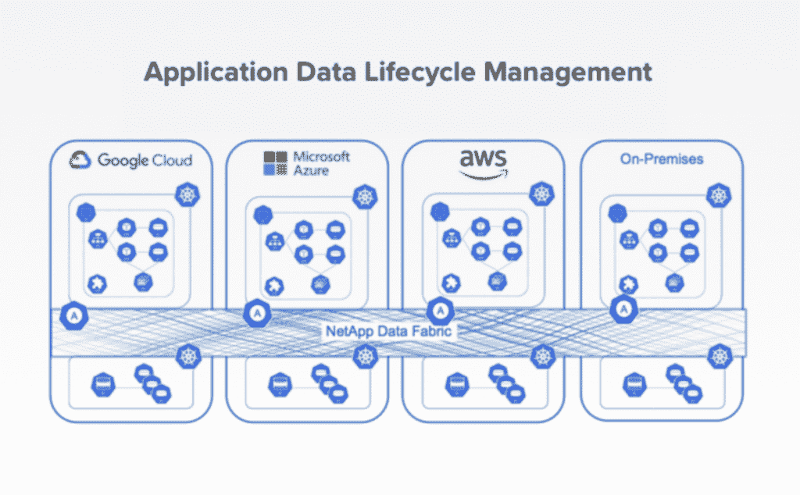

# NetApp 的“Project Astra”为 Kubernetes 带来了数据管理

> 原文：<https://thenewstack.io/netapps-project-astra-brings-data-management-to-kubernetes/>

数据管理和存储提供商 [NetApp](https://www.netapp.com/us/index.aspx) 希望帮助组织依靠单一平台来管理由 Kubernetes 控制的数据服务、存储和应用程序。

与 Kubernetes 社区合作， [NetApp](https://www.netapp.com/us/index.aspx) 推出了 [Project Astra](https://cloud.netapp.com/project-astra) ，这是一个平台，可帮助组织通过他们选择的单个控制平面管理 Kubernetes 部署的整个数据生命周期。这些功能将包括灾难恢复、治理、数据保护和复制，以及完整的存储功能。

NetApp 表示，他们正在与 Kubernetes 社区合作开发一个平台，该平台将:

*   发现适用于不同 Kubernetes 控制平面的应用，无论是在本地还是在单云或多云环境中。
*   在 Kubernetes 环境中集成和统一应用和数据管理，包括多云和内部环境。
*   扩展状态和无状态工作负载的可移植性。
*   将 NetApp 的数据和 Kubernetes 管理合并为服务和内置功能。
*   该公司表示，预计 Project Astra 最终将为 DevOps 社区提供与任何 Kubernetes 控制平面兼容的软件架构和插件工具，但没有透露时间表。

目前，组织可能依赖 NetApp 的存储产品进行内部和公共云数据管理以及相关的存储卷管理。然而，Astra 项目正在开发中，旨在帮助组织超越存储管理，例如，作为一个独立且通常孤立的实体。相反，[负责 NetApp 云数据服务的产品管理副总裁 Eric Han](https://www.linkedin.com/in/eric-han/) 告诉新堆栈，应用程序数据管理不同于卷数据管理，因为“您必须了解应用程序的身份，理解应用程序，并且能够恢复应用程序，这样才能迁移应用程序，从而实现可移植性。”

图片:NetApp

如上所述，Project Astra 旨在允许组织使用他们选择的 Kubernetes 控制平面，并在 Kubernetes 上提供全面的应用程序数据管理以及 Kubernetes 上状态和无状态数据的可移植性。

“我们希望人们说‘嘿，这就是我们想去的地方’，而不是说‘你知道吗，Kubernetes 只是为无国籍人士服务的，这就是我需要 Kubernetes 的原因’，”韩说。“那有点太小了。”

“组织可以开始使用 Project Astra 作为平台来管理 Kubernetes 集群上的数据库应用程序和机器学习工作负载等工作负载，并管理此类工作负载的整个生命周期，包括备份和灾难恢复，”IDC to The New Stack 的分析师 [Sriram Subramanian](https://www.linkedin.com/in/sriramhere/) 说。“截至目前，这些工作负载需要使用 NetApp 存储产品，如 OnTap 或云卷服务作为后端，”Subramanian 说。

Subramanian 说，Project Astra 可以为部署在 Kubernetes 环境中的 DevOps 团队解决的问题之一是，它可以为在 Kubernetes 环境中工作的 DevOps 团队消除存储和应用程序数据生命周期管理的复杂性。" Subramanian 说，DevOps 人员或 Kubernetes 集群管理员对如何管理存储后端知之甚少. "同样，存储管理员对云原生应用程序的数据需求一无所知。Astra 试图通过抽象出工作负载级别的存储需求来弥合这两者。"

韩说，Project Astra 背后的概念适用于 5 到 10 人的小型创业公司，因为这是一个太大的跨国公司，可能会开发机器学习或数据科学应用程序，或者有许多其他不同的用例场景。无论如何，组织通常可能希望将他们创建的东西作为服务提供给他们的用户或最终用户。

“他们希望我们处理生命周期，”韩说。“他们希望我们在他们的 Kubernetes 基础设施上运行。”

在技术层面上，DevOps 团队能够选择它想要的 Kubernetes 控制面板或界面，韩说这“不同于过去的方法”“我们并不是说，为了开始，你必须使用这个，只有这个，”韩说。相反，组织选择的 Kubernetes 集群将连接到 Project Astra 平台，下载一组操作符，并在开始生命周期管理流程之前开始进行发现。

“现在，如果你没有(集装箱存储接口)和管道，你就无法销售这种产品，但它必须不仅仅是管道，”韩说。“我发现解释这一点的最简单方法是，我们必须从存储转向应用程序数据生命周期，这需要了解身份、访问等。”

NetApp 是新体系的赞助商。

<svg xmlns:xlink="http://www.w3.org/1999/xlink" viewBox="0 0 68 31" version="1.1"><title>Group</title> <desc>Created with Sketch.</desc></svg>