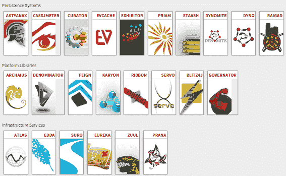
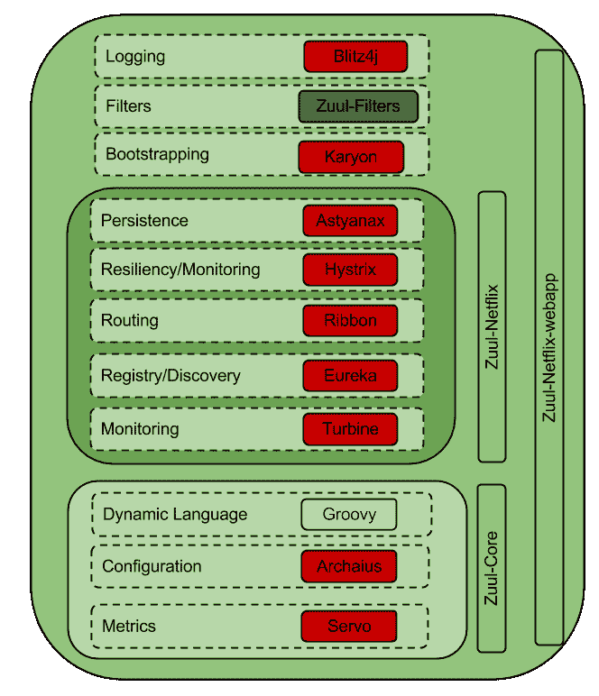
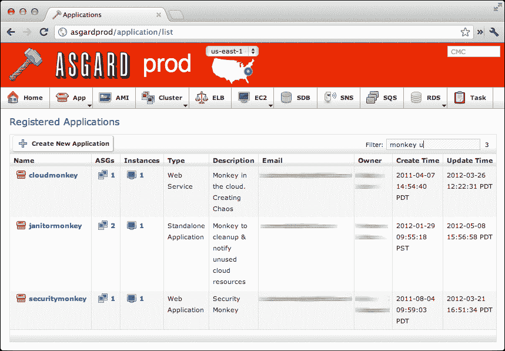

# 网飞用开源打寒战，增加 Docker 支持

> 原文：<https://thenewstack.io/netflix-chills-open-source-adding-docker-support/>

为了促进开源软件的广泛使用，网飞已经开始将许多公开的项目打包到 Docker 容器中，这样其他人可以更容易地部署它们。

随着对网飞开源项目贡献的增加，公司很快意识到需要为贡献者提供更简化的体验。

“虽然我们的许多[开源软件]项目在世界各地的许多公司中成功使用，但我们从社区中获得了一个非常明确的信号，即越来越难确定哪些项目对特定公司或团队有用；它们完全独立；网飞的工程师 Andrew Spyker 和 Ruslan Meshenberg 在宣布这些变化的博客文章[中写道。](http://techblog.netflix.com/2015/10/evolution-of-open-source-at-netflix.html)

因此，网飞彻底改革了其开源项目开发库，使软件开发人员更容易找到他们想要使用和工作的网飞开源项目。迄今为止，网飞已经开放了公司内部开发的 50 多个开发和基础设施应用程序。

网飞是许多 webscale 公司中的一员，他们正采取措施致力于开源内部构建的软件，以获得第三方的反馈，并在不断发展的 IT 生态系统中拥有发言权。AirBnB、脸书和脸书旗下的 Instagram、Pinterest、Etsy、易贝、雅虎、LinkedIn 只是维持开源项目的其他网络公司中的几个。

网飞发布的一些开源项目。

除了对其 Github 库的[变更，网飞将提供其许多开源项目作为 Docker 容器。](http://netflix.github.io/)

使用 Docker 容器消除了开发人员必须管理、编辑和修改 Wikis 或外部资源，以及如何最好地为网飞开源社区做贡献的需要。提供基于容器的贡献解决方案使开发人员能够在将图像克隆到他们的本地开发环境后，快速旋转他们想要处理的图像。这也防止了新开发人员潜在地通过调试提交破坏源代码，因为他们的开发实例包含在 Docker 中，来自网飞存储库自己的分支。

祖尔岛的网飞组件

探索重新设计的网飞 GitHub 门户网站显示了按类别细分的项目，如大数据、构建和交付工具、微服务的运行时管理、数据持久性、洞察力、用户界面设计和安全性。这些部分中的每一个都与存储库中的其他部分相连接，突出了项目是如何相互衔接的。

对于那些对开发微服务感兴趣的人，网飞提供 Asgard 来管理应用部署。Eureka 为 Asgard 提供了支持，使用户不必在服务关闭时重启数百个故障节点。Eureka 还提供服务发现，因此独立 AWS 集群上的容器可以相互通信和发现，而不管它们在 EC2 实例上的位置如何。

基于容器的工作流解决方案中的数据持久性是网飞的另一个重点，其产品 [Raigad](https://github.com/Netflix/Raigad) 和 [Priam](https://github.com/Netflix/Priam) 能够备份数据，配置部署，并在出现问题时恢复 Cassandra 和 ElasticSearch 数据库。这些产品中的许多现在将作为 Docker 映像提供，这将允许更快地部署活动集群，使开发人员能够解决潜在的错误，纠正问题，并快速部署修复程序或对项目应用公认的增强功能。

网飞 Asgard 注册申请仪表板

随着各种水平的开发人员继续通过为开源软件做贡献来磨练他们的技能，为项目做贡献的人数持续上升。因此，公司会发现他们潜在的开源贡献者比他们的项目还多——尽管对网飞来说这不是问题。自从采用开源模型及其可用选项以来，该公司经历了大规模的开源增长，开发人员可以参与各种项目。

对于许多开发人员来说，通过自学提高他们的软件开发技能，为开源项目做贡献是一种提高他们在该领域声誉的方式，同时仍然致力于有趣和具有挑战性的项目。网飞为开源社区提供了一个机会，不仅可以磨练他们的技能，还可以在此过程中使用令人兴奋的新技术。

特写:奥卓·阿杜巴，来自网飞系列电影《橙色是新的黑色》经由[网飞](https://pr.netflix.com/WebClient/Login.jsp)。

<svg xmlns:xlink="http://www.w3.org/1999/xlink" viewBox="0 0 68 31" version="1.1"><title>Group</title> <desc>Created with Sketch.</desc></svg>