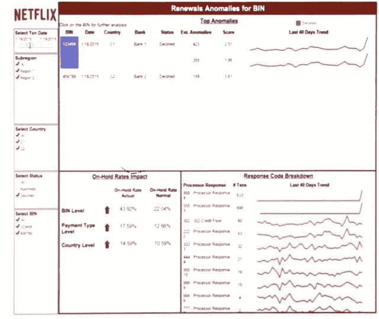

# 网飞的交易所如此复杂，以至于引发了一场科学复兴

> 原文：<https://thenewstack.io/netflix-exchange-complex-triggered-scientific-renaissance/>

互联网规模的架构正在重新唤醒许多学科的开发人员，让他们认识到一个惊人的事实:2010 年代多用户、微服务架构问题的答案通常是早在 20 世纪 60 年代就在大型机规模上构想的相同产品的放大版本。

典型的例子:一种应用于矩阵的数学概念，称为奇异值分解(SVD)，在洛斯阿拉莫斯国家实验室制作的这部 1976 年的电影中，它被解释和描述为用于检测物理异常。这是一个将严格的算法应用于值矩阵的概念，目的是导出可以用作阈值的单个值。识别异常值的第一步是建立阈值，异常值是指时间序列中似乎不是由与大多数其他值相同的输入生成的值。

有什么比用 SVD 诊断反应室中亚原子粒子的行为更困难的？在一个每秒钟可能累积多达 13，000 条记录的全球支付交易系统中隔离不准确的支付数据如何？你以为我在说证券交易所吗？

不，我说的是网飞，广受欢迎的流媒体视频服务。

## 网络的黑仔应用

根据思科的视觉网络指数，世界上超过一半的网络流量是由内容交付网络(CDN)管理的。其中大约三分之二来自网飞。

> 根据最保守的统计，网飞是世界上最大的带宽消费者。

到目前为止，网络还没有崩溃。cdn 似乎正在按照设计的那样工作。但是有一点你可能从来没有考虑过，至少没有考虑到这个深度:所有网飞的流量都被金融交易所占据。网飞订阅不仅仅是打开无限制访问世界上最大的视频流的网关。据该公司估计，网飞全球 5，700 万用户中每天都有视频流的那部分用户的金融交易每天会产生超过 10 亿条单独的记录。

这只是对网飞而言。每一笔金融交易都由支付处理公司、银行及其支持银行之间的至少三笔(通常是四笔)后续交易支持，网飞可以说是历史上最复杂的商业交易所。

网飞规模的支付系统异常就像一列出轨的火车。当服务提供商的一个支付合作伙伴无法与客户交易时，它随后无法与数百个客户联系。其结果是一个可测量的“流失”——对于一个普通的百货商店来说，顾客的流失将被认为是灾难性的。

在计算机械协会旧金山湾区分会去年 1 月 26 日举办的一次会议上，网飞首席数据科学家 Shankar Vedaraman 解释了被误认为是“异常”的东西是如何导致这种麻烦的。他领导着一个分析团队，直接与网飞的支付经理和财务规划师合作，他们的任务是尽可能减少客户流失。

“基本上，如果客户无力支付网飞，无法使用网飞的服务，我们希望将(客户流失)降至最低。这是我们的首要目标。“我们有一小群人与业务用户密切合作，因此能够对整个组织产生更大的影响。但有时会发生这样的情况，我们有动机为特定的垂直行业开发解决方案，但我们会后退一步，看看我们是否可以提供一个可扩展的解决方案，可以跨不同的应用程序使用。”

在这种情况下，网飞团队遇到了最初为视频监控领域设计的一种奇异值分解排列，具体来说，是一种从捕获的人脸中去除虚假阴影以促进更好的面部识别的方法。这是一个被称为稳健主成分分析(RPCA)的概念，由斯坦福大学数学团队推动，该团队由 Emmanuel Candès 教授领导

## 低维度的祝福

2009 年的一篇研究论文[PDF]从总体上解释了这个问题:“最近科学、工程和社会中大量高维数据的爆炸给许多领域带来了挑战和机遇，如图像、视频、多媒体处理、web 相关性数据分析、搜索、生物医学成像和生物信息学。在这些应用领域中，数据现在通常存在于数千甚至数十亿个维度中，许多样本有时处于相同的数量级。”

在统计学中，维度是指描述一个数据点所需的坐标数。应用于数据库时，您可以将它看作是标识一个点所必需的相关属性的数量。坎迪斯教授明白，他正在讨论的类别的数据“位于一些低维流形上”，这意味着它不需要用太多的坐标来索引。他说，数学家可以依靠这一事实来生成矩阵，算法可以更稳健地应用于这些矩阵。

即便如此，Candès 指出，他更强大的概念是灵活的，表明它可以应用于某个视频流媒体服务——具体来说，就是帮助它根据一组不完整的客户电影评论来确定客户的电影口味。网飞自己的产品分析团队成员 Chris Coburn 引用了 Candès 的工作，推导出一种 RPCA，不仅可以应用于网飞的支付记录，也可以应用于其他业务。

PCA 的健壮形式极大地减少了假阳性的数量。在上周四的一篇公司博客文章中，科伯恩和他的同事展示了他们工作中的真实 RPCA 算法的互动演示。几乎就像 1976 年的洛斯阿拉莫斯电影一样，你可以实际观看该算法生成一个季节性波动的低阶近似，尽可能地将自己拟合到一系列振荡中——这与网飞客户观看习惯在时间序列中的起伏没有什么不同。

【T2

一旦生成低秩估计波，该波不考虑的点被认为是异常值。然后，可以对这些异常值进行评估，以发现潜在的支付处理事件，并将分析结果投射到 Tableau 生成的仪表板上。然后，支付处理合作伙伴可以共享该仪表板，他们不一定是数据科学家，但也需要了解客户事件如何影响他们。

更重要的是，这些检测到的异常值的行为可能会开始形成一种模式，这可能会使合作伙伴能够在支付系统异常发生之前检测到它们。

“今天，网飞的客户在世界各地数百种不同类型的浏览器或设备上注册，”该团队写道。“识别国家、浏览器/设备和语言的独特组合中的异常有助于我们的工程师了解客户注册问题并及时做出反应。”

当单片软件统治数据中心时，处理错误被视为不可避免的罪恶。但是巨石柱的规模只能到此为止。现在它们被微服务所取代，开发人员正在重新扮演他们作为工程师和数学家的角色，以 70 年代大型机开发人员预见的方式重新发现行业工具。

<svg xmlns:xlink="http://www.w3.org/1999/xlink" viewBox="0 0 68 31" version="1.1"><title>Group</title> <desc>Created with Sketch.</desc></svg>