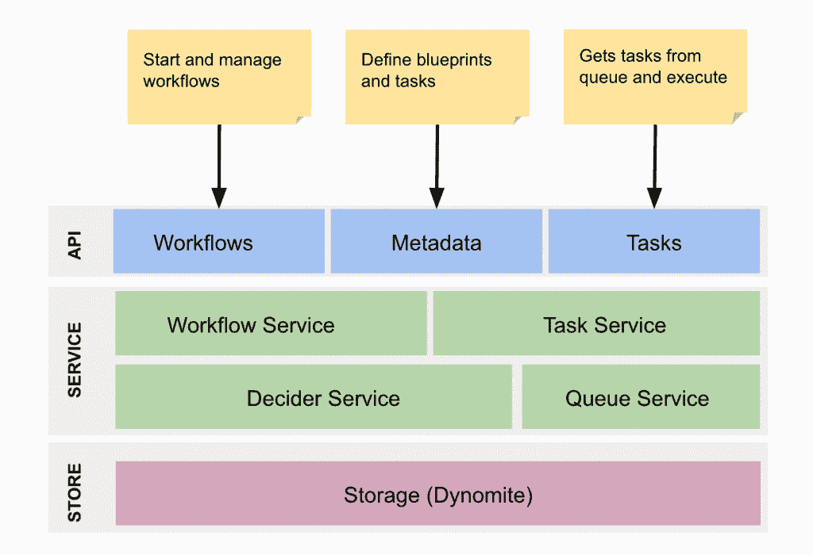
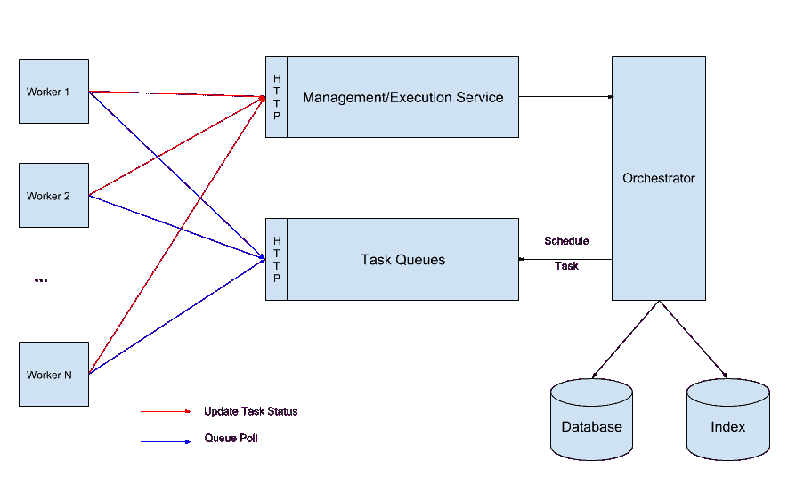

# 网飞的开源 Orchestrator，Conductor，可能证明了普通可扩展性的局限性

> 原文：<https://thenewstack.io/netflix-orchestrator-may-prove-limits-ordinary-scalability/>

这种情况在你身上发生过几次？有一天，你正在经营自己的事业，在成千上万个并发频道上运行你的高清戏剧和喜剧视频的国际传输系统，16 声道立体声。你在东京或哥本哈根或其他地方的内容供应商，就像每隔一天一样，用原始或半编辑的视频淹没你，并寻求你对可能的编辑和场景变化的输入。他们使用的是一种国际标准的视频传输格式，这种格式就是为此而创建的，也许你是这种格式的唯一客户，但你以前从来没有遇到过这种问题。

突然之间，你有了三四个热门节目，而现在是假日，每个人都在同一时间疯狂地观看它们。你的供应商向你提出他们需要完成的要求，这样他们就可以在一月份出版他们的系列。有一个交通高峰。你的观众的分辨率必须下调到 4K 高清以下才能补偿。对于这种突发事件，事先没有建立工作流程。全世界的小孩都注意到他们被降到了 1080 便士，并开始哭泣。离圣诞节只有几天了。你会怎么做？你会做什么？

想象你的数据中心像谷歌一样运行一点点，或者运行很多是一回事。想象它像网飞那样运作完全是另一回事。然而，对于任何有这种倾向的人来说，[网飞上个月发布了开源的编排引擎](https://netflix.github.io/conductor/)，该引擎是其工程师为在云中运行其整个操作而开发的——具体来说，是在亚马逊的云上。它很可能成为世界上最复杂的分布式处理系统的引擎。

因此，为了我们的缘故，问题变成了，它会把*缩小到*吗？更重要的是，如果网飞的好想法在小范围内仍然有效，那么 Conductor 是否比我们需要关注的小 ol' [Kubernetes](/category/kubernetes/) 开源容器编排引擎更有优势？

## 真正的编排还不存在

上个月，[在他们公司的工程博客上写道](http://techblog.netflix.com/2016/12/netflix-conductor-microservices.html)网飞建筑师[维伦·巴莱亚](https://www.linkedin.com/in/virenb/)和维克拉姆·辛格，“通过点对点的任务编排，我们发现随着业务需求和复杂性的增长，它变得更加难以扩展。”

我们过去在这里讨论过微服务，它是一种通过将服务分解为最小的组件并开放它们之间的通信通道来实现效率的方法。在一定的尺度下，让事物无限变小会在它们之间产生过多的串扰。从网飞的角度来看，这可能是唯一比当前美国总统换届更难安排的事情。

在 2016 年 11 月的 IEEE 白皮书中，包括 IBM Zurich 员工研究员 [Lydia Y. Chen](http://researcher.watson.ibm.com/researcher/view.php?person=zurich-yic) 在内的六名研究人员尽可能完整地展示了利用常见的基于容器和基于虚拟机管理程序的技术的超大规模微服务调度平台的数量。他们的计数正好是零。

“尽管在基于容器和虚拟机管理程序的虚拟化技术方面取得了明显的技术进步，”该团队写道，“但我们尚未实现一个标准的大规模、性能优化的调度平台，来管理联网的微服务生态系统，以创建一个专门的应用程序堆栈，如多层 Web 应用程序和物联网(IoT)应用程序。”

阅读过去几年的新堆栈[，人们可能会认为这个目标已经实现了。但是，正如这个团队得出的结论，现代容器编排系统依赖于配置管理系统的能力，将必要的定制应用于运行服务的每个节点。他们写道，在微服务规模上，甚至连计算器都不包含预测可能性数量所需的数字。“因此，我们需要新的研究，”他们写道，“专注于开发精确建模、表示和查询微服务和数据中心资源配置的技术。”](/category/microservices/)

或者，您可以采用一种更少依赖于“定制配置”的架构这就是网飞导体和支持它的架构所实现的:导体依赖于服务的 [*幂等性*](http://www.restapitutorial.com/lessons/idempotency.html) ，以及它们的无状态性。也就是说，方案中的任何服务都被信任以完全相同的方式实现完全相同的结果。这个理想有一种[无服务器](/category/serverless/)的氛围:在基本层面上，执行相同功能的微服务被视为一个功能。

在这种情况下，这种功能在执行其工作的过程中，实际上需要沟通的地方就少得多了。只要明确定义了工作的工作流，并且工作的结果要么是“这是您要求的”，“我做到了”，要么是“哎呀”，这种使典型的工作流在大规模上变得不可能的事情永远不会发生。

还是有沟通的。但是，由于任务被细分得如此之细，它们所贡献的工作最终更容易监控，因此可以直接确定进度的相对状态。而不是用一个相当于“你好吗”的请求来轮询应用程序。“负责维护工作流的组件——网飞称之为“决策器”——评估每个单独服务的总体进度，并从那里确定应用程序在任何时刻的*状态*。

【T2

## 信任，但要核实

真正的辩论开始了。不管我们喜欢与否，微服务是面向服务的架构(SOA)的最新高潮。这意味着，最终，上世纪 90 年代遗留下来的一些悬而未决的争论将在今天露出它们丑陋的嘴脸。其中一个处理*委托*。具体来说，一个流程编排者应该在多大程度上信任组成流程的服务，让它们自己管理流程？一个流程越值得信赖，在高流量的情况下，它们传递给编排者的负担就越小。

在世纪之交，在 Linux 容器或它们的形式被认为是业务流程的容器之前，编排争论围绕着*业务事务*的本质。SOA 架构师的一个目标是导出一个事务的概念，它是原子的、一致的、隔离的和持久的(ACID)，一个不可分割的单元。从他们的角度来看，计算功能可以映射到业务交易。因此，可以设想围绕这些事务开发一个 API，使用与业务人员理解事务的方式相对应的术语和技术。

问题是:交易是连锁进行的。也许每个链接都是不可分割的，但是下一个链接依赖于前一个链接使用的相同数据源，并且可能被修改。

在 2001 年，一个包括惠普和康柏 Tandem 部门(即将合并)成员的研究小组发表了一份白皮书[PDF],探讨了将商业交易映射到计算机过程的问题，向人们介绍了当时寻找解决方案的竞争方法。

惠普/康柏团队写道:“特别是，原子性和隔离性的特性可以有效地应用于业务流程(或者至少是业务流程的一部分)”。例如，一个人可能想要声明发票的支付和收款人账户的贷记是原子工作单元的一部分。

“但是，人们也认识到，将整个业务流程作为单个 ACID 事务来处理是一种矫枉过正的做法。首先，由于业务流程通常持续时间很长，将整个流程视为一个事务将需要长时间锁定资源。其次，由于业务流程通常涉及许多独立的数据库和应用程序系统，在整个流程中实施 ACID 属性将需要在这些系统之间进行昂贵的协调。第三，由于业务流程几乎总是有外部影响，使用传统的事务回滚机制来保证原子性是不可行的，甚至可能在语义上也不理想。很明显，必须扩展现有的数据库事务模型。”

HP/Compaq 团队探索了各种形式的消息传递，包括发布/订阅模型，作为业务流程链中任务相互之间“传递接力棒”的方式。这样，链中的下一个链接可以访问前一个链接使用的数据，并且只有在前一个链接完成后才能获得访问权。

他们在这一阶段展示的证据表明，如果不为编排它们的任何东西创造过多的工作，你真的不能直接将业务交易(如流程图上的大块)映射到计算机进程。由此开始了一种趋向于松散耦合的趋势，人们接受了在业务层面上看起来不可分割的过程应该在计算机层面上是可组合的。

基于指挥的工人与发动机的通信

## 转念一想，不要相信，但要看得很仔细

发布/订阅似乎是合适的，部分原因是它使用了*主题*作为维护链中各种链接的上下文的方式。在这个十年的开始，挪威 [Uni Research](http://uni.no/en/) 实验室的 [Sattanathan Subramanian](https://www.linkedin.com/in/sattanathan/) 提出了一个概念【PDF】叫做数据流委托(DFD)，作为编排者指导服务链中的服务如何参与工作流，以及如何交换这些服务相互依赖的数据。DFD 使用了一个听起来像 SDN 的概念:将控制平面与数据平面分离，“以便将数据流责任委托给组件服务。”

在 DFD，有一套明确的指令指定数据来自哪里，去往哪里。服务引用那些指令并从那里开始工作。对于微服务之间的串扰问题，这似乎是一个可行的解决方案——适用于 Kubernetes 这样的管弦乐队，搭配 Kafka 这样的消息系统。

但具有讽刺意味的是，网飞发现这一概念的组成部分约束性太强——换句话说，解耦性不够。网飞大学的 Viren Baraiya 和 Vikram Singh 上个月写道，“发布/订阅模式适用于最简单的流程，但很快突出了与该方法相关的一些问题。”在他们的列表中，他们说过程流倾向于“嵌入”在应用程序中，并且围绕其工作流的假设，例如 SLA，倾向于紧密耦合并且不可适应。最后，没有一种简单的方法来监控他们的进展。

所以网飞对导体的研究更进了一步，就像把亚原子粒子分解成夸克一样。Conductor 在这个非常小的尺度上寻求原子性和幂等性，除了对完成的期望之外，对这些过程没有任何委托。工作流程的状态由指挥者的决策者集中决定，通过将每个工人的进度与它所谓的“蓝图”进行比较虽然 Subramanian 等研究人员可能认为这种方法会导致潜在的单点故障，但 Singh 和 Baraiya 指出，这种集中化为可视化系统的实时状态开辟了单一用户界面的途径——这在委托方法下实际上是不可能的。

网飞导体是最新的证据，表明计算过程要在大规模下更加有效和可行，它们的行为必须越来越不像一个理性的商人所期望的那样。在将逻辑应用于试图证明服务像人一样的最新模型时，网飞证明了相反的情况。

<svg xmlns:xlink="http://www.w3.org/1999/xlink" viewBox="0 0 68 31" version="1.1"><title>Group</title> <desc>Created with Sketch.</desc></svg>