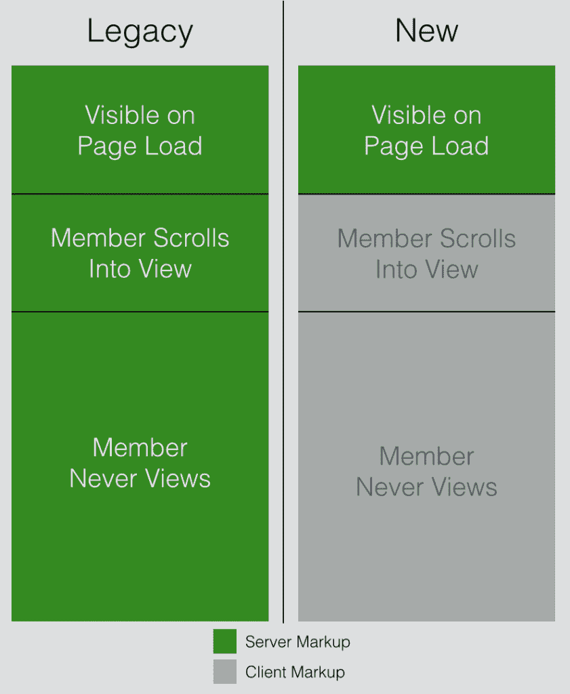
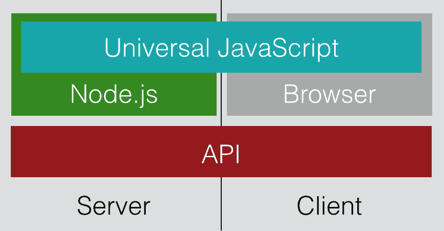

# Node.js 如何为网飞的众多用户界面提供支持

> 原文：<https://thenewstack.io/netflix-uses-node-js-power-user-interface/>

编者按:TNS 执行主编

[Joab Jackson](https://thenewstack.io/author/joab/)

对本报告有贡献。

通过将用户界面转移到 Node.js，网飞已经能够简化开发，缩短构建时间，并提高每个用户的用户界面定制水平。

网飞用户界面工程总监金·特罗特说，Node“对我们来说是一个非常有吸引力的选择，因为它与 UI 工程师的技能非常契合。Trott 将于下周在俄勒冈州波特兰举行的网飞 Node 峰会上发表演讲。

传统上，网飞一直是一个企业 Java 商店，但“随着我们从数据中心迁移到云，我们转向了一个更加基于服务的架构，”Trott 说。该公司正在将曾经是一个整体的 Java 应用程序分解成一系列更小的服务。 Java 仍然驱动着网飞的后端，但是用户看到的所有东西都来自 Node。

[Node](https://nodejs.org/en/) 是一个服务器端 JavaScript 运行时，允许开发者为 web 应用的前端和后端编写相同的代码。由于 Node 构建在事件驱动的架构之上，因此它是一个特别适合大规模处理微服务的框架。

网飞大学的 UI 工作要求很高。该公司的服务流向众多设备，从网络到移动应用，再到专用控制台。Trott 说，前端工程师“不得不编写大量的 Java 代码来制作网站，但他们也不得不在客户端编写大量的 JavaScript”。有了 Node，他们可以用 JavaScript 完成所有工作。UI 团队管理视频服务的节点平台。

节点还大大缩短了构建时间。Java 应用程序可能需要 40 分钟才能启动，这对于快速的 DevOps 过程来说并不合适。“团队无法像他们希望的那样快速前进，”她说。

图为:网飞标记架构实现 Node.js

## 网飞和节点的未来

将来，除了用户界面之外，网飞的数据访问层也将迁移到 Node。网飞将其客户端分层，针对一个 API 编写脚本，而不是编写数百个服务。当在 API 服务层中部署脚本时，客户端从数据层的集合中提取数据，例如订户信息、关于电影的元数据、字幕信息等等。目前，API 脚本被直接部署到单个 API 服务上，这限制了扩展或隔离出现的问题的能力。

因此，网飞目前正在开发一种将脚本编写为单个节点应用程序的方法。如果一个脚本表现很差，那么它只会妨碍或杀死它自己的服务，而不是整个系统。这些节点应用程序将运行在 Docker 容器上，旁边是亚马逊网络服务的弹性容器服务(ECS)，网飞的基础设施提供商的选择。这允许容器在本地运行和调试，而不是在本地调试它们的整体 API 服务器。

图为:通用 Javascript 客户端和服务器端在网飞与节点。射流研究…

Trott 说，Node 被证明是如此方便，以至于该公司正在将其应用扩展到堆栈的其他层。

网飞通过 Codex 将 Node 的使用向前推进了一步，Codex 是一套根据客户正在使用的设备设置向特定客户提供特定功能的功能。

例如，如果一个网飞客户拥有一个 XBox，在 Codex 中，开发人员可以定制一个 JavaScript 包，该包将针对网飞用户及其特定的娱乐设置。Codex 将对那些使用跨平台运行的 Web 服务的公司特别感兴趣。这也有助于 A/B 特性测试。

Trott 说，网飞计划明年发布 Codex 作为一个开源项目。

<svg xmlns:xlink="http://www.w3.org/1999/xlink" viewBox="0 0 68 31" version="1.1"><title>Group</title> <desc>Created with Sketch.</desc></svg>