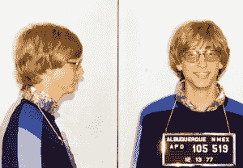
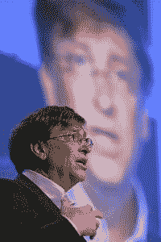

# 网飞的比尔·盖茨纪录片揭示了一个不安分的头脑仍在努力工作

> 原文：<https://thenewstack.io/netflixs-bill-gates-documentary-reveals-a-restless-mind-still-hard-at-work/>

上周，网飞首映了一部新的三集纪录片，讲述了标志性的、不屈不挠的比尔·盖茨，他在 1975 年共同创立了微软，并帮助开创了信息时代的曙光——同时也成为了世界上最富有的人。

纪录片制作人采访了盖茨生活中的重要人物，试图总结他一生在科技行业努力竞争的经历，然后转变为雄心勃勃的慈善事业的“第二幕”，专注于第三世界国家的卫生设施等问题。盖茨和他的妻子梅林达创建了据说是世界上最大的私人基金会[。](https://mashable.com/article/inside-bills-brain-decoding-bill-gates-netflix-review/)

电影制作人似乎在《比尔的大脑内部:解码比尔·盖茨》中提出了一条共同的线索，那就是比尔·盖茨独特的*头脑*。事实上，这部纪录片的部分乐趣就在于看到电影制作人选择在他们长达三小时的剧集中纳入比尔高风险生活中的哪些伟大的极客故事。

有一些感人的记忆和一些私人回忆，回到我们共同的历史，对我们自己的集体未来有一个新的坚定的看法。他们问盖茨对自己的感觉如何——得到了小心谨慎的回答，他真诚地试图抵制建立自己神话的诱惑——并感谢那些在盖茨一生的关键时刻帮助过他的重要人物，其中许多是女性。这些观点来自他的妻子、朋友、同事和合作者，他们可能和其他人一样了解盖茨。但在这一切之下，我们一直对他的巨大成功暗暗好奇，这种诱人的魅力挥之不去。比尔·盖茨的一生有什么值得我们学习的吗？

[https://www.youtube.com/embed/aCv29JKmHNY?feature=oembed](https://www.youtube.com/embed/aCv29JKmHNY?feature=oembed)

视频

## 为几天不睡觉而编码

“比尔几天不睡觉写代码，”这部纪录片的第一集这样开头。这部电影讲述了他 22 岁时在新墨西哥州阿尔伯克基附近因超速行驶被捕的故事。这部纪录片将此描述为“发泄情绪……挑战他的汽车和法律的极限。”

这部纪录片几次指出，盖茨强烈的专注能力可能会成为一个问题。盖茨后来分享了他童年的一些记忆。“我父母的权威似乎是武断的。我真的不想遵守他们的规则……”这暗示了一些极客可能在 20 世纪 90 年代末美国政府对微软提起反垄断诉讼时形成的不妥协和冷酷无情的盖茨的形象。

微软内部备忘录显示，盖茨一直在毫无歉意地寻求击败微软竞争对手的方法，无论是领先的网景网络浏览器还是 Linux 的开源操作系统。1999 年的纪录片《盗梦硅谷》(Pirates of Silicon Valley)甚至追溯到了更久远的年代，其中有一个场景是苹果联合创始人史蒂夫·乔布斯(Steve Jobs)与盖茨(Gates)就微软将苹果的软件理念用于他们自己的个人电脑一事进行了对抗。

如果这是你心目中的比尔·盖茨，你会喜欢这部新纪录片对他年轻时的生活的倒叙。第二集开始，“比尔在执行一项任务。他需要解开 PDP-10 电脑的秘密。但大人们不会和 13 岁的比尔分享源代码。”这是他与[未来的微软联合创始人保罗·艾伦](/remembering-paul-allen-tech-pioneer-and-life-adventurer/)年轻时的伟大冒险之一，因为“他们一起大胆地去了没有人去过的地方。”特别是垃圾桶。

在整个纪录片中，年轻的盖茨有风格化和轻度动画的插图——与他的母亲争吵，与保罗·艾伦一起打印程序，最终与梅林达会面。盖茨记得保罗·艾伦是“那个找到我，向我解释芯片和在芯片上增加更多能力的魔力的人。”

已故的艾伦本人甚至通过档案电影剪辑出现在纪录片中，将比尔描述为“一个了不起的程序员”。有时候他会睡着——真的是把头放在键盘上睡着了。然后他会有点昏昏沉沉地醒来，看着屏幕，然后他会从停下来的地方开始打字。”

对我来说，这是这部纪录片最有趣的部分。“我们玩得很开心，”盖茨回忆道。"我从来没有喝醉过，但保罗让我喝醉了……"盖茨被问及艾伦是否是一个"腐败"的哥哥。“哦是啊。这肯定是有原因的。在那之前我和保罗是好朋友，去过他家，和他一起去看电影。但我们关系的真正加强是在今年夏天，保罗成了我最好的朋友。”

[https://www.youtube.com/embed/UFcb-XF1RPQ?start=89&feature=oembed](https://www.youtube.com/embed/UFcb-XF1RPQ?start=89&feature=oembed)

视频

在盖茨高中毕业之前，他们就已经找到了一份年轻程序员的工作，仅仅几年后，当盖茨 22 岁时，两人再次合作，为世界上第一台商用微型计算机编写操作系统。这是一段他们无法忘却的记忆——关于这两个年轻人如何一起创办了他们的第一家软件公司。“我们兴奋极了，”保罗·艾伦的声音说道。“我们几乎没睡。我们会停下来吃快餐，然后回到工作岗位，直到凌晨 3 点。”

但当然，艾伦在几年内离开了微软，部分原因是健康问题——他与霍奇金淋巴瘤和非霍奇金淋巴瘤做斗争。但众所周知，艾伦对微软的环境感到不满。在纪录片中，比尔对他和艾伦之间的紧张关系守口如瓶，谨慎地说“有几次我对保罗很严厉。有很多年了，我是他的老板，我打电话给他说，'嘿，努力工作。'"

但梅林达·盖茨说，这两位微软联合创始人最终开始修复他们的关系，回忆起“我们和保罗在一起的时候，我们会坐上几个小时。他们就像两个小男孩一起笑着讲这些古老的故事。”

然而，当采访者问盖茨，他是否后悔离开了与保罗的关系时，有一个漫长而有意义的停顿，随着悲伤的音乐在背景中播放，叙述者补充了故事的其余部分。“在比尔知道保罗生病之前，他们曾试图彼此联系，但从未发生过。然后，当保罗宣布他又生病了，比尔伸出手，终于让所有的情绪出来。比尔非常诚实地说出了他对保罗的感觉，他有多爱保罗，他们的友谊比任何可能导致他们中任何一人生气的事情都重要。爱是永恒的。愤怒会慢慢消失。这是一种突破，他们又走上了一起的道路，但是……”

"比尔死前有机会再见到他吗？"面试官问一位前微软员工。

“不，”他严肃地点点头回答道。“没有。”

## **今天的挑战**

但这部纪录片的主题似乎是，盖茨的强烈关注现在正被带到盖茨在微软后在[比尔和梅林达盖茨基金会](https://www.gatesfoundation.org/)的工作中所面临的人道主义挑战。在他的第一次采访中，盖茨似乎有点僵硬，当他带着采访走进树林时，几乎没有摆动双臂。但是叙述者记得他们第一次见面时，盖茨正在阅读明尼苏达州的预算——而且“在他的手提包里还有 37 份其他的预算”

很快，纪录片制作人将采访纪思道，这位记者写了一篇关于第三世界国家缺乏淡水的文章，启发了基金会的新方向。盖茨说，每年有 300 万儿童因缺乏淡水而死亡。比尔和梅林达刚刚有了他们的第一个女儿，梅林达描述了她的难以置信的反应。这似乎是悲剧，也是不必要的。这篇文章改变了基金会，克里斯托夫称之为“我为此写过的最重要的文章。”

盖茨说，他同意这种看法，即他是一个技术爱好者，认为技术将拯救一切。电影制片人指出，盖茨基金会应用高分辨率卫星图像、算法和计算机能力来创建和分析尼日利亚的详细地图。学到的一件事是:如果人们住在政治区的边界，他们更有可能感染脊髓灰质炎，在那里他们可能会错过救援工作。

比尔和梅林达·盖茨基金会的主任菲利普·维尔霍夫说:“一个大问题是我们如何使用定量分析来了解如何从低脊髓灰质炎到零脊髓灰质炎。”这部纪录片既承认他们的挫折，也承认他们的胜利。在达卡，该基金会的 [Omni 处理器](https://en.wikipedia.org/wiki/Omni_Processor)现在正在处理该市三分之一的污泥，并提供清洁的饮用水。第三集也关注了基金会在帮助应对气候变化方面的工作，包括盖茨风险投资公司首席执行官拉里·科恩的一些评论。

但这也解释了这种慈善冲动是如何植根于盖茨的童年。

盖茨的一个姐姐记得她们的母亲也是几个组织的董事会成员。“穿上西装，整理好行李，拿着公文包，出门去开会……她是一股力量。她希望我们的家庭成为一股力量。”

盖茨说，她有一种价值观，这种价值观传达得非常清楚，即使是间接的。当被问及他一生中最糟糕的一天时，盖茨想了几秒钟，然后说:“我母亲去世的那一天。”盖茨的一个姐妹补充道，“她不在这里真是太遗憾了。

“因为她会为他感到骄傲的。”

* * *

## WebReduce

<svg xmlns:xlink="http://www.w3.org/1999/xlink" viewBox="0 0 68 31" version="1.1"><title>Group</title> <desc>Created with Sketch.</desc></svg>